# 底层逻辑:资产和被动收入

出售时间片不可能规模化
-----------

对二十一世纪来说最宝贵的是人才，但对一人企业来说，最宝贵的却是时间。最稀缺的就是最宝贵的。正如本书前文中所述的，对于只有一个全职员工的企业，即使我们每天工作10小时，一周也只有50个工时。如果是以Side Project的方式来做，可用工时会更少。

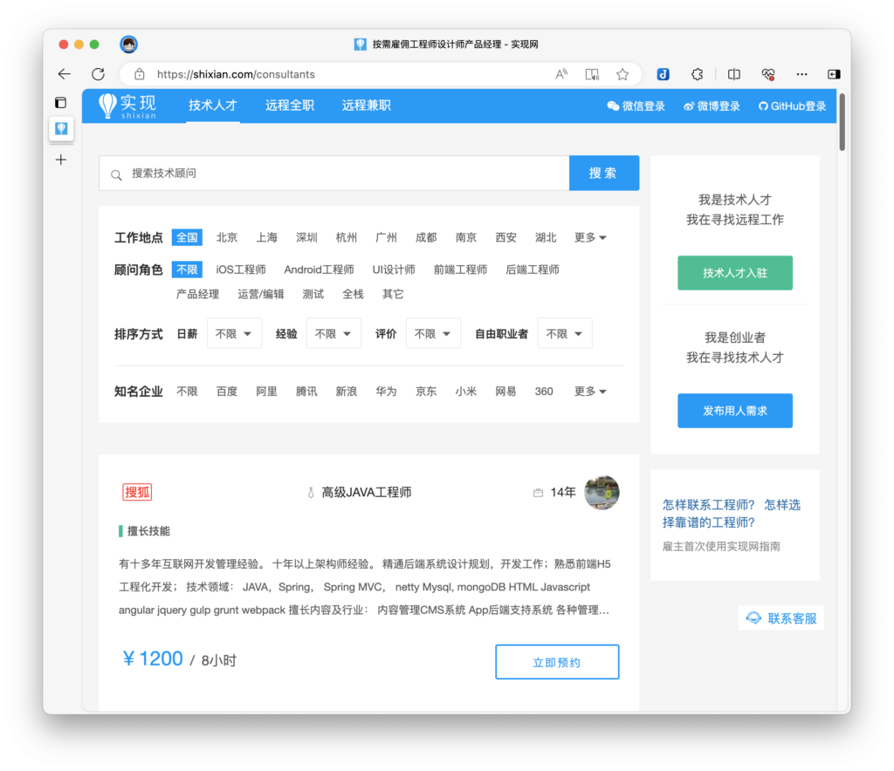

实现平台的日薪

在程序员灵活用工平台shixian.com上，腾讯阿里百度等大厂的员工兼职日薪约为1000~1500，我们按1500/8小时计算，一人企业如果单纯售卖时间片，其收入上限为 (1500/8)*50*4 = 37500。也就不到4万块钱。注意这是上限，而且你需要每天工作10小时。即使你通过海外平台接单，我们假设收入翻一倍，却依然可以得出结论：出售时间片不可能规模化。

所以我们需要一种不依赖于时间片就能挣钱的方式。

资产和被动收入
-------

《穷爸爸富爸爸》

在《穷爸爸富爸爸》中，罗伯特-清崎说过一句很经典的话：富人不为钱工作。要想规模化财富，就要让钱为你工作。解决办法也很简单，就是不断持有资产。

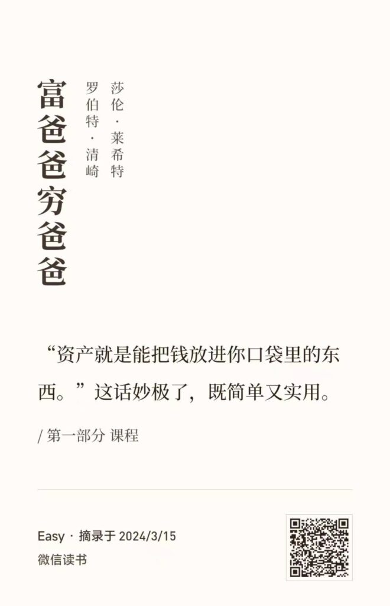

《穷爸爸富爸爸》中对资产的定义

书中对资产的定义是：「资产就是能把钱放进你口袋里的东西」。换言之，如果某样东西能在你不工作的时候为你带来持续的收入，那么它就可以被认为是资产。本书将沿用这个定义。

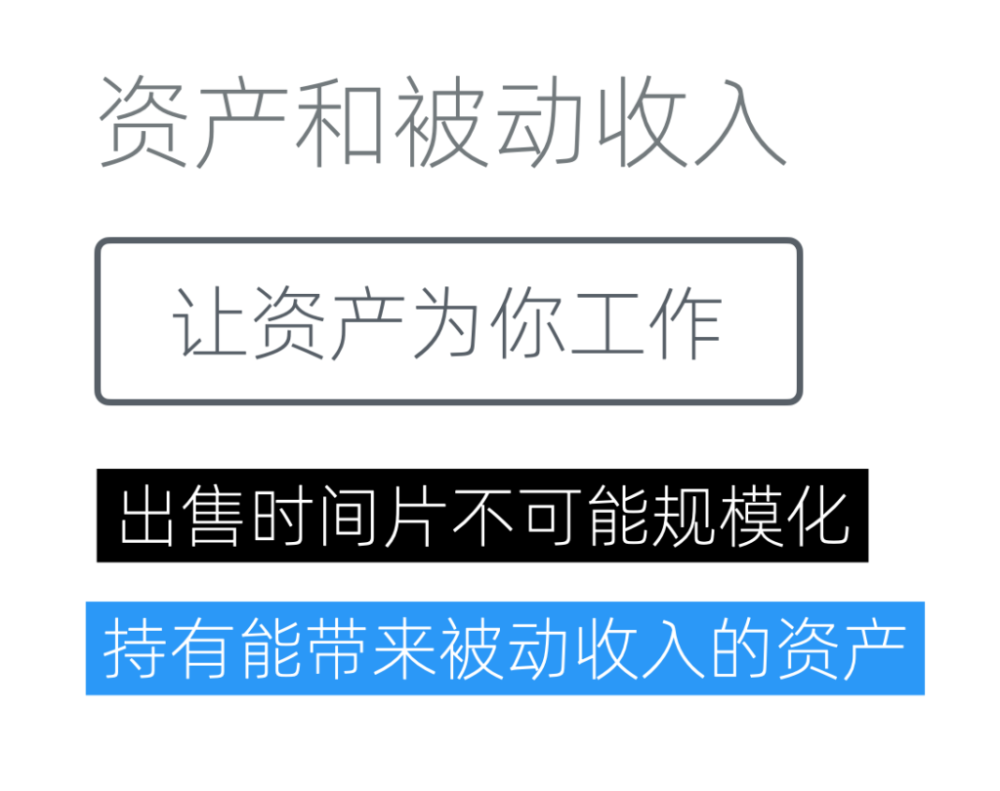

让资产为你工作

让我们来梳理下逻辑，因为「出售时间片不能规模化」，所以我们「需要一种不受时间片限制的、增加收入的方式」，而「能带来被动收入的资产」正是解决之道。

那么，剩下的问题只有一个，如何才能获得能带来被动收入的资产呢？

如何获得资产
------

资产可以「把钱放进你的口袋」，这可是会下金蛋的鸡，当然是人人都想要了。既然人人想要，就难以轻易获得了。

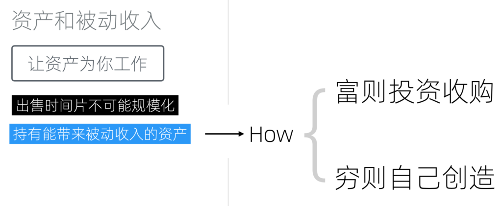

如何获得资产

总体上来说，获得资产的方式无非两种：富则投资收购、穷则自己创造。

### 富则投资收购

如果你手上钱比较多（这种情况比较少），那么可以通过投资或收购的方式来获得资产。这将帮我们跨过试错环节，直接去收购那些已经被市场认可，开始有不错的MRR（每月周期性收入）的资产。

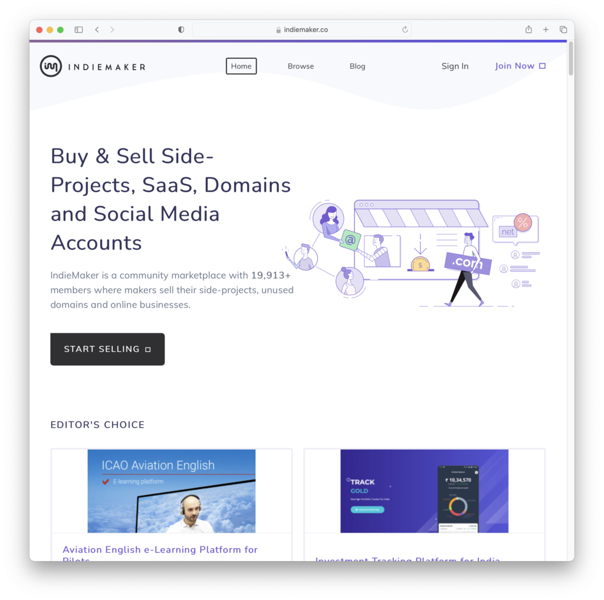

indiemaker.co

#### 收购Side project

例如，在Indie Maker这个网站上，我们可以看到许多程序员会销售他们的Side project。

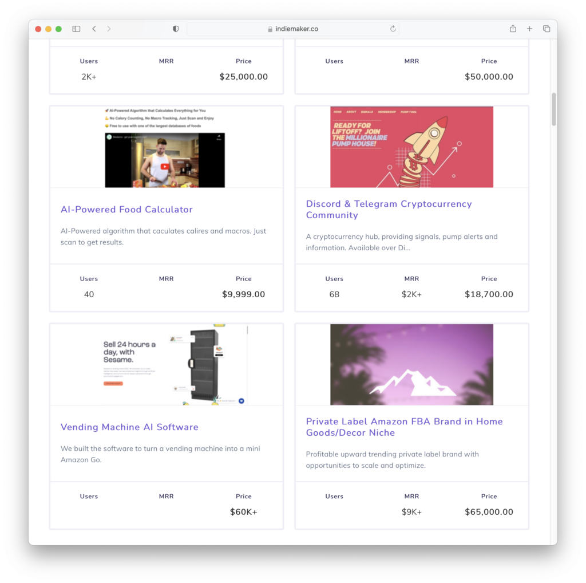

已经产生MRR的项目

其中一些已经有不错的MRR了。比如这个以18,700美金出售的项目，周期新月收入已经达到了2,000美元。如果我们有足够的资金，我们可以挑选一些比较合适的项目进行投资。

但是，在考虑价格时，我们也需要考虑到网站标注的MRR可能是临时性的。它也许不是虚假的，但可能是临时的。比如说，某些和流行热点相关的项目，可以在大火时获得很高的MRR，但之后可能是断崖式的下跌。而网站展示给我们的可能正好是某个高点时的数据。

另一方面，购买程序类资产时不应忽视后续的开发和维护成本。需求是会变动的、程序也不可能没有Bug。购买项目后，无论是维护还是定制开发都还需要雇佣程序员。这些都是成本，需要考虑进去。

#### 收购其他资产

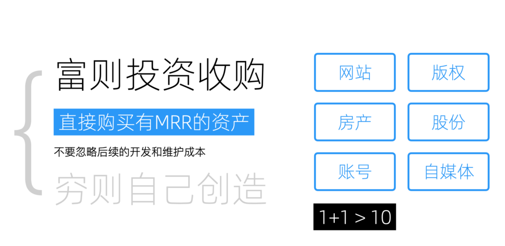

除了软件和SaaS产品之外，我们还可以考虑购买其他类型的资产。如网站、版权、房产、股份、账号以及一些自媒体平台。这会帮我们节省大量时间。

但是，在购买这些资产时，我们需要思考一个问题：为什么这些已经产生月收入的资产的持有者想要出售它们？交易始终是围绕价值进行的，没有人是傻子。想明白出售背后的原因，才不容易买到有坑的资产。一个已经产生稳定MRR的资产，通常不会低价出售。出售者可能有他们的原因（例如需要现金），捡漏是存在的，但不常见。

所以通过购买方式获得的资产，必须在我们这里要能发挥出比它在原主手里更大的效果，挣到更多的钱才算是好的交易。一个常见的原因是协同效应。资产并不是孤立的，它可以和我们拥有的其他资产形成协同效应。比如我们如果拥有一个每天上万独立用户的垂直论坛，这时候收购一个在同一个群体上已经证明能产生MRR的APP，直接对接上就可以获得不错的现金流。

考虑到收购本身的沟通成本、收购之后的维护成本以及风险，以及一人企业自身的有限资源，我通常认为只有能实现1+1>10的资产才是值得购买的。否则自己创造可能更划算。

另外，如果想要投资股票，那就完全是另一个领域了，有很多专家可以为我们提供指导，不在本书的讨论范围之内。

### 穷则自行创造

#### 数字商品创作

数字商品创作的种类

许多人可能会先入为主地认为，由于自己不会编程，因此无法创造任何东西。这种观念在十年前是较为主流的。然而，随着公众号、网红文化和直播的兴起，人们开始意识到即使不精通技术，也能进行创造出极具价值的资产。

数字商品的创作，如网络小说、在线课程、电子书、付费社群以及电子邮件列表，都是可行的路径。最新的，还有由OpenAI开放的、自定义GPT商店 GPT Store ，很多人都觉得它的潜力堪比Apple的App Store。

当然，不同类型创作的投入产出比和风险是不同的，比如网络小说虽然一旦成功收益颇高，但要想在[2200万网文作者](http://www.news.cn/culture/20230413/198b8af478f84b38a65c115fb43257bd/c.html)中脱颖而出也是非常困难的。这就涉及到资产的评分，这个我们放到后边讲。

#### 通过NoCode创造互联网应用

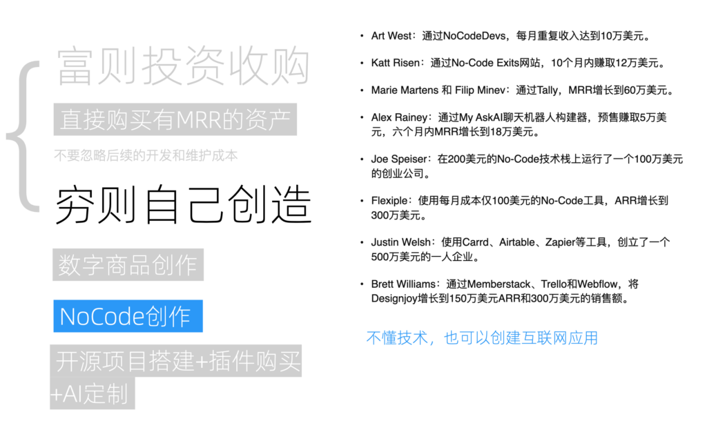

NoCode创作实例

并不是说不懂技术，就只能局限于前边我们提到的数字商品创造。这些年，NoCode软件已经逐渐成熟。所谓NoCode指的是将一系列可用于构建互联网应用的组件，通过拖拽、设置等方式，在完全不编码的前提下，实现业务逻辑，创建出一个功能完备的互联网应用。

在国外，NoCode已经颇为流行，不但出现这个领域的几大巨头SaaS，还有大量基于NoCode盈利的生态和案例。以下是我摘录的例子：

-   Art West：通过NoCodeDevs，每月重复收入达到10万美元。
-   Katt Risen：通过No-Code Exits网站，10个月内赚取12万美元。
-   Marie Martens 和 Filip Minev：通过Tally，MRR增长到60万美元。
-   Alex Rainey：通过My AskAI聊天机器人构建器，预售赚取5万美元，六个月内MRR增长到18万美元。
-   Joe Speiser：在200美元的No-Code技术栈上运行了一个100万美元的创业公司。
-   Flexiple：使用每月成本仅100美元的No-Code工具，ARR增长到300万美元。
-   Justin Welsh：使用Carrd、Airtable、Zapier等工具，创立了一个500万美元的一人企业。
-   Brett Williams：通过Memberstack、Trello和Webflow，将Designjoy增长到150万美元ARR和300万美元的销售额。

但在国内，也许是用户对产品细节要求更高，2C（面向消费者）领域里NoCode的流行程度并不高。但在2B（面向企业）领域，NoCode也已经在国内大量使用，毕竟内部管理系统主要看中的不是美观和特效。

另一方面，对于一人企业和创业公司，NoCode也是非常好的一个方向。因为在主流创业方法论中，有一个用于验证市场需求和产品是否契合的步骤，需要构建最小可行性产品（MVP）。而 NoCode 正是这方面极为有效的工具，它允许我们快速搭建出70到80分的MVP来进行市场验证，甚至实现盈利。最重要的是，这个过程完全不需要技术人员支持。

而随着业务的发展，我们可以用所获得的资金来开发更高质量、细节更为精致的系统，以取代最初的MVP。

所以，不懂技术，也可以创建互联网应用。

#### 开源+AI定制

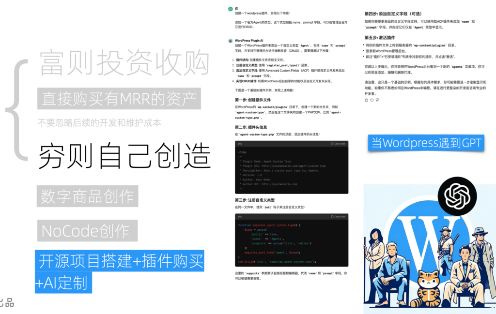

通过GPT给WordPress写插件

除了使用第三方的NoCode平台，我们也可以通过开源项目自行搭建很多互联网应用。近些年开源蓬勃发展，方方面面都开源替代品。其中，作为最通用和最强大的，是有着六万多插件的WordPress。

绝大部分的通用功能和行业专用功能，都可以通过购买专门的WordPress插件来解决。最后一点定制需求，如果不是特别复杂，甚至GPT4都可以帮你写出来。如果现在写不出来，等几个月后再试试可能就可以了。

#### 自学编程创造

当然，如果想要高效又完美的实现自己的需求，学习编程自行开发是最好的选择。现在，借助GPT等工具，学习编程变得更加容易和有趣，它极大地降低了学习的门槛，并提高了学习的效率。因此，如果你曾经因为编程难度而放弃，现在是一个重新尝试的好时机。

如果你觉得学习编程细节过于繁琐，那么掌握其中的编程思想即可。因为不管是使用NoCode和Devin这种写码机器人，都需要理解代码背后对需求的实现逻辑。

资产的量化评估
-------

既然资产是把钱放进我们口袋的东西，那是不是越多越好呢？理论上讲，当然是的。但是资产并不是一成不变的，它也需要定时维护、也会随着市场和需求而变化，甚至可能从资产变成负债，持续消耗我们的财富。因此，我们需要对资产进行量化评估，抓大放小，把主要精力放到优质资产上。

这里给大家分享一个我自己的标准，它包含以下五个评估项：投入、产出、持续性、风险和门槛。

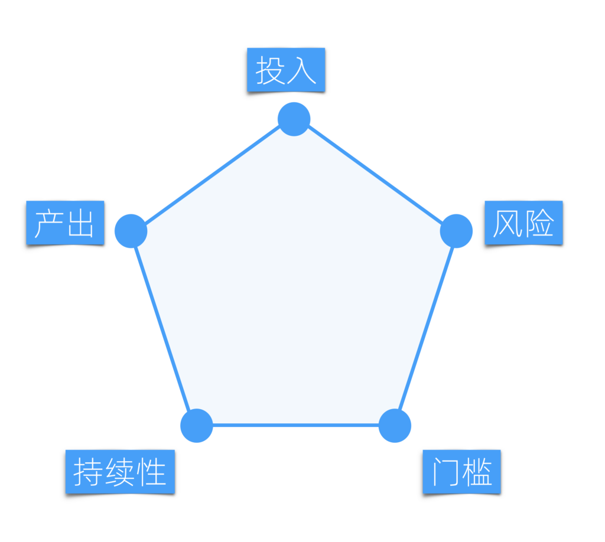

资产的量化评估

### 性价比

首先考虑的是投入，即获取这项资产所需的成本；其次是产出，也就是这项资产能够为我们带来多少收益。将投入和产出相加，我们就可以得出这项资产的性价比。性价比越好，越值得我们持有。

这是一个很简单的道理，但需要注意的隐形投入和边际成本。很多成本只有在运作起来时才会显化出来，因此需要还原场景仔细思考。另一些成本可以通过协作效应，将其作为边际成本，从而极大减少投入。

很多产出不大的资产，如果投入极低，也是可以操作的。

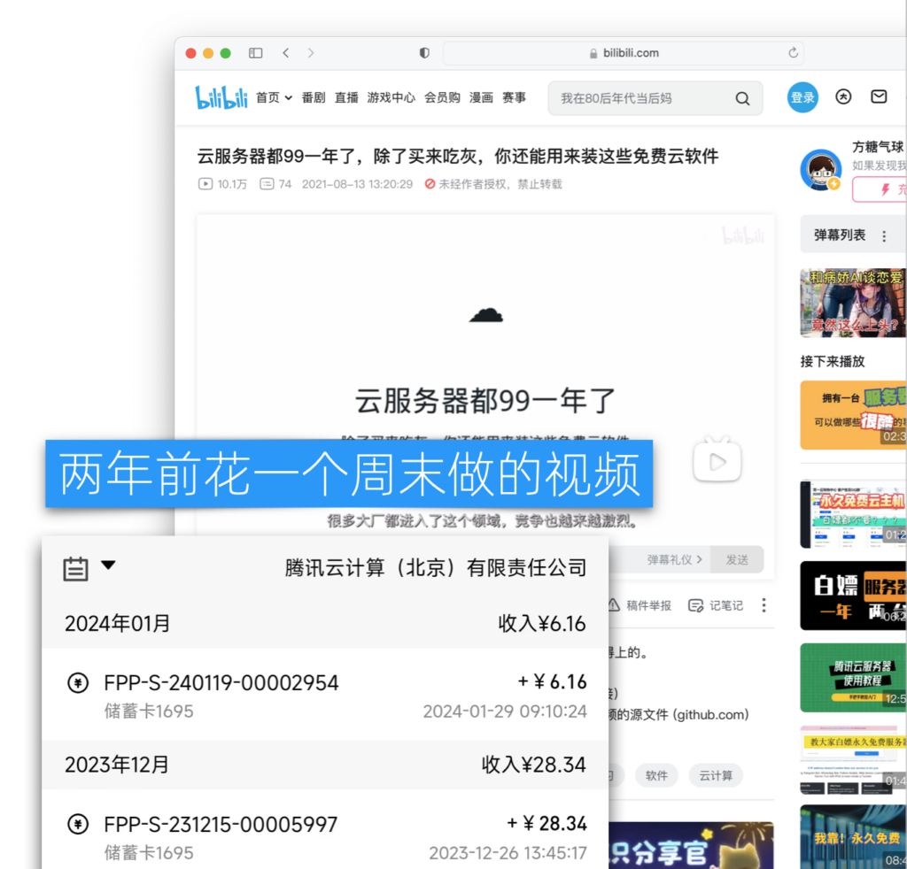

B站视频

比如我在B站上发布的这个视频《云服务器都99一年了，除了买来吃灰，你还能用来装这些免费云软件》------播放量达到了10万。这段视频是我两年前仅用一个周末的时间制作完成的。

它的盈利方式很简单，即视频下方附有一条腾讯云的推荐链接，我当时并没有期望它能持续带来收入。不过后来的收益超过我的预期，累计下来有小几千。尽管这份收益绝对值看似不多，但考虑到这是被动收入，且我在这上面的投入仅是一个周末的时间，还是相当不错的。

### 持续性

「被动收入」这个说法容易让人误解为我们持有资产以后，什么事都不需要做了，资产就会源源不断地为我们挣钱。但实际上，每次投入能带来的产出往往是随着时间递减的，因为市场会变化、需求会更新、潮流会轮回、设备会陈旧。我们必须再次投入，才能恢复其产出。持续性则描述了投入之后，可以持续带来收入的时间。

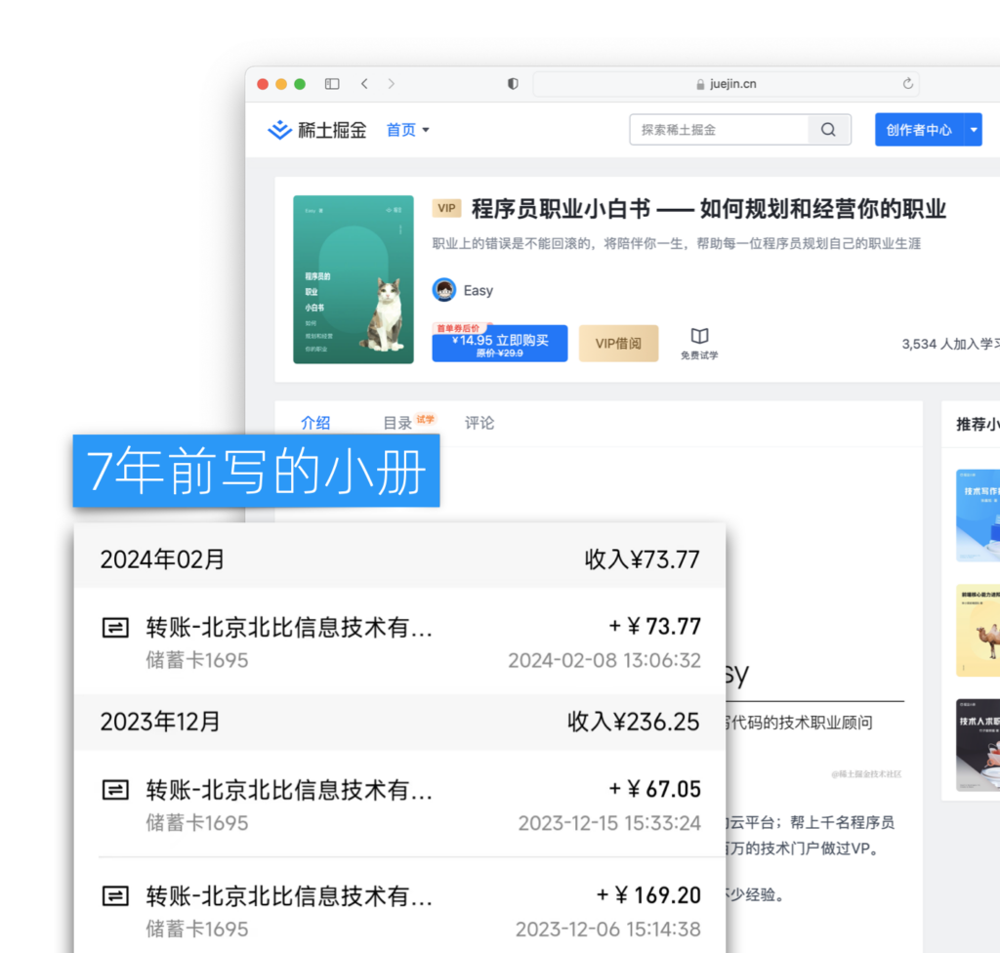

持续性高的资产

什么是持续性高的资产呢？举个例子，我手上有一项非常小的资产------ 七年前我编写的一本名为《程序员职业小白书》的小册。直到2024年今天，它每个月仍然为我带来收益。以2023年12月，它带来的收益为23.6元；而到了2024年2月，收益大约为70元。这些收益都是扣除税费后的净收入。因此，这可以说是一项持续性极佳的资产。

### 风险

很多事情并不是我们投入了就一定有回报，也可能背离我们的预期。这就是风险。风险往往和性价比密切相关，高回报往往意味着高风险。尤其是对低门槛的资产来说。比如前文提到的网文创作，因为进入门槛低，竞争异常激烈，所以风险也异常高。

并不是说高风险的资产一定就不能投入，而是说我们要合理搭配，靠低风险资产保温饱，用高风险资产求发展。

### 门槛

很多业务有其硬性门槛，门槛越高，意味着我们前期投入就越大。甚至有一些门槛加大投入也无法达到。不过门槛并非是绝对的，不同产品形态有不同的门槛，通过调整产品形式，我们也可以绕过某些门槛。另一方面，门槛也和杠杆相关，新杠杆领域进入的门槛往往会较低。

从以上五个方面对一个资产进行评分，我们就可以得出一个综合评分，并根据评分对资产进行管理。
