# 产品构建:从零构建软件产品或服务

本文尝试完整地介绍一个软件类产品从规划到上线的全过程，希望能给你带来启发。内容节选和改写自[《精益副业》](https://github.com/easychen/lean-side-bussiness)。

产品流程
----

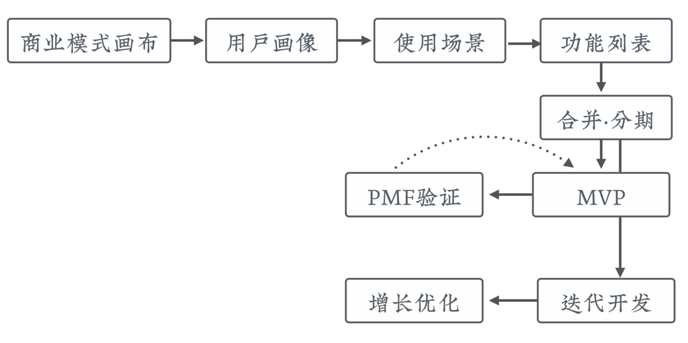

更适合一人企业的产品流程

在本文中，我们采用的是优化后的、更适合一人企业的产品流程。其中「商业模式画布」步骤，建议换为更加有针对性的「[一人企业画布](https://ft07.com/opb-canvas-and-opb-report/)」。

这个流程和很多硅谷公司的产品流程很像，但是针对一人企业做了一些调整和优化。经过三年多时间的使用，我们自己用起来已经很顺手。

1.  首先定义价值主张，然后围绕着价值来设计商业模式画布。
2.  完成画布以后，我们把画布里的「客户细分」部分拿出来，做成「用户画像」。这是一个将细分客户具体化、变得有血有肉的工具。
3.  有了画像，再据此还原用户使用产品的各个场景，他们是用电脑还是用手机、是在家里还是在车上使用等等。
4.  想象为了在上述场景下向用户传递价值，我们需要什么样的功能，这样就会得到一个功能列表。
5.  功能列表会很长，不同功能的优先级也不同。所以我们会对功能进行分期，其中最重要也是最靠前的一个功能分期，就是用来开发「最小可行产品」的分期。
6.  当「最小可行产品」开发完成后，进行「产品市场契合」的验证，如果达不到设定的验证目标，就需要调整功能，甚至重新设计价值主张。
7.  当通过「产品市场契合」后，我们就可以按照分期迭代开发产品的其他功能了。
8.  在迭代过程中，我们会持续对新上线的部分功能进行增长优化，保证每一部分功能达到预定的目标。

以上就是我们为一人企业优化的精益流程，虽然讲起来比较多，但实际操作起来还是比较简单的。而且我们其实省略了不少大公司流程中的环节，比如用户访谈、焦点小组等。

项目简介
----

先来介绍一下我们的实战项目 ------ 福利单词。

它来自于我在学习过程中的一个原生需求。最开始我是使用 Anki 这个软件来背单词，软件很好用，但是每次都有一种逼着自己去背的感觉，背完以后如释重负。为了提醒自己不要逃避，我还定了一个闹钟每天催自己。

有一天，我又因为上[Pixiv](https://www.pixiv.net/)（一个二次元内容创作社区）看图忘记了时间。突然间我想到，能不能把背单词和看图片这两个行为绑定到一起呢？

你看，背单词虽然有用，但让我痛苦，度日如年；看图片很欢乐，流连忘返，但似乎不是很「有用」。如果我们把两者结合到一起，一边看图一边背单词，是不是就可以让背单词不那么难受，可以持续不断地背下去了？

这就是福利单词的出发点。

接下来，我们就来看看，怎么从这个还有些模糊的想法中提出一个明确的价值主张，然后围绕它进行商业模式规划、功能和界面设计、验证和迭代开发，最终使其成为一个商业产品。

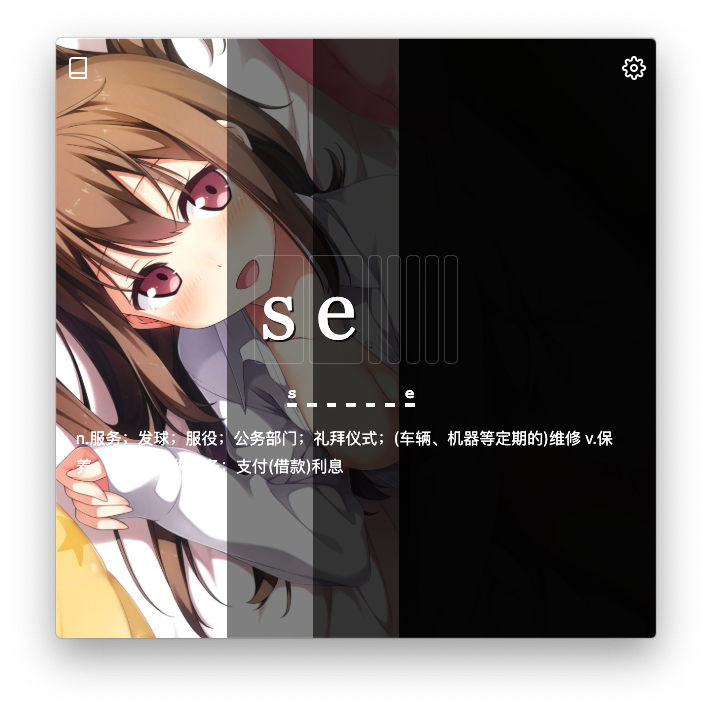

福利单词APP

需要说明的是，开发过程很难在有限的篇幅中讲解清楚，也偏离了本文的主题，所以我们只会简略地提及一些需要注意的地方，并不会进行开发的教学。

第一步：商业模式规划
----------

首先我们通过商业模式画布来规划产品的商业模式。

### 价值主张

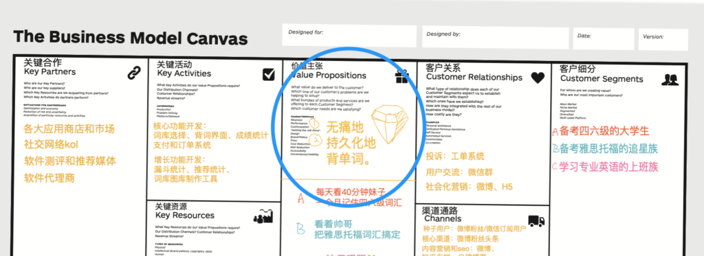

福利单词的价值主张

福利单词的核心价值主张在于为那些觉得学习英语充满挑战的人提供一种轻松愉悦的学习方式。其目标是通过增添学习过程中的乐趣来减轻学习者的压力，使本来短暂且困难的学习活动变得更加可持续和习惯化。

因此，在「价值主张」部分，我们特别强调了两个关键点：「无痛学习」和「持续性学习」。这两点构成了该产品的核心价值。

有了这些价值主张，我们能够帮助客户克服以往阻碍他们学习的障碍，从而促进他们的个人成长和提升。

### 客户细分

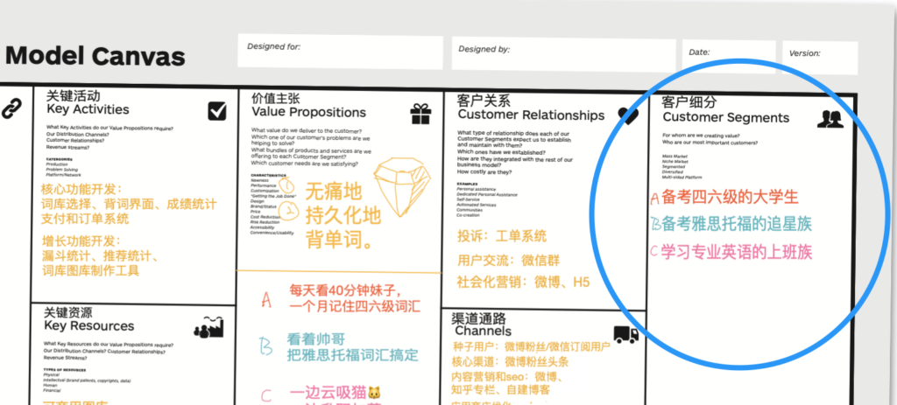

福利单词的客户细分

细化价值主张需要我们仔细考虑客户的细分。考虑到福利单词是一款学习软件，其目标客户群体自然与学习英语的需求密切相关。我们可以将目标客户分为三类：

1.  需要备考大学英语四六级的大学生。
2.  有留学或移民需求，需要准备雅思、托福考试的人群。
3.  希望通过提高专业英语水平以在职场中取得更好表现的职场人士。

这三类客户的学习目的各有侧重，但通过提供「词库切换」或「自定义词库」功能，我们的软件能够灵活满足他们的需求。

### 价值主张的细化

细化后的福利单词价值主张

仅仅提供词库供用户学习，并不能使我们的软件与众不同。因此，我们在价值主张中追加他们难以抗拒的部分------「糖」。

然而，对不同的用户群体而言，「糖」的含义并不相同。

如果只是放一些二次元的萌妹子，只有喜欢动漫的人会觉得这是他们的「糖」，可以吸引着他们，每天都来看一看。对于其他一些二次元无感的人群来讲，这些图就毫无吸引力，所以我们需要增加「糖」的种类。比方说有的妹子就喜欢看帅哥、有的粉丝就喜欢看偶像、有的铲屎官就喜欢看猫猫狗狗、有的吃货就喜欢看肉和甜点。这一部分，我们可以用多图库的方式来满足。

据此，我们为不同的客户细分制定更具体的价值主张：

1.  「每天看40分钟妹子，一个月记住四六级词汇」
2.  「看着帅哥，把雅思托福词汇搞定」
3.  「一边云吸猫一边升职加薪」

现在听起来是不是就有吸引力多了？

### 渠道通路

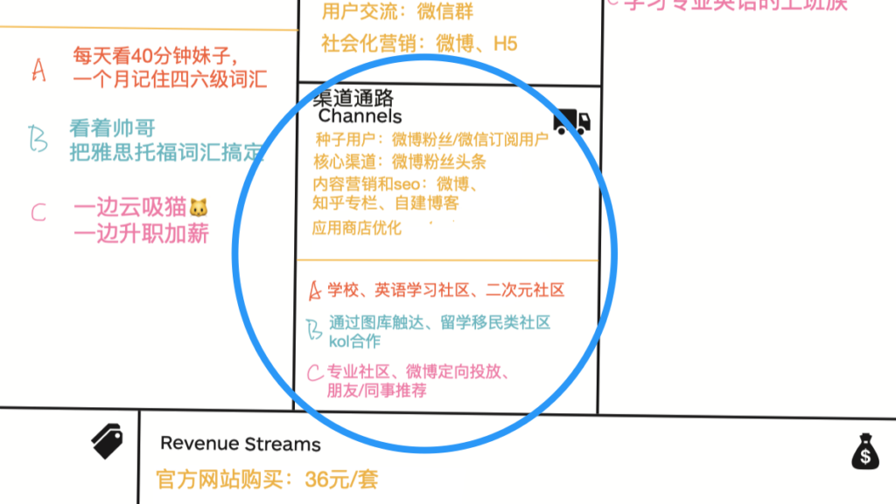

福利单词的渠道通路

在「渠道通路」方面，我们计划通过微博引入种子用户。通过对种子用户的测试反馈，一旦产品转化率达到预期标准，我们便会展开更广泛的合作并通过微博启动广告投放，以此来衡量广告成本与带来的流量效果。

### 客户关系

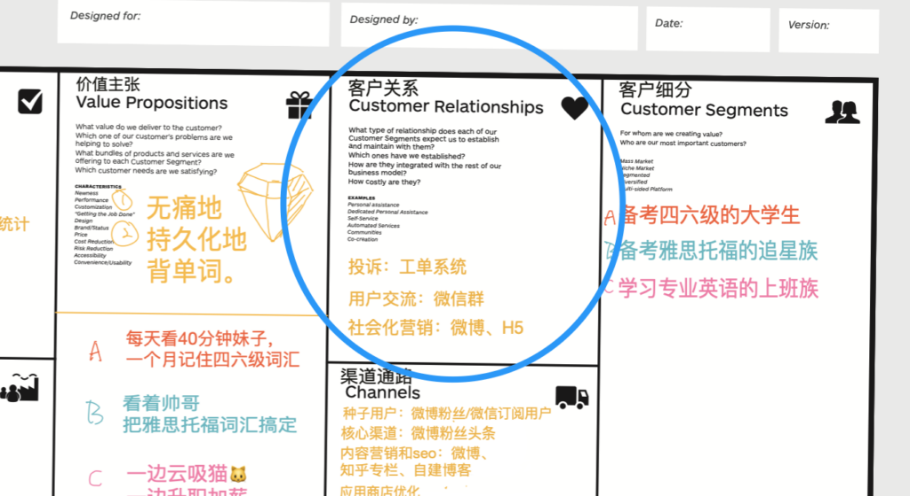

福利单词的客户关系

为了维护良好的客户关系，我们将利用腾讯的「兔小巢」工具提供售后支持。这样，用户可以方便地提交反馈，而我们则能通过微信或者QQ等多种渠道及时响应。

### 关键活动

福利单词的关键活动

在关键活动方面，最小可行产品（MVP）的初版应包含基础的背单词功能、100个单词与相对应的图片，以及简单的互动式学习模块。此外，我们还需要关注用户的学习数据，以验证我们的价值主张。

在MVP验证成功后，我们将开发网页版应用，作为第一阶段的产品发布。此阶段的关键功能包括背单词界面和词库选择功能。为了实现收益，我们还将引入支付和订单系统，并开发分析工具以优化转化过程。

### 关键资源

福利单词的关键资源

关键资源方面，除了人力、资金和时间外，我们还需特别注意用于背单词的图片资源。尤其是在收费环节，我们必须确保图片资源的合法使用。

在最小可用产品中，因为不涉及到收费，我们可以使用的图片很多。一旦开始收费，如果还是不加识别地从网上下载各种版权不明的图片，放到自己软件里并以收费的方式进行售卖，很可能会出现侵权。

所以，我们就需要思考图片资源的解决方案。粗略分析后，有以下几种思路：

1.  作者授权
2.  换用无版权图片
3.  用户自行提供图片

#### 作者授权

直接找作者把图片买下来，然后作为付费词库卖给用户，这是最直接的方式。但有问题，那就是价格，光是大一点的词库就有超过一万个单词，也就是说我们要买一万多张图。如果按一张图 50 元计算，需要 50 万的投入。

在一分钱都还没挣之前就做出这么大的投入，风险还是很高的。这种方式更适合我们挣到钱以后，在扩大规模时使用。

#### 换用无版权图片

当然，我们也可以寻找无版权的图片来做图库。这样即使我们打包在软件里进行商业销售也不会有任何问题。互联网上已经有比较庞大的无版权高清图库了，比如 [Unsplash](https://unsplash.com/) 等。不过这些图库主要是风景和动物，人物类非常少。

#### 用户自行提供图片

本质而言，我们卖的是「看图背词」的工具，而不是图片本身。现在之所以在版权上有风险，是因为打包导致的。所以我们可以尝试着将付费的服务和免费的图片分离开。

比如我们可以给用户提供自定义图库的制作工具，让他们把自己收藏的图片导入进去。这样既能达到目的，又没有版权上的风险。

类似需要考虑的，还有背单词时用到的音频。最简单粗暴的方式是使用云平台的TTS（文字转语音）接口直接生成。

### 成本与收益

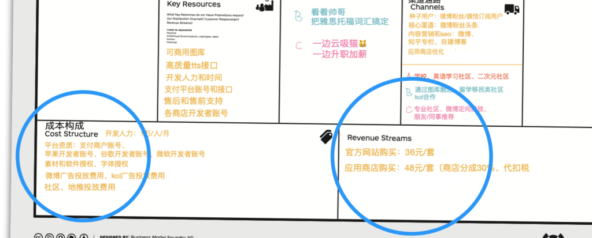

福利单词的成本和收益

最后，通过填补商业模式画布的相关部分，我们可以开始对成本和收益进行预估，以计算预期利润区间。

由于我们开发的项目相对比较小，用到的资源也不是特别的多，所以商业模式画布做得还不算细致。不过通常来讲，第一版的商业模式，画布本身也不会特别细。它是随着项目的进展不断被细化的。

最后我们来看看完整的商业模式画布：

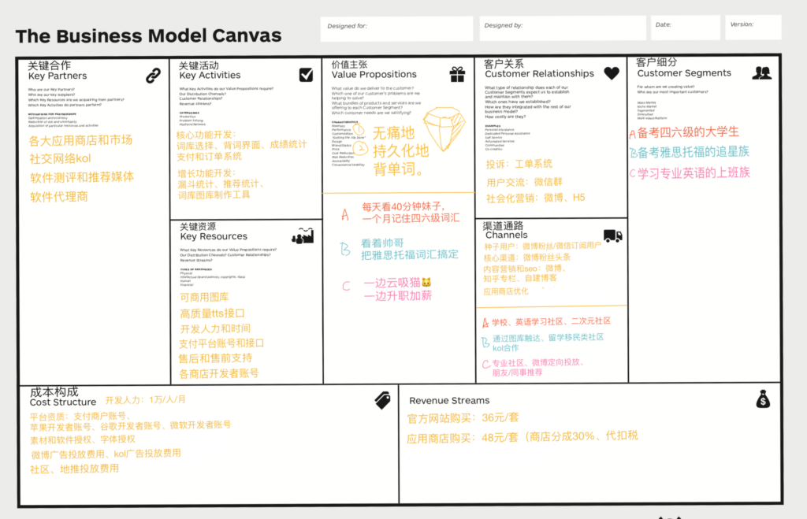

福利单词的完整商业画布

第二步：为细分客户建立用户画像
---------------

### 什么是用户画像

在商业模式画布里面，我们对客户进行了细分，把客户分成了不同的组，每一组代表一个独立的需求。

用户画像（persona）呢，就是给这些已经分好的组，每一组搞一个人设、建一个虚拟形象，让其变得有血有肉、有姓名有年龄有性别、有自己的身份有自己的爱好、有使用产品的场景。

这样当我们聊到这个用户画像的时候，就像在讲自己的朋友、同事一般熟悉的人一样。

把抽象的需求变成活灵活现的人，这样我们在进行产品设计的时候，就更容易还原到场景，带着画面去想象这个人的需求和行动，这就是用户画像的意义。

### 福利单词的用户画像

接下来，我们就在福利单词的客户细分基础上，为每一类客户建立用户画像。

#### 四六级备考生

首先是备考四六级的大学生这个细分客户群。我们叫他王小康，设定为一个大三的男生。他现在有一个迫切的任务，就是一定要通过四级考试。这位同学是一个动漫宅，他喜欢看的图就是二次元的萌妹子。

#### 留学移民预备军

然后我们来给有留学移民需求、需要考雅思和托福的人群做一个用户画像。我们叫她章小留，她是一个大学刚毕业一年的女生，现在有出国留学的想法，正在准备雅思考试。这位同学是追星族，喜欢看的图片是韩国帅哥。

#### 专业提升小白领

第三个细分人群的用户画像，我们叫她卢小白，是一个毕业两年左右的女生。在生物公司从事技术相关的工作，她需要尽快熟悉大量的生物专业方向的英文单词，方便她更好地了解公司业务。她家里有猫，喜欢看的图片是萌宠和美食。

确定了这三个用户画像的基本资料以后，我们会给他们配上头像，写上他们的需求关键字，把它整理到一页A4纸上。

这样我们就可以把它打印出来，贴到墙上，在做产品设计的时候可以随时去看他们，就像看着我们身边的熟人一样。

### 画像的头像制作

很多书里面都强调说，用户画像的头像要尽可能真实，最好用真人头像。但需要注意在网上乱找真人头像容易导致肖像权问题，这里给大家推荐一个通过AI生成真人头像的网站，叫做 thispersondoesnotexist.com。

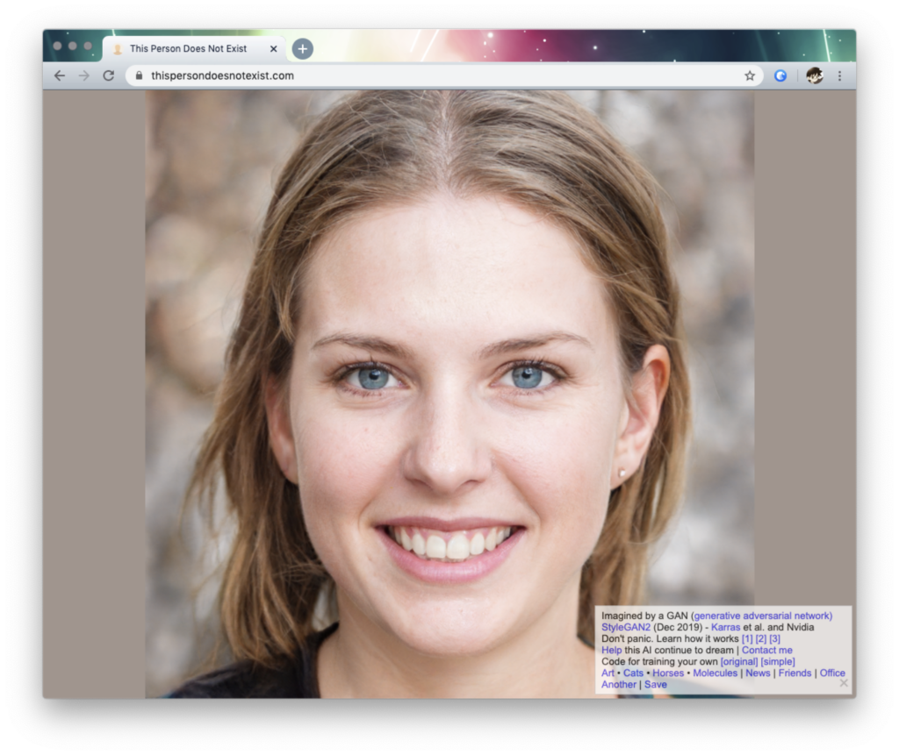

thispersondoesnotexist.com

不过这个网站生成的多是欧美人，对国内的产品来讲，反而各种违和。我更喜欢使用日系的动漫捏脸网站来做，比如 [charat.me](https://charat.me/) 这个网站。

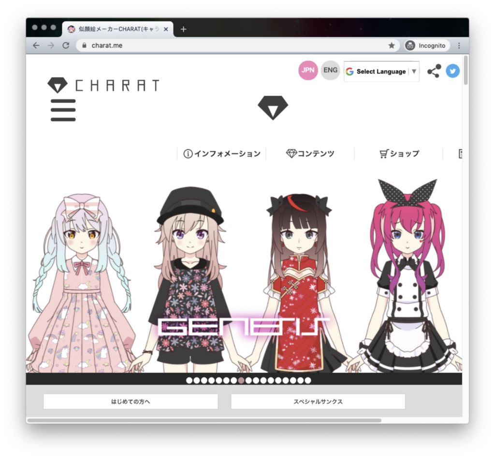

charat.me

### 最终的用户画像

有了头像，再配上角色的说明和需求关键字，我们就有了一个简单好用的用户画像。下边是我们制作好的三个画像：

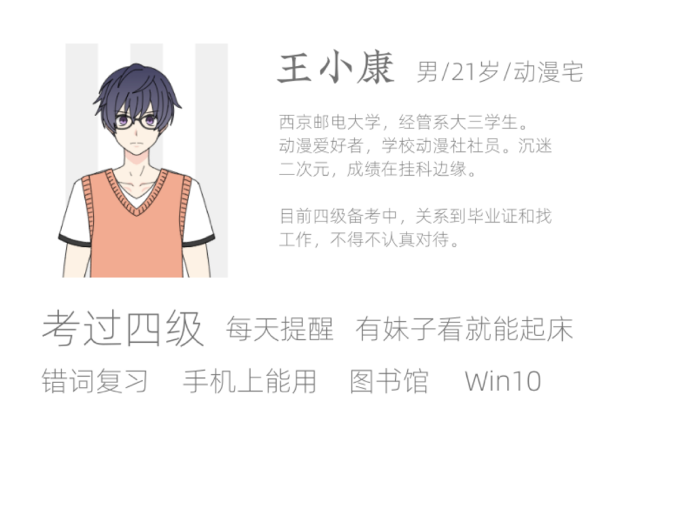

用户画像：王小康

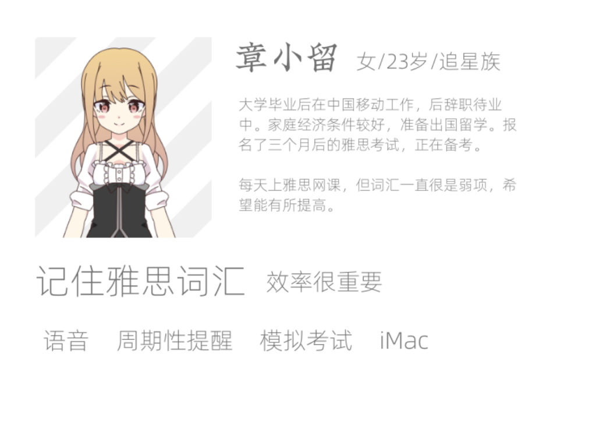

用户画像：章小留

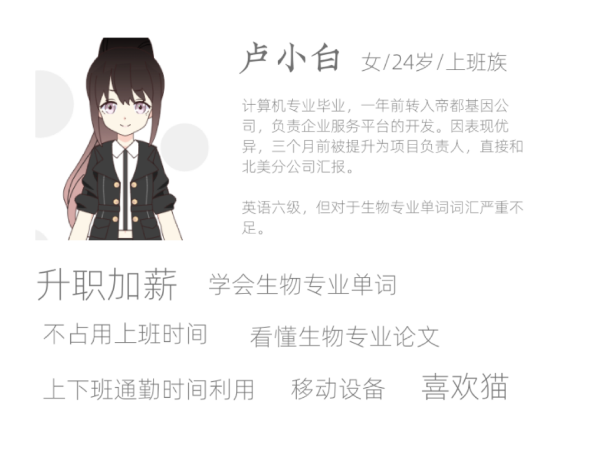

用户画像：卢小白

第三步：画像→场景→功能和分期
---------------

### 使用场景分析

有了栩栩如生的用户画像，我们就可以从画像想象出场景，再由场景梳理出功能列表并进行分期。下边我们就具体来看下怎么分析使用场景。

#### 王小康的使用场景分析

首先是王小康的使用场景，包括在学生宿舍、在图书馆以及在课堂上。

在宿舍，他每天晚上八点到九点使用台式机。因为宿舍比较吵，他会戴着耳机学习。这时候他使用的是外接键盘。

晚上睡觉之前，他还会窝在被窝里玩一会儿手机，时间大概是晚上十一点半到十二点，也就是睡觉前的半个小时，这时候的使用场景就是用手机背单词。

图书馆也是一个典型场景，因为在这个环境里边，需要保持安静。所以你要么戴耳机，要么将设备调成静音。王小康一般是下午三点到五点去图书馆自习，这个时候他使用的是笔记本电脑和 iPad 。

需要注意的是使用 iPad 的时候是没有键盘的，所以在输入上面没有使用外接键盘方便，整体输入速度会下降很多。

图书馆和学生宿舍是两个相当不同的场景。宿舍里很可能有室友在玩游戏或者聊天，很容易分心，甚至连背单词这件事都很容易忘掉，所以我们需要有提醒。

相对而言，图书馆就是安静的沉浸式环境，没有人来打扰你，大家都在忙着学自己的东西。

#### 章小留的使用场景分析

下面我们来做章小留的场景分析。

她现在辞职在家，完全是备考的状态。每天上午会在家学网课、或者去线下的培训班学习，下午会在家学词汇。晚上的话，可能要看韩剧。

主要场景在学词汇的下午。因为是在家里边，她使用的是台式机，鼠标和键盘都是外接的。每天早上起床的时候可能也需要复习一下。

所以她的两个主要使用场景是使用电脑学习，以及早上起床时用手机进行复习。

实际上，这个场景和王小康在晚上用手机复习的场景非常类似，可以都写上，最后进行功能合并时，重复的内容会被合并掉。

同时，因为这两个用户都是在备考，所以他们其实还有「考试复习」这个特殊场景。

在这个场景里，它的词库是有范围的，不一定是整个词库。而背单词的时候，需要有一个考试模式，限时答题，并给出得分。这些需求我们不一定都要通过福利单词这个产品来满足，但可以先写下来。

#### 卢小白的使用场景分析

小白是上班族，所以学习时间是非常有限的，主要是在上下班通勤的时候学习，以及在周末的时候有一点空余时间。

通勤场景一般会在地铁上。运气好的时候就有座位，运气不好的时候还需要站立着。这时候她会使用手机和耳机来学习。

因为她的词汇学习主要是为了工作需要，所以在工作的时候可能还会有查词的需求，可以通过词典软件解决，但是她可能会想把生词加入到福利单词来记忆。

大部分时间地铁里是很挤的，有时候需要一个手扶住上面的吊环或者旁边的柱子，所以小白可能需要单手操作。

另外要意识到小白只是一个典型代表，她需要的是生物类的词汇，但是其他的上班族需要的词汇可能会覆盖各行各业，这部分的词库需要通过自定义词库来解决。

同时，小白很喜欢宠物，当她看见可爱的喵星人时，很可能希望将这个图片保存到相册。这里如果再结合到我们上面的考试模式的话，其实可以做得更游戏化一些。比如说我们可以加入一个图鉴，就是一个画册，里边有每一个单词对应的图。只有你对这个单词达到一定的熟练度以后，才能在里边看见。大体上这就是小白的使用场景。

### 从场景到功能

现在我们三个用户画像的使用场景已经分析完了。接下来，我们就可以根据场景来确定功能了。也就是说，为了满足这些场景下的需求，我们在产品上需要提供哪些功能来支撑。

在确定功能的时候，有两类需要特别注意。一类是核心功能，没有它，所有画像都没法使用我们的产品。另一类是边界功能，没有它，某一个画像就没法使用我们的产品。核心功能是交集、边界功能是并集。

我们会根据画像的设定，将一些边界功能分配给他们。比如说，为什么卢小白她就会想保存图片到相册，章小留就不会呢？事实上章小留也会，但我们不需要把一个边界功能重复分配，因为最终都会覆盖到。

画像需要注意的是它特有的场景，比如考试模式是备考生的特有场景。对于不考试的同学来说有没有都无所谓，但是对考试的同学是非常有用的。

我们把边界功能标记出来以后，就可以框定一个大体的功能范围。

比如说，章小留使用的是苹果台式机，这就要PC版需要同时支持 Windows 和 Mac 两个操作系统。路小白上下班通勤的时候是单手操作，我们在手机上设计浮动键盘时，就要考虑到小屏幕手机上26键的全键盘单手时容易按错的问题。

对于卢小白来讲，她的空余时间不多，所以可能还会利用家务和健身的时间，这个时候如果她想复习单词，可能还有一个语音播报的需求。

章小留是追星族，那她在网上看韩剧的时候，会顺便把喜欢的偶像的图片给保存下来，制作成词库，甚至还会分享给同好。

这些都是边界功能。在早期设计的时候，可以先不考虑工期、开发量这些很现实的问题，我们可以先把它放进来思考，至于做不做、什么时候做，那是以后的事情。

我们要做的东西在早期应该尽可能的少，但是思考的范围却应该尽可能的广。我们是把很多东西都想明白了以后，选其中最核心的、最重要的来做。而不是说很多东西我压根就不想，只做眼前看到的那一丁点就开始做了。这样到项目中期，就会出现很多思考上的盲点，这些盲点甚至会导致我们的项目重做，所以需要尽可能避免。

#### [通过思维导图梳理功能](http://r.ftqq.com/lean-side-bussiness/040305.html#%E9%80%9A%E8%BF%87%E6%80%9D%E7%BB%B4%E5%AF%BC%E5%9B%BE%E6%A2%B3%E7%90%86%E5%8A%9F%E8%83%BD)

我们可以通过思维导图软件来梳理功能。

想象一下新用户从什么地方开始使用我们的软件，跟着他的使用流程来同步构建功能。

比如说，首先会需要有一个用户系统，这样我们才能识别用户。接着我们肯定需要有词库，不然就没有单词可以背了。我们肯定也需要有单词的背诵、管理，如果我们要收费的话，肯定还需要有支付。

用户系统里边，我们考虑使用微信登入，这是目前最简单的办法，不用做用户系统、也不用做密码找回。有了登入肯定也得有退出。

有了用户系统以后我们就可以保存用户背单词的进度了。在词库这边呢，既然我们要做一个可切换和自定义的词库，那肯定会有一个列表。

这个列表，首先是会有一个官方的或者叫内置的，然后我们在建立一个本地的列表，给自定义词库用的。

自定义词库这边，我们可能还需要给提供一个工具来制作词库。我们需要有一个单词表、需要生成对应的音频、需要有对应的解释，以及我们背单词的时候看的图片。这是词库的大体功能。

如果我们要做图鉴的话，就需要有词库的完成度数据。就是用户背了词库里面百分之多少的单词、以及对每一个单词的熟练度。在这个基础上我们还需要有一个相册，用来欣赏高清图片。

自定义词库制作完成以后，它还需要有一个分享方式。我们可以允许用户通过二维码分享，其他的用户通过二维码扫码导入。

接下来，我们来看背单词的功能。

首先它需要有一个地方来输入字母，我们会根据输入的字母动态地进行遮罩的调整。然后我们需要把用户输入的时间或者错误的次数统计起来，这代表着对这个单词的熟练程度。我们也还需要有一些辅助按钮，用来显示单词的意思、以及跳过不会的单词。

在最后，当正确地输入了单词以后，我们需要显示一个高清图片，让用户可以很完整地看见这张图片，这是对其的奖励。

另外我们也需要把用户的背单词成绩记录下来，为了能更清楚地看见这个成绩，可能还需要提供一个进度统计，告诉用户背了词库里面的百分之多少，各自的熟练度是多少。

还有支付部分别忘了。首先我们要显示可以付费的商品，当点击购买按钮以后，要把微信支付给呼叫起来。在微信支付完成以后，要进行确认。同时我们也需要维护一个订单列表来进行售后和退款。

### 分期

确定好功能表以后，接下来就可以进行分期了。

#### 功能分期

最常见的流程这里其实是设计MVP而非第一版，但设计方式一致，因此我们选择相对复杂的演示。

因为我们现在的功能实际上已经非常多了，必须要把它分成不同的阶段来做。最小可行产品不太典型，这里我们以 PMF 验证完成后的第一个版本为例，来选择第一期的内容。第二期就是「以后再做」的功能，第三期就是「不知道啥时候做」的功能。

来看我们的功能列表：

-   推送提醒：可以放到第一期。但为了实现推送，需要有消息系统。如果要做定时提醒的话，还需要做设置界面。因为用户设置过提醒以后，可能有一天不需要了，要能及时取消，不然天天推送还挺烦人的。
-   考试模式：放到第二期。虽然对备考生很重要，但是因为整个开发量比较大，在挣钱之前可以先不做。
-   虚拟键盘：放到第一期。为了支持单手操作，我们需要给背单词的界面添加在移动设备上的键盘界面。不同输入法的键盘可能会导致兼容性问题，所以我们直接通过一个虚拟键盘来解决它。
-   自定义词库分享：放到第二期。
-   图鉴模式：放到第二期，也可能是第三期。
-   语音回放：放到第二期。

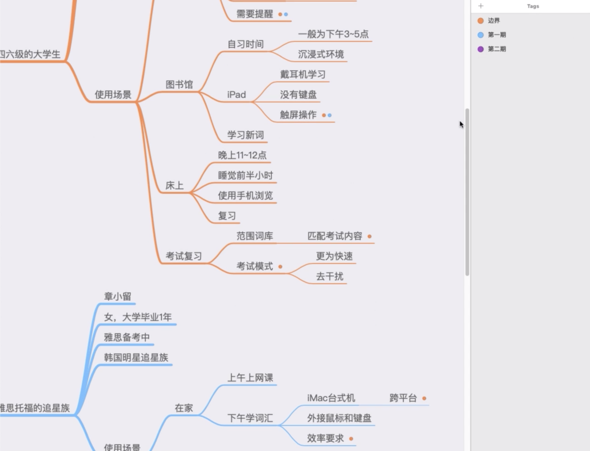

使用思维导图构建功能列表

确定分期的时候，也要同时检查功能点是否都对应上了。比如支付里面，我们需要把「微信支付的对接」加上。

### 功能归类到界面

确定好某一期的功能列表后，可以把各个功能归类到界面里。新建一个思维导图，写上显而易见的各个界面，然后把功能放到界面下去。

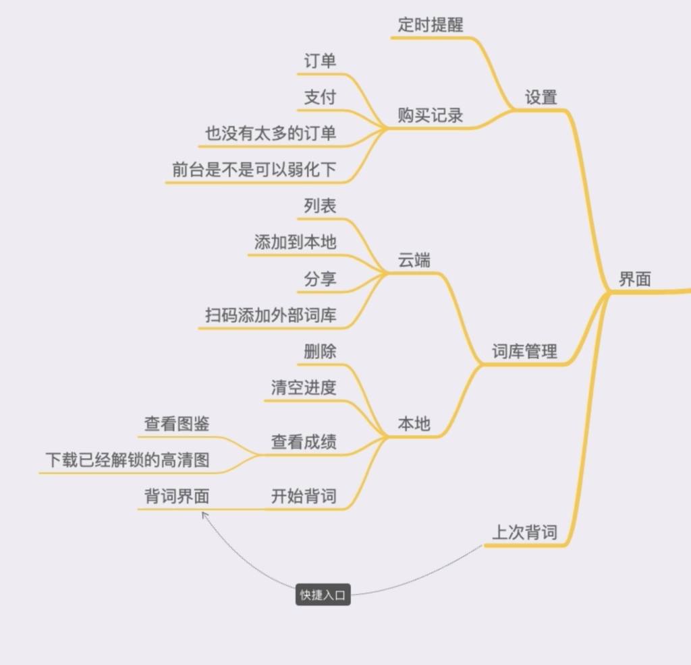

将功能归类到界面

如果发现有功能没有界面放，恭喜你提前发现了做丢的界面，赶紧把这个界面也加进去吧。

这一步完成以后，我们就可以开始进入设计阶段了。

第四步：产品设计
--------

推荐使用矢量原型软件来设计界面，常用的包括AdobeXD、Sketch、Figma和开源的Penpot。本文以XD为例，但各个软件使用起来大致方式类似，可以触类旁通。

### 什么是 Adobe XD

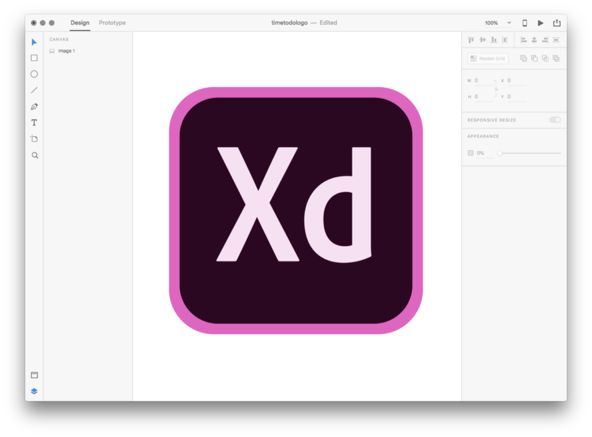

AdobeXD

Adobe XD是由 Adobe 开发的矢量设计工具，它和 Sketch 类似，既可以用来绘制矢量界面，又包含原型设计功能，还可以在手机上预览设计好的界面。XD 支持 Windows 和 Mac，是 Adobe 为数不多的可以免费使用的软件（当然你可以付费升级 pro 版本）。

Adobe之前准备收购Figma，于是放弃了XD的更新，但后来又收购失败。当下建议使用Figma或者开源的Penpot。

### 使用 Adobe XD 设计简单界面

软件的使用主要还是靠大家勤学多练，这里我们和大家演示下如何用它来设计背单词界面。

#### 理解画板

首先，我们在 XD 里新建一个画板（art board）。

画板是什么？它相当于 Word 里边的页面。一般的纯设计工具没有画板这个概念，但 XD 也包含了原型功能，有时候我们需要在多个界面之间来回切换，而一个画板往往就是一个界面。

点击左侧的菜单里面倒数第2个画板的按钮，

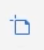

画板按钮

这时候在屏幕最右边就会出来一系列预置的画板尺寸。

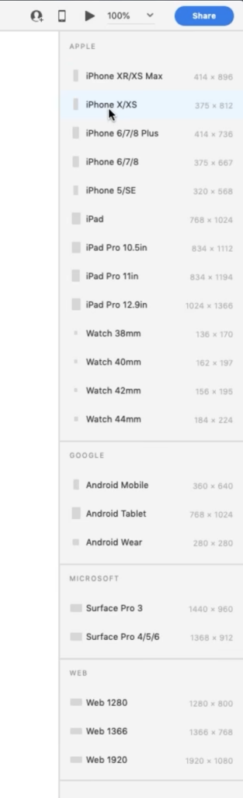

画板预设

它已经帮我们准备好了常用的规格，比如苹果的iPhone、iPad，谷歌的安卓机型，以及网页常见的尺寸。

我们只要从里边选择对应的尺寸就好了，当然也可以不选择它给你预置的，直接手工拖拽来画或者在属性里面调整画板的宽和高。那我们就新建一个iPhone Xs尺寸的画板好了。

然后按住 CTRL或者CMD + D，就可以直接复制画板。我们把第一个画板叫做背单词界面，然后开始设计。

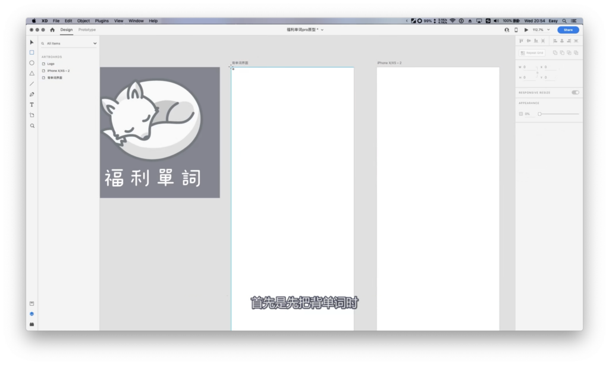

复制画板

#### 遮罩的制作

先来制作背单词时，字母没有输入完时显示的遮罩效果。选择左侧工具栏中的矩形 

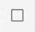

矩形工具\
工具，画出一个覆盖全部画板的长方形。然后调节填充颜色为黑色，透明度为 30%。

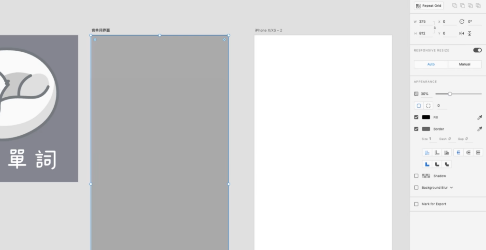

遮罩的制作

然后我们到 unsplash.com 这个无版权网站上，找一只猫的图片，把它也放进来。

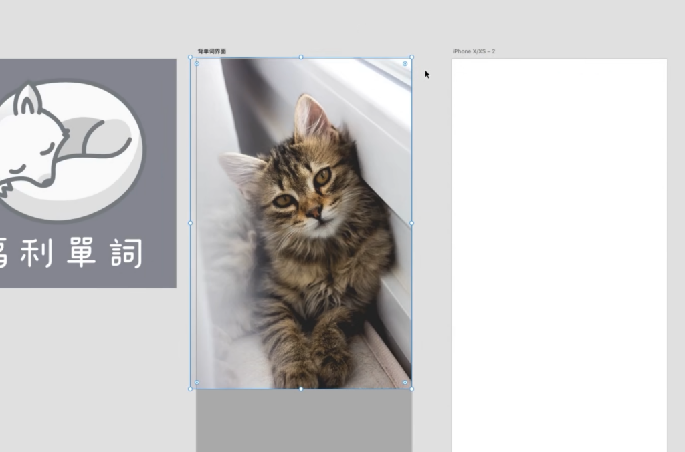

添加猫图

这时候猫是在遮罩上方的，所以它挡住了遮罩。

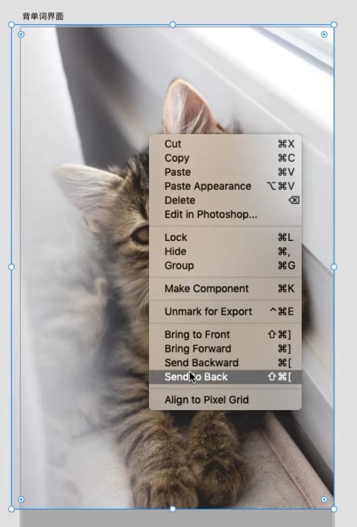

调整图层顺序

点击右键，选择「Send to back」将它放到遮罩后，我们就可以看到被半透明遮罩挡住的猫了。

#### 单词释义和输入框

接下来，在遮罩上边，我们来放上单词释义和输入框。点击最左侧工具栏中的

文字工具\
图标，切换到文字工具。

然后输入文字释义。

添加文字

在右侧的属性面板里，我们可以调节文字的字体、大小、颜色和对齐。

然后我们放上之前设计好的 Logo，加上单词输入框。

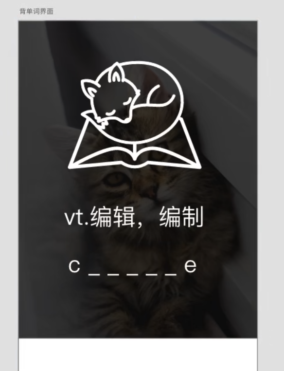

添加单词输入框

注意这个输入框不一定非要是「框」，比如我们这里也可以把它做成下划线。

#### 虚拟键盘

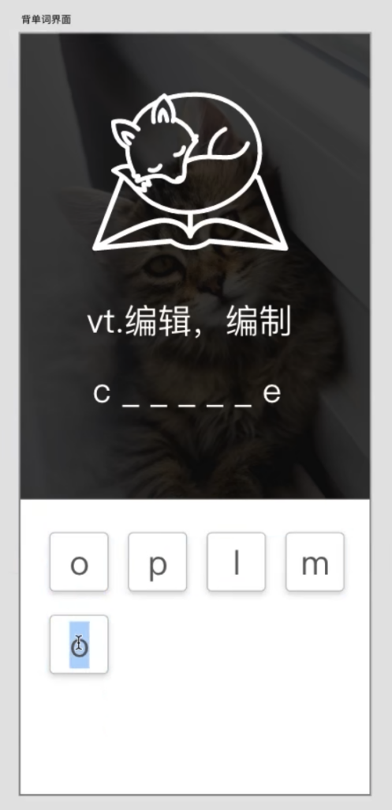

虚拟键盘

虚拟键盘的制作在 XD 中也很简单，直接用矩形工具绘制就行。需要注意的是圆角的做法。

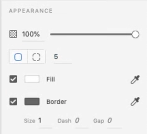

圆角的设置

其实很简单，在右侧的属性设置里边，把圆角从0 改为 5 就可以了。在做好一个按钮后，我们可以按住 Shift 同时选中按钮和上边的文字，在右键菜单中将其编组（Group）；然后按 CTRL或者CMD + D 就可以复制按钮。

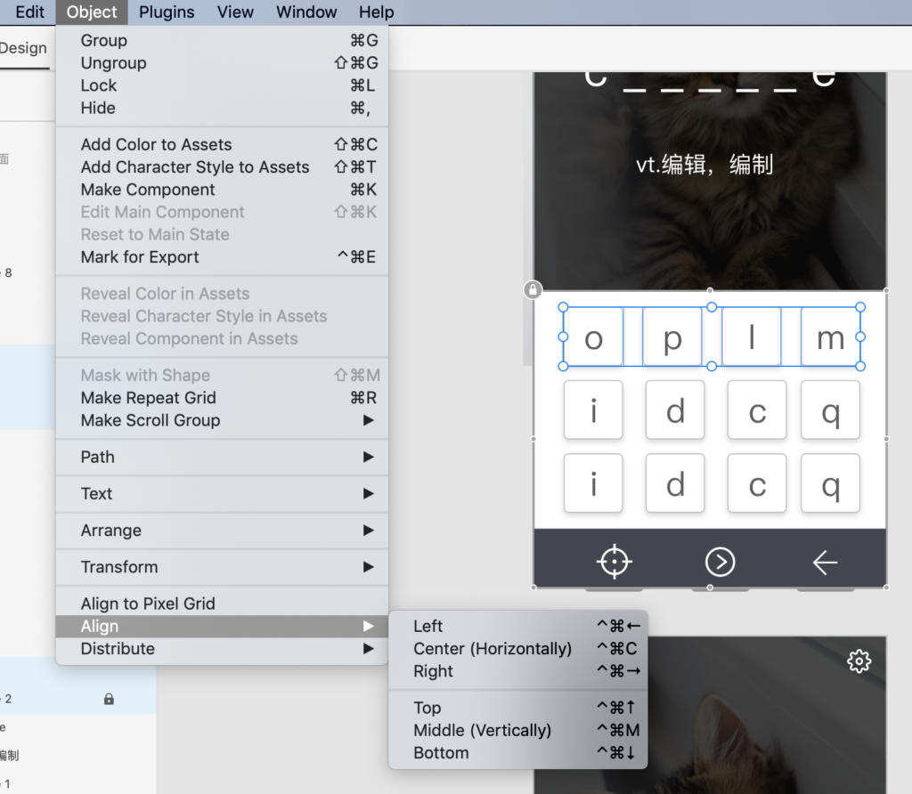

批量分布和对齐

当按钮多起来之后，要对齐它们还挺费事的。其实选中多个按钮后，可以在菜单 Object → Align 中来自动对齐；也可以在 Object → Distribute 中让它们自动均匀分布。

#### 矢量图标

再下来，我们需要在界面中引入图标。既然是矢量界面，当然是矢量图标最好。前边我们已经介绍过 thenounproject.com 了，它还为 pro 用户提供了一个客户端。在这个客户端里边可以非常方便的复制图标。

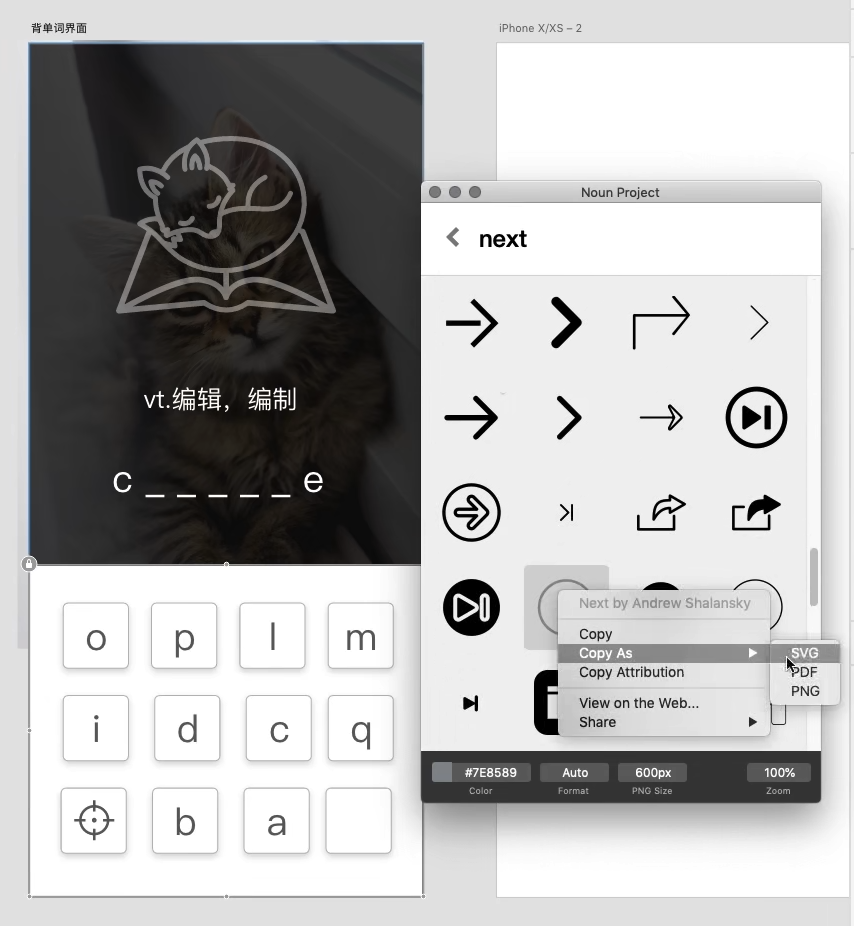

矢量图标

当我们通过关键字搜索到图标后，可以通过下载并将其拖拽到 XD 的方式引入；也可以直接在客户端中右键选择 Copy as SVG，然后直接粘贴。因为是 SVG 格式，调整完大小后可以很方便地更换颜色。

最后我们再微调一下输入框和单词释义的位置，背单词界面就做完了。其他界面的制作非常类似，就不在这里累述了。

后续步骤：产品开发、众筹、迭代开发
-----------------

完成产品设计以后（第一版一般是MVP设计），我们就可以进入开发了。注意，对MVP来讲，产品设计和产品开发不是必须的，而且是应该在能验证需求的前提下尽可能避免的。只有无法通过图文说明、视频演示等办法展现产品特性，也无法通过开源软件快速搭建时，才进行产品级别的MVP的开发。

准备好MVP后，我们就可以通过众筹来验证需求和最基本的营销能力了。当众筹达标，我们才进入下一步的迭代开发。反之，则回到价值主张部分重新优化或者转型。
