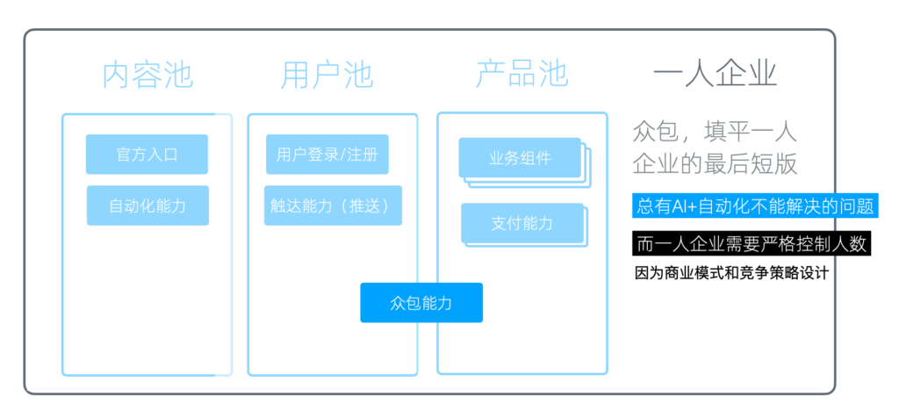
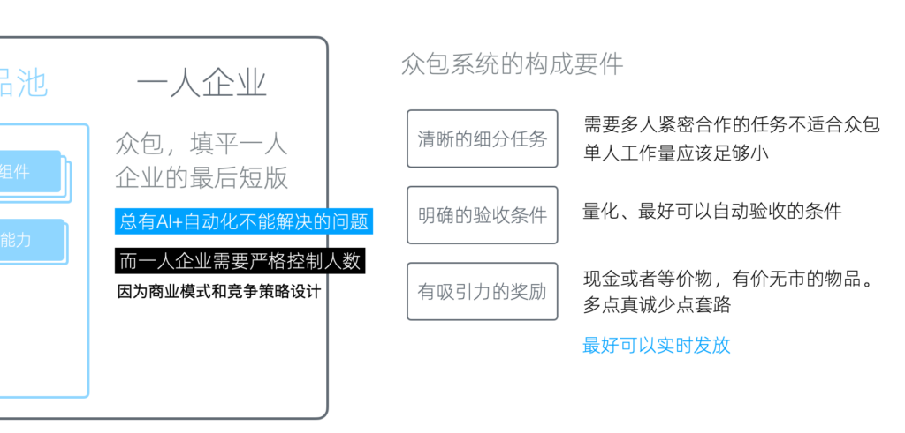

# 众包能力

最后还有一个基于产品池和用户池之上的、非常重要的能力 ------ 众包能力。

为什么需要众包
-------

对于一人企业来说，这个能力至关重要，因为我们需要严格控制人数。这是由于我们的商业模式和竞争策略都是按照这个设计的。

我们在很多策略中都提到，由于人数较少，我们可以专注于非常垂直的小市场。即使获得的利润相对于大公司来说较少，但因为人数少，所以人均高，这就成了我们商业模式和竞争策略的基础。如果我们有很多人，那么这种优势就不存在了。

我们现在可以通过AI和自动化处理很多事情，但总有一些问题是它们无法解决的，需要由人来解决。这就形成了一个基本矛盾。虽然在我们起步的阶段这个矛盾不会太明显，但随着业务量增加，它会日益明显。

为了解决这个矛盾，我们需要拥有众包的能力。简单来说，众包就是将任务分包给很多人，通常是我们产品的用户。在这种方式下，我们不需要雇佣员工，所以员工数量不会增加，可以很好地满足我们一人企业在规模上面的要求。

众包能力在基础设施中的位置和重要性

众包能力的构成要件
---------

这个方案听起来很理想，但实际操作中有很多需要注意的细节。

首先，并不是所有的任务都可以众包，它们需要非常明确，而我们分包给的任务执行者需要具备相应的能力、时间和意愿。所以总体来讲，我们需要处理掉所有自己、自动化和AI能处理的事情，最后将处理不了的部分拿出来进行众包。

众包系统的构成要件

众包系统的构成要件包括几个方面。

### 清晰的细分任务

首先，要有一个清晰的细分任务。不能将一整块任务扔出去，这样完不成的风险很高，沟通成本也高。需要多人紧密合作的任务也不适合直接众包。我们需要将任务分得特别细，无需沟通就可以直接执行。

例如，如果我们要翻译我们的整个网站，我们可以将要翻译的内容全部拆成单句，然后发给我们的用户。每一个用户只需要翻译这一句，然后提交。我们会对比两到三个人的翻译结果，然后从中选择一个较好的。而选择结果的任务又可以作为一个独立任务，再次通过众包系统分发下去。采用类似于这样的逐步分拆的方式，使每一个细分任务都足够明确。

另外，单人的工作量应该足够小。因为众包与外包不同，众包是任务执行人在业余时间来做这个事情，所以他的时间和精力都是非常不可控和不可知的。我们需要将承担的工作量变得足够小，然后执行任务的人足够多，这样我们才可以更好地进行控制质量和风险。

### 明确的验收条件

第二，是一个明确的验收条件。其核心是量化，即这个任务是否完成，完成的好不好，要有一个量化的标准。最好可以自动验收。

自动验收的最大优点在于，一旦验收完成，我们就可以实时发送奖励。这样对任务执行人的激励效果会放大，不但会刺激他继续来做众包任务，甚至还会推动他邀请自己的朋友来参与。

### 有吸引力的奖励

最后，有吸引力的奖励也非常重要。

现在各个APP里面的邀请任务已经非常多了，套路已经被用烂了，产生「吸引力」就很难。

我们发现依然有吸引力的奖励首先是现金或等价物，比如说京东购物卡；然后是与业务相关的一些有价无市的物品，比如说像我们设计的 NodeJS 实体包，这个现在已经买不到了。如果把它作为奖品的话，我觉得还是对我们的目标人群是很有吸引力的。总的来说，在奖励上，要多一点真诚，少一点套路。

发放时机刚才已经说过了，最理想的方式是实时发放，因为它可以在任务执行过程中就把激励循环转起来，最后获得的效果会好很多。

众包系统
----

那么，要完成众包，我们需要什么样的支持系统？

这取决于我们是否要自动判定验收条件，因为不同的任务的验收条件是完全不同的。

如果要自动判定，我们就需要各种垂直细分的专用系统。比如，像裂变和推荐返现就是非常典型的垂直众包。这个场景被单独拿出来优化运行，甚至现在大家都不觉得它算众包了。

但它本质上就是一种众包。我们可以回过头来看它的这几个要件：

1.  首先，它有一个清晰细分的任务。给你一个链接，你通过这个链接邀请用户来。
2.  然后，它的验收条件也非常明确，用户带着邀请码注册，系统直接就能识别到。
3.  最后奖励也是实时的发放的，一旦发现任务完成以后，立刻发送奖励，很多系统微信上立马就可以收到现金。

所以，众包不一定是一个独立系统，它也可以是一个垂直的功能。

如果接受人工验收，那么我们可以有一些更通用的方案。

比如论坛加积分商城。网龄稍微大一点的同学可能用过，基本流程就是，你可以在论坛发布任务，然后把积分悬赏放上去，然后其他人完成任务以后，你去结帖，然后积分就会转让给他。同时论坛本身提供一个积分商城来做奖励的兑换。当然，现在论坛的这个产品形态已经用得非常少了，但是类似的机制依然运行得很好。

如果你使用WordPress，它有一些现成的商业的威客插件。安装以后，可以为 WordPress 添加类似的任务发布、领取、验收、积分/现金结算的功能。