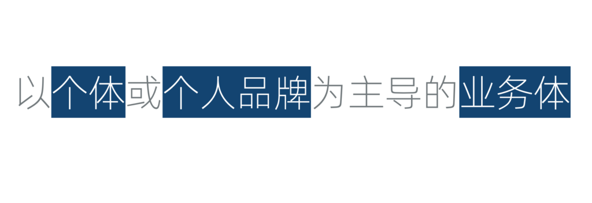
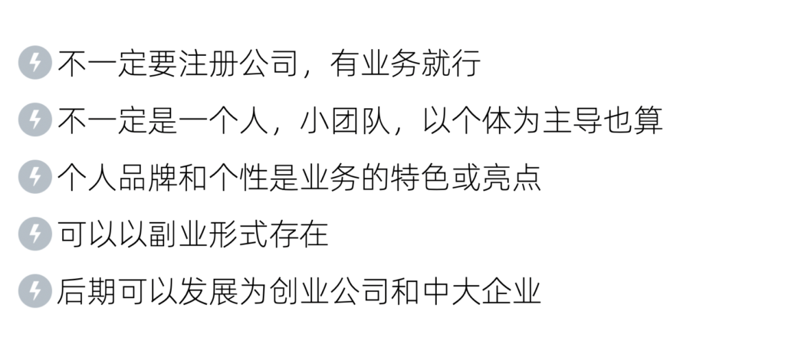
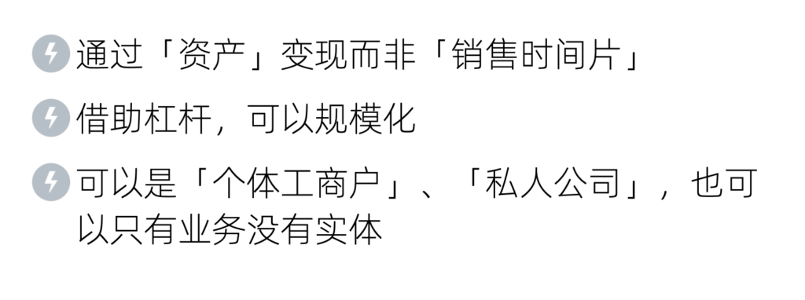
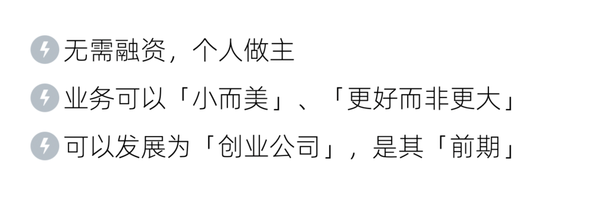
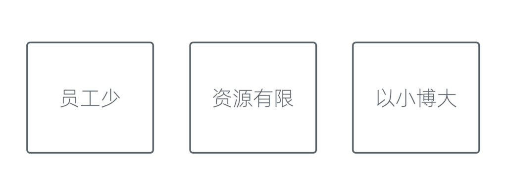
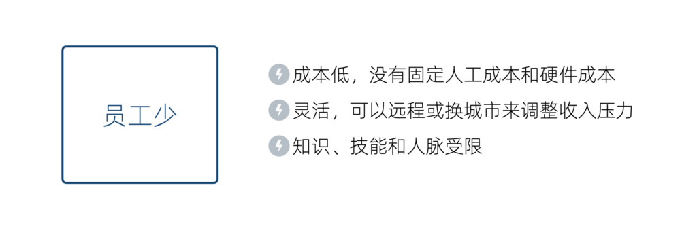
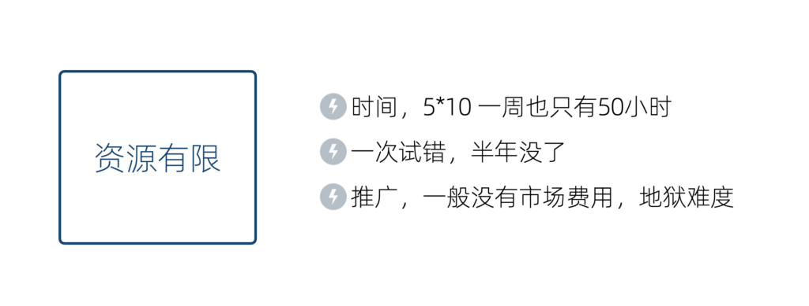
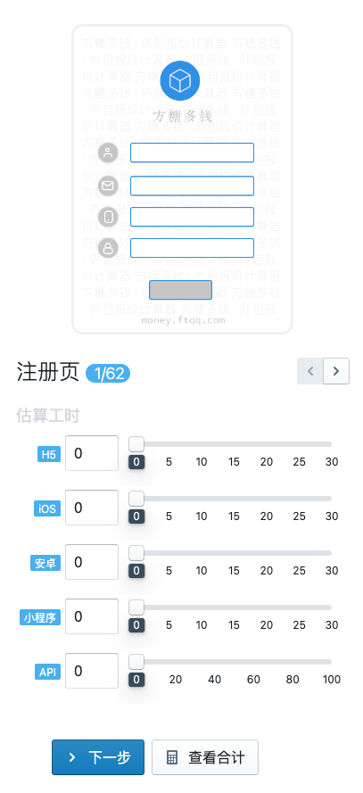
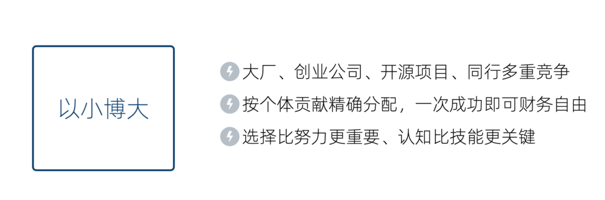

# 一人企业的定义

什么是一人企业
-------

首先，我们来谈谈什么是一人企业。

### 一人企业的定义

在这里，我想给出一个我自己的定义：「一人企业是以个体或个人品牌为主导的业务体」。

什么是一人企业

之所以选择称之为「业务体」，而非「公司」，是因为存在一个普遍的误解，即许多人认为必须要注册一家公司。尽管后来我将其称之为「企业」，这种误解仍旧存在。

一人企业的基本定义

实际上，一人企业是一个业务体，这意味着并非非要注册公司，只要你有业务即可。同时，它以个体或个人品牌为主导，并不意味着必须是单人运作，小团队同样适用，只要是以个体为主导就行。此外，个人品牌的个性和独特的个人IP是这种业务模式的特色或亮点。它还可以、甚至更多地作为副业存在。

那么，如果某人不想做一人企业或从事副业，学习这一模式是否还有意义呢？实际上，我认为这依然非常有意义。

因为你可以将其视为创业公司或中大型企业的初期阶段。毕竟，不可能一开始就成为一个中大型企业，一切总是从小处开始。一人企业提供了一个非常好的起点。当然，创业公司也是一个很好的起点，但前提是你能够获得融资。如果你无法获得融资，或者需要为某个目标做大量准备，在这个阶段，一人企业的概念同样是一个非常好的思考工具。

### 一人企业不等于个体工商户

很多人把「一人企业」和「个体户」划上等号，这是不对的。它们有根本上的不同。

一人企业和个体户的区别

一人企业的核心在于通过资产实现变现，而不是简单地出售时间。它依靠杠杆效应实现规模化，在形式上，既可以是个体户，也可以是私人公司，甚至是没有实体业务的组织。关于资产、杠杆和规模化，我们将在后续内容中详细讨论。

### 一人企业不等于创业公司

一人企业和创业公司的区别

接下来，我们来探讨一人企业与创业公司的区别。

最显著的区别在于，一人企业不需要融资，我们可以独立做主。我们的业务可以是「小而美」，追求「更好而非仅仅更大」。

对于已经获得投资的创业公司而言，通常不被允许仅满足于「小而美」，因为风险资本对投资项目的期望是在3到5年内实现至少5到10倍的回报。如果达不到这一目标，投资便被视为失败。但一人企业则不同，它允许存在「小而美」的可能性。

有趣的是，一人企业可以发展成为创业公司的前期阶段。这意味着，是否选择创业完全取决于个人。如果你满足于维持一个稳定的现金流，并不渴望不断扩大规模或与参与竞争，那么你可以选择继续经营一个「小而美」的公司。如果想要大规模发展，那么你也可以在一人企业的基础上进行融资。甚至连什么时候做出这个选择，都可以由你决定。因此，一人企业可以作为创业公司发展的一个前期阶段。

### 定义的意义

当然，这里所述的一人企业定义是本书内的特定定义。

如果你的业务符合这个定义，那么在本书中的内容适配性最好；如果有不符合的地方，比如你是一家创业公司想要应用这套方法论，可能会有60%到70%的内容适用于你的初始阶段。

然而，如果有些内容明显不符合你的公司情况，你就需要自行进行调整。比如说，我们的假设是你只有一个小团队，这意味着你可能只有两三个员工，其中只有一两个是全职的，其他人是兼职或以合同形式工作的。这种模式包括以合作分成或外包的形式与你的核心团队周围的服务提供商或合作伙伴合作。如果这不适用于你的情况，那么你就需要调整我们的一些中间结论。

总之，这套方法论本身是灵活的，你可以根据自己的实际情况进行调整。但是，符合这个定义的比例越大，你需要调整的地方就越少。这就意味着，通过本书提供的视角和工具，你可以为自己的业务或个人品牌构建一个强大的基础，无论是作为一个独立的个体企业主，还是在更大的商业环境中寻求成长和扩展。

另一个方面，即使你完全符合我们的定义，也应该带着质疑精神来阅读本书。因为市场和需求随时都在变动。不过为了提升效率，我们建议先全面了解本方法论及其推论和结论，在第二遍阅读时，再自行推理和验证。

一人企业的特点
-------

在详细讨论一人企业的定义之后，我们来看一下一人企业的特点。

一人企业的特点

它有三个显著的特点：员工数量少，资源有限，以及面对的竞争环境是以小博大。

员工少的优缺点

### 员工数量少

首先，关于员工数量少这一特点，这并不一定是缺点。

#### 成本低

员工少的优势在于成本较低，不存在固定的人工和硬件成本。如果我们只是一个人，可能就会选择在家中工作，从而无需租用办公室或支付水电等办公场地成本。在业务发展顺利时，这些费用可能无足轻重，但在业务遇到困难时，则可能成为骆驼背上的最后一根稻草。没有固定成本，意味着业务上长久的韧性：只要每月的生活费用得到覆盖，我们就能维持生计，业务也能持续下去。

#### 灵活

其次，员工少也使得企业更加灵活。例如，我们可以通过远程工作或更换城市的方式来调整收入压力。如果在北京生活感到不适，完全可以选择搬到其他地方，甚至出国。但是，如果拥有一个团队，这种调整就变得复杂，特别是如果团队需要面对面沟通。相比之下，员工少意味着更高的灵活性。我们经常见到大公司从一个城市搬迁到另一个城市时，会面临大量员工离职的问题，这正是因为缺乏灵活性。

#### 知识、技能、人脉受限

然而，员工数量少也有其缺点，在知识、技能和人脉方面都受到限制。许多专业知识与特定岗位紧密相关，而在一个人的企业中，如果你主要负责开发工作，那么需要补充的知识范围就特别广泛。此外，人脉在商务拓展和销售方面尤其关键。虽然我们可以通过社交网络构建新的人脉关系，但相比那些大公司或创业公司，他们通过直接挖角或与以往合作伙伴建立的联系，拥有的原有人脉网络要丰富得多，这使得他们在谈合作时更加顺利。相对而言，作为一名完全的新人，没有既有人脉的支持，确实会显得更为艰难。

不过幸运的是，GPT和Claude可以极大程度的补全我们的知识树；而通过社交网络，我们可以快速建立新形态的人脉。

### 资源有限

资源有限的优缺点

首先，我们要考虑的一个问题是时间资源的有限性。时间是一人企业中最稀缺的资源。

#### 时间有限，试错半年

以一人公司为例，假设每周工作5天，每天工作10个小时，那么一周便有50个工时。

50个工时意味着什么？举个例子，如果你要制作一个网页并添加细节，可能需要大约10个小时，而这还不包括测试和后期的一些优化工作。也就是说，如果以网站开发为例，一周大约可以完成3-5个页面。简略计算，两个小功能大约就能占用一周的时间。

方糖多钱外包报价计算器

一个题外话，我之前做过一个[外包报价计算器](https://money.ftqq.com/)，但你也可以用来简单估算项目的工时。

因此，如果我们的一个项目以开发周期来进行试错，一次试错可能需要半年时间。这里的试错不仅仅是开发过程，而是从项目立项，到产品设计，再到开发和上线的整个过程。

由于资源非常有限，我们的产品设计和开发不能并行，开发只能依靠我们自己。当然，我们可以聘请兼职帮手，但沟通成本可能会比开发本身的时间成本还要高。大家实际操作一下就会明白我在说什么。

#### 零成本推广，地狱难度开局

接下来，谈谈推广。一般来说，我们不会有太多市场费用。在没有市场费用的情况下进行推广实际上是非常困难的。

我曾经一直思考，为什么很多独立开发者不擅长做推广，而看那些市场总监进行的活动和策划，都显得如此有力度，传播性极好。但后来有过自己创业的亲历以后，我发现那些市场总监确实很有能力，但营销效果也是建立在较大的市场费用基础上的。

在一人企业的起步阶段，通常来说，我们没有太多的资金。如果真的拥有几千万，可能更趋向于以购买而非创造的方式来获得资产。即使将其存入银行，立刻就可以实现财务自由，至少是一种初步的财务自由。因此，对于大多数人来说，推广实际上是在没有市场费用的情况下进行的，这是非常困难的。包括那些在大公司能够做好推广的人，如果没有任何市场费用，他们也会觉得非常困难。

在这种情况下，我们可以尝试通过内容营销或利用自媒体进行推广，但这特别耗时。自传播的产品或许更为有效，在本书的后续，我们也会详细讨论这部分内容。

#### 被迫精简和专注

另一个方面看，资源的有限也会反向推动我们提出更有针对性和吸引力的价值主张、设计出更精简的、更一针见血的产品，反而和那些大而全的产品拉开差距。

### 以小博大

一人企业必须以小博大

那么，第三个特点就是，经营一人企业，必然面临「以小博大」的处境。

#### 多重竞争

很多独立开发者和创业公司都有一种「我弱我有理」的心态；觉得因为自己的弱势身份就理应获得更多的支持。情怀的确可以让用户买几次单，但很难让用户一直买单。从用户和市场的角度来看，绝大部分人比起关心这个产品背后是谁，他们更关心的是提供的产品质量如何，服务是否到位，价格是否合理，性价比是否高。

因此，无论是大型企业、创业公司、开源项目还是我们的同行，都可能是我们的竞争对手，尤其是大型企业和开源项目，它们对独立开发者构成了很强的竞争压力。例如，苹果公司一旦发布新系统或系统的新版本，很多独立开发的小组件就可能被官方功能取代，导致这部分开发者的收入归零。

#### 成功一次即可的游戏

看到这里，你应该已经发现经营一人企业的难度颇大了。的确如此。但这是成功一次即可财务自由的游戏。

对一般人而言，每月10万、一年120万被动收入，足以「财务自由」。虽然这个数字放到个体薪资上看起来很多，但能做到月盈利超过10万的小企业遍地都是。而一人企业的另一个特点就是，它能根据个体的贡献来进行精确分配收益 ------ 因为员工就一个人。换句话说就是，企业挣的都是你的。

即使你在大厂打工，即便公司非常成功，如果你不是高管、如果没有赶上企业上市或爆发期、或者没能持有相当数量的公司期权或股票，那么最终折算下来月收入超过10万的并不多，高额收益仅限于极少数人。

尤其在个体崛起的现在，大厂原有的贡献衡量体系已经落后了。董明珠与其助理、东方甄选及其主播的之间的矛盾不是偶然的。大厂不是不知道贡献衡量体系有问题，而是它们想要的就是螺丝钉。

而一人企业这个游戏虽然难，但只要屡败屡战、持续优化，总能坚持到成功的那天。这也是我沉迷于此、不可自拔的主要原因。

#### 认知层的竞争

我知道很多读者都觉得自己比其他人优秀、有一些也的确如此。但即便这样，以一人之力和大中企业硬碰硬，还是有种螳臂挡车的既视感。

因为平心而论，大部分的企业都没有航天飞机、芯片和大模型的核心技术作为护城河。而作为一人企业，我们在资源上不占优势。即使我们是技术能力出众的开发者，也难以与大公司顶尖的专家们竞争。更何况，我们不可能将全部时间用到开发上。

所以，四两拨千斤，是因为顺势借力；以小博大，更要讲究方式方法。

一人企业的竞争，有一半都是在认知上。因此，本书专门设置了「规划一人企业」这个模块，尝试从「底层逻辑」、「赛道选择」、「竞争策略」几个方面帮大家进行认知上的强化。
