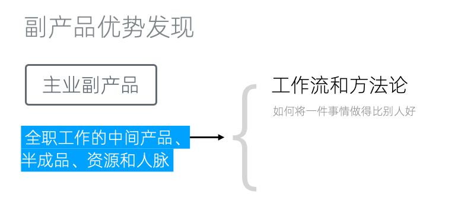
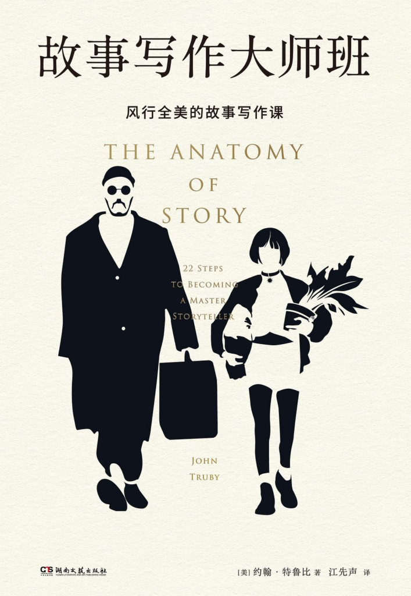
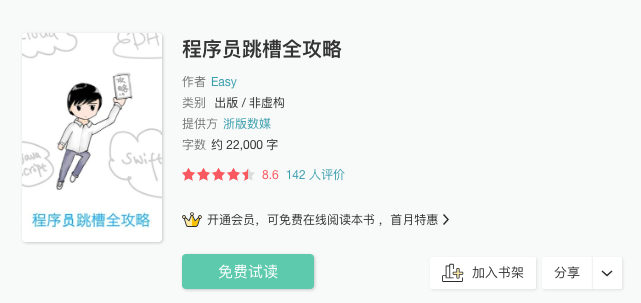
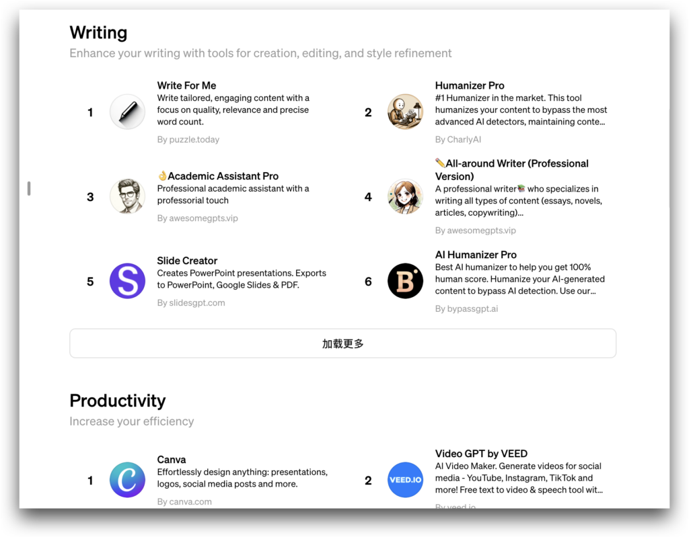
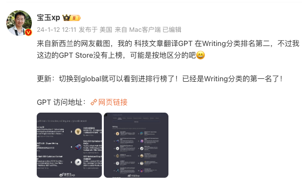
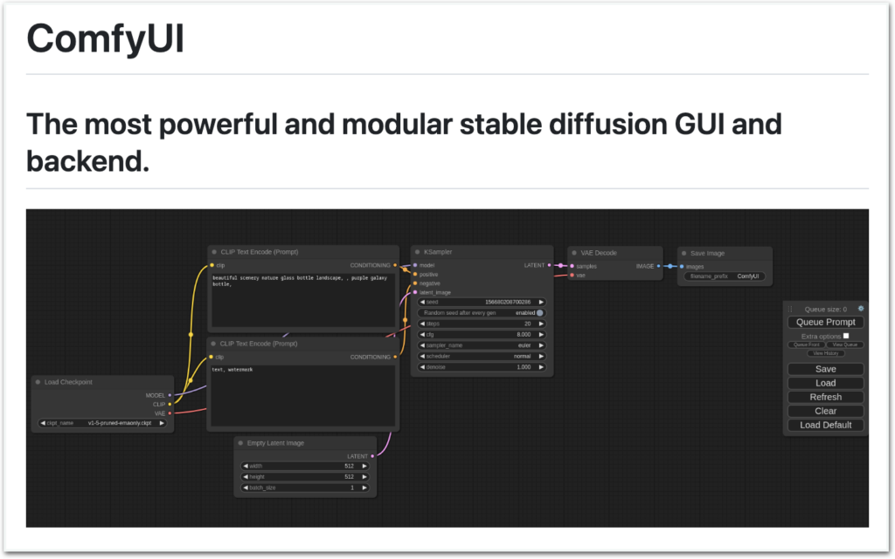
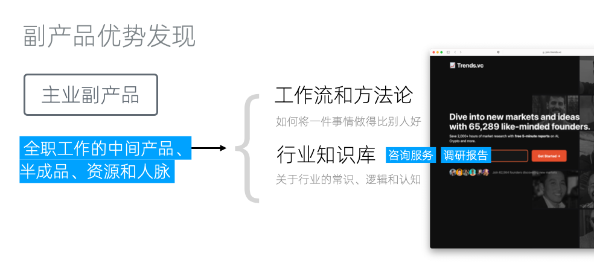
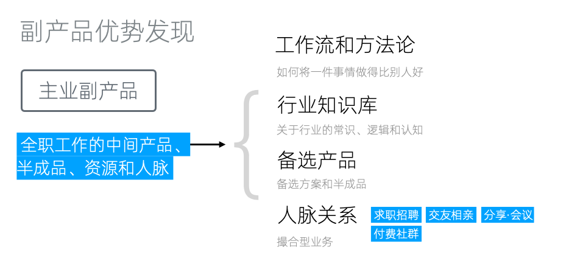
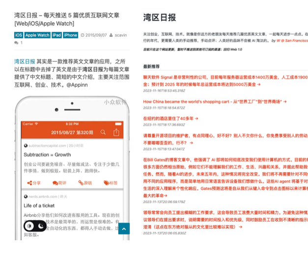
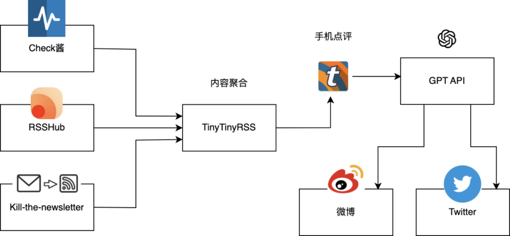

# 优势发现:副产品优势

优势发现与一人业务构建
-----------

初次接触一人企业方法论的读者，可能会觉得「方法论的道理我都懂，但完全不知道如何开始」。这是非常正常的，「好的开始是成功的一半」，尤其对于偏重认知的一人业务，起点更为重要。

因此，我们特地准备了「优势发现」这个专题。它将帮助大家充分分析自己所拥有的资源，找到一个事半功倍的切入点。

首先要讨论的是我们多次强调的「副产品优势」。今天我们将在主业、生活方式、兴趣爱好三个方面对其进行细化。大家在阅读文章时，可以同步地针对自己的具体情况进行分析，说不定就能很快找到切入点。

主业副产品
-----

对于以副业模式运营一人企业的情况，主业消耗了每天绝大部分精力，有些甚至挤占了休息时间。这使得我们能投入的时间变得非常有限，成为放弃的主要原因。

但如果我们能充分发掘主业的副产品，让主业和副业之间形成互补，不仅可以最大化利用我们的时间和资源，还能在一定程度上缓解工作与休息之间的冲突。不仅能够为副业找到独特的切入点，还能通过副业的运营反哺主业，形成一个良性循环。

### 工作流和方法论

主业最大的副产品：工作流和方法论

主业最大的副产品是我们在工作中积累下来的工作流和方法论，换言之，是「如何讲一件事情做得比别人好」的诀窍。这些积累原本就随着我们的职业生涯不断增长，职业发展的主要推动力。在行业中分享这些知识，不但和主业没有冲突，而且是大多数公司鼓励的。

针对工作流和方法论的副产品形式，已经有大量成熟的渠道。

#### 书籍出版

比如书籍出版，不但适合销售方法论，也是获得行业影响力的最佳渠道之一。甚至即使作为译者、也能「大树底下好乘凉」。

《故事写作大师班》

以我最近阅读的《故事写作大师班》为例，它的作者约翰-特鲁比的主业是为迪士尼、索尼、福克斯、BBC和HBO等主要工作室提供故事写作咨询。在「诊断」了超过1800部电影和电视剧本后，作者形成了极为优秀的方法论。

在此基础上，特鲁比开发了剧本写作和类型创作课程（一级副产品），吸引了全球数万名学生，其中许多人后来制作了好莱坞热门电影，并成为《纽约时报》畅销书作者和文学奖得主。而《故事写作大师班》正是这些课程的精华（二级副产品），被翻译为多国语言，畅销十多年。

#### 在线课程

纸版书籍的出版门槛较高，并非每个人都能触及。但是随着互联网技术的发展，电子书和在线课程已经颇为成熟。你完全可以无需他人许可，自己写作并售卖电子书、制作在线课程。

我之前在做独立开发时，经常开着OBS软件录制屏幕，将整个开发过程录制为视频。等到开发完成后，再抽时间剪辑为实战课程。

这里充分利用了独立开发全凭自己做主的特点，不要在为公司办公时做类似的事情，大部分公司应该是禁止的。但你可以把它用到自己的开源项目上。

这个原本只是为了充分利用副产品的举措，后来帮助我度过了全职独立开发时没有收入的那一段时间。我后来又将录制和制作技术教程的方法论做成了[网课变现课](https://stack.ftqq.com/course/detail/5)，实现了复合副产品优势。

网课变现课

#### 电子书

和视频课程相比，电子书的优缺点同样明显：

1.  撰写文章比制作视频课程更为简单，但文字整理更花费时间
2.  同样的内容，制作为电子书和视频课程，用户愿意支付的价格相差五到十倍
3.  更容易被盗版传播
4.  对字数和内容没有硬性要求，更灵活

我2018年时曾出版过一本两万字左右的《[程序员跳槽全攻略](https://read.douban.com/ebook/7611058/)》，定价在一两块钱，累计收益扣完税有6千左右。

关于电子书的正式出版，可以参考我之前写的[《如何通过互联网出版一本小书》](https://github.com/easychen/howto-make-more-money/blob/master/ch11.md)一文中关于[BookDNA](https://www.bookdna.cn/)的介绍，注意因为文章写作时间较早，部分内容可能过时，需要自行确认。

#### 长文

如果累计的经验还不足以构建完整的方法论，可以通过长文分享并获得反馈。单篇长文可能难以获得直接收入，但可以聚集用户，充盈内容池，成为构建自媒体的助力。

#### Custom GPT

以上都是一些较为传统的副产品方式，从2023年开始，AGI开始落地，时代开始变了。现在我们有了一个更优的选择：自定义GPT。

OpenAI在2023年11月推出了Custom GPT，允许用户通过指定提示词、上传文档、添加API作为工具等方式，将通用GPT定制为专用版本。并在 2024年1月10日推出了GPT商店，采用与苹果应用商店类似的商业模式，创作者可以在其中盈利。

GPT Store

经常活跃在微博上的[宝玉XP](https://weibo.com/u/1727858283)老师，经常使用GPT翻译大量科技文章和视频字幕。他将自己的方法论制作为Custom GPT后发布在 GPT 商店，在2024年1月登上了 GPT Store Writing分类的第一名。

科技文章翻译GPT

PS：可以[点这里](https://weibo.com/1727858283/4981299343787589)查看这个GPT的提示词。

#### AI workflow

通常AI产品并不能完成一个完整的工作流，于是出现了各种AI工作流软件。一个典型的例子是ComfyUI，它是一个基于Stable Diffusion的流程工具，可以完整覆盖除了图片生成以外的其他工作流。

ComfyUI

稍后我们应该会看到更多AI工作流软件，我们自己也在研发这个方面的产品。

#### 产品化

最后，产品化也是工作流和方法论作为副产品的一大方向。当你能很好的手动实现某个业务后，你可以逐步将其自动化或者半自动化，最终作为一个服务来售卖。对一人企业而已，这也是《纳瓦尔宝典》中说的「将你自己产品化」。

这个产品不一定是软件，也不一定需要编码。逻辑思维最初只是公众号，后期才发展为得到APP。但如果已有的方式不适合我们的副产品，那我们可以创造一个独有的产品来承载它。

得到APP上有本《得到品控手册》，详细记录了知识产品的方法论，感兴趣的同学可以读读

### 行业知识库

行业知识库

主业中积累的行业知识库可以成为我们宝贵的副产品。它通常包括对行业的基本常识、逻辑和认知。具体的产品形态，通常是咨询服务和调研报告。

以Trenders.vc为例，这些报告本来是独立开发者在开发产品之前为了深入了解市场进行精准分析、把握行业趋势而产生的副产品。但将调研报告转化为一项服务后，Trenders.vc现在已经拥有超过六万的订阅用户。

另外，正如上边我们提到的，在AI时代，我们还可以采取新的方法，例如将知识库转化为聊天机器人。这样，我们可以通过聊天的形式更有效地获取知识。阅读大量的资料确实十分耗时，而聊天机器人能够迅速地根据我们的需求提供所需知识，极大地节省了我们的时间。

咨询AI机器人不但给用户提供了和以往类似的聊天体验，同时还将之前因为一对一服务无法规模化的业务，变成了完全符合新杠杆的「零复制边际成本」的产品。在AGI落地的过程中具有极大的潜力。

### 备选方案和半成品

对设计师和架构师等类似职位来说，主业还会产生很多备选方案和半成品。比如很多设计师都知道，老板和甲方虽然会让做很多个版本，但往往最后会觉得第一稿最好。这中间的数个甚至数十个备选方案，这时候就闲置了。

对架构师也是如此，当我们着手于一个项目时，通常会设计出三到五套技术方案。最终，我们只会选择一套最适合本企业的方案实施。但这并不意味着其他方案缺乏价值。相反，这些未被采用的方案可能正好适合其他企业的需求。因此，它们完全有潜力作为副产品进行市场变现。

不过因为这些副产品和主业密切相关，我们需要严格遵守公司的相关规定。这里有两个处理方案：

#### 公益化

直接将副产品商业化，容易和主业公司发生利益冲突。但如果将其作为免费的公益产品，就从「为自己谋利」变成「为行业发展出力」。对程序员来讲，开源项目就是一个很好的方式。

#### 转换表现形式

另一个处理方案是，转换表现形式，比如将文本产品转为音频或者视频等。这样不但和主业产品有了形态上的区分，还能够增强产品对特定人群的竞争优势。免相互干扰。

### 人脉关系

在传统行业和二三线城市，人脉关系至为重要，甚至是很多人的生存之道。但作为互联网从业者，我们可能会认为，在这个行业里，人脉关系并不是主要资源，大部分的业务还是规则驱动的。但后来我意识到，光是认识的人足够多，就可以成为撮合型业务的基础。

人脉关系的副产品形式

比如说，我们可以提供求职招聘、交友相亲等服务，可以组织会议分享经验。在这些基础上，我们还可以创建付费社群。在这个付费社群里，我们甚至不需要做什么，只需将人和需求聚集在一起，就能赚取收益。这就是人脉关系的魅力所在。

生活方式副产品
-------

生活方式副产品是指，我们日常生活一部分的各种活动，无论我们是否热爱，它们都可能产生副产品。

例如，有些人每天不得不花费一到两个小时在通勤上，这段时间内，他们可能会选择在地铁上刷手机。这种生活方式能够带来的副产品之一就是阅读。

湾区日报

举个例子，湾区日报。最初，这只是一个每天阅读文章，并从中挑选出五篇质量高的文章进行分享的行为，后来，它演变成了一个付费产品，拥有自己的客户端和网站，并获得了良好的口碑。这就是基于生活方式的副产品。

很多生活方式都可以产生副产品，无论是吃饭、做菜、甚至看美女，只要你有良好的美感，说不定都能发展为一个某某精选业务。

### AI优化的Reading as a Service

不过，看起来湾区日报在2023年11月停止更新。其挑战之一在于，尽管文章摘要使用中文，但许多链接的内容都是英文，这对于一些读者来说可能较为困难。湾区日报创建时，人工智能还不够成熟，如果我们现在考虑使用人工智能技术来重构，那么可以将其打造成足够自动化的Reading as a Service。

Reading as a Service

例如，我们可以按上图的方式来组织服务。

首先通过利用Check酱、RSSHub、Kill the newsletter可以随时监测网页、RSS和NewsLetter的更新，并将其转为RSS。然后，我们可以将对接到TinyTinyRss上，并通过它的手机客户端在通勤路上阅读。当阅读到不错的文章时，我们可以添加评论并发布到TinyTinyRss的一个独立Feed中。

我们使用一个定时脚本读取这个Feed，并根据评论内容，调用GPT等AI进行翻译、摘要、总结等处理。最后将处理好的内容自动发布到微博或Twitter上。

这样，我们几乎构建了一个全自动的生活方式副产品生成流程，仅需用户在手机上阅读并进行点评。

兴趣爱好副产品
-------

兴趣爱好副产品和生活方式副产品非常类似，区别只是它来源于兴趣爱好。这里要强调的是，一个反常识的事实时，很多人以为自己有兴趣爱好，但大部分时候都只是叶公好龙，并没有真正在兴趣爱好上投入太多，「玩都玩不专业」。

还有的人可能兴趣爱好很多，但都浅尝辄止，每隔一个月换一个。这种也难以产生优质副产品。如果没有能坚持数年持续投入的兴趣爱好，我们更建议考虑其他副产品。