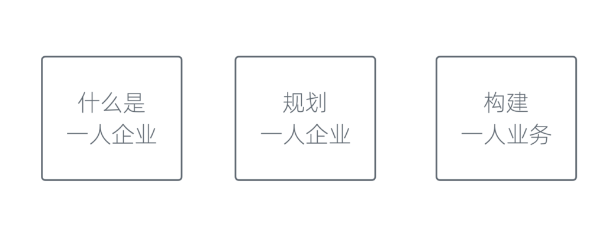
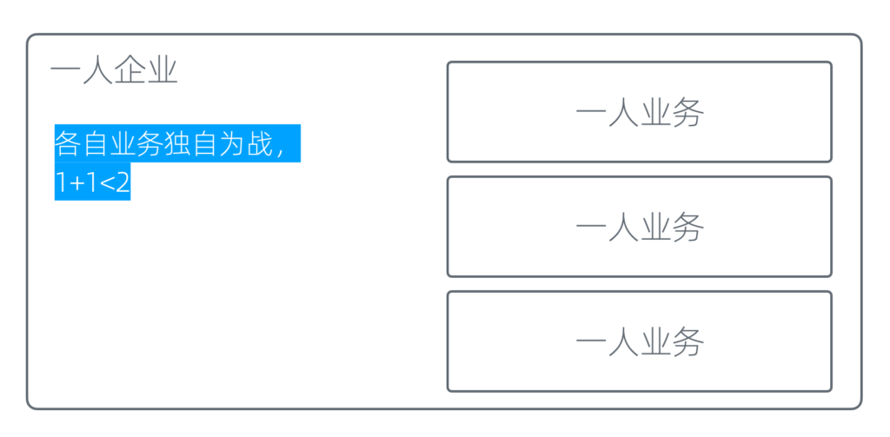
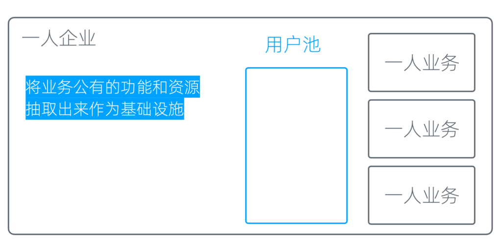
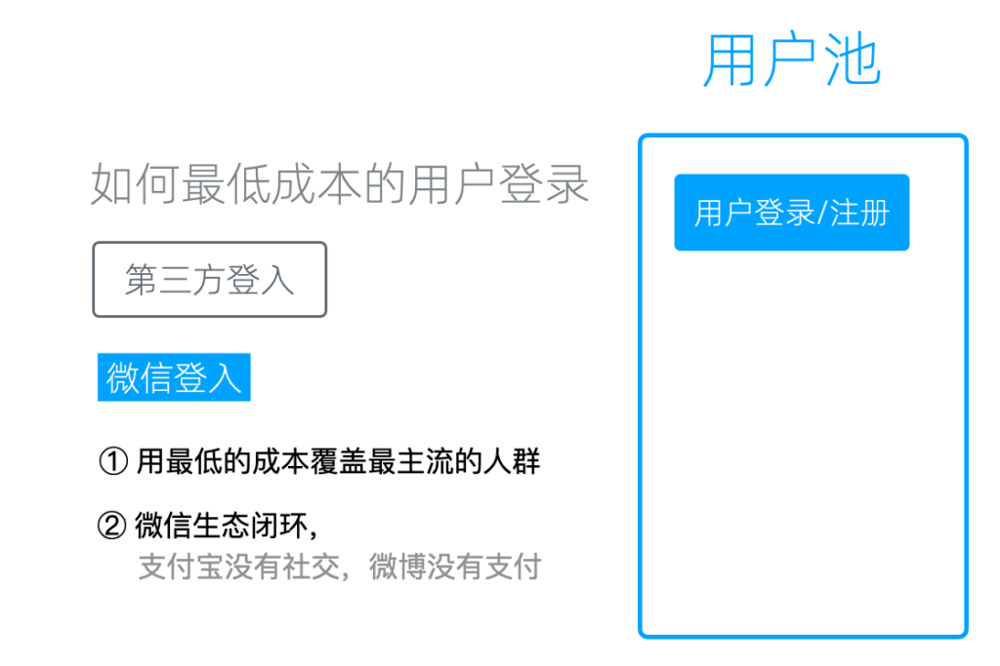
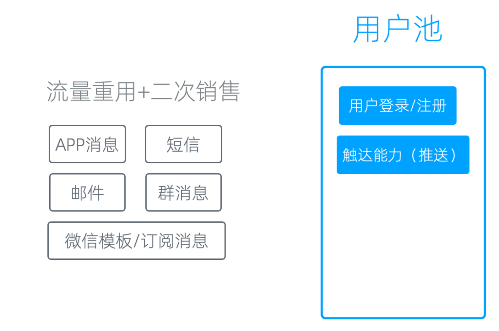

# 用户池和触达能力

什么是基础设施
-------

在一人企业方法论2.0中，我们讲了三个方面。

一人企业方法论的三大内容

第一，什么是一人企业；第二，如何规划一人企业；第三，如何构建一人业务。

前两部分，我们在专栏里之前的文章中讲得已经比较详细，都是理论和认知层次的内容，没有深入到实践中去。到了第三部分，虽然我们知道要构建一人业务，但具体怎么构建、怎么落地、怎么操作，缺乏一个可以看得见摸得着的例子或发力点。

在之前的内容中，我们反复强调，一人企业并不是一人业务。

这是2.0版本和1.0版本最大的区别。一人企业包含了很多个一人业务，只要其中一个业务做起来了，我们就可以实现财务自由。

按照这个说法，一人企业就像图中所示，在一个一人企业里有很多一人业务。

每个业务各自为战

但实际上，一旦按照这个方式操作，你会发现有很多一人业务，但每个业务各自为战，1+1可能连2都达不到，甚至小于2。

因为精力被分散到各个业务上，所以一人业务之间必须要协同。一些公共的功能和资源需要抽取出来，放到一个地方公用，我们称之为基础设施。这就是我们今天要重点讲的内容。

基础设施

用户池
---

首先，我们可以从每一个业务中抽取出来的，是用户池。所谓用户池，就是用户注册、登录、留存的地方。它的基本功能当然是注册和登录。

### 低成本登录

但如何以最低成本让用户登录，实际上是有讲究的。

比如在国内，如果通过电子邮件方式登录，邮件到达率会很差。很多用户不愿意用邮箱，收验证邮件时很痛苦。另一方面，如果用手机号登录，到达率还可以，现在有云平台可以发送，但会有成本问题。此外，技术人群很讨厌用手机号登录，而普通用户可以接受，主要还是成本的问题。

我们测试后发现，对一人企业来说，最低成本的用户登录方案是第三方登录。

第三方登录

在所有第三方登录中，我们认为微信登录最好用。原因有两个。

第一，你可以用最低的成本覆盖最主流的人群。

我见过很多人没有支付宝，但很少见不用微信的人。偶尔遇到不用微信的，是不用智能手机的人。所以，微信的覆盖度非常高。还有一个更大样本的证据，我们方糖自己的国内服务只支持微信登录和微信支付，多年来要求使用支付宝支付的用户非常少，不到十个。

第二，微信的生态是一个完整的闭环。

这在国内很难找到同样的替代品：支付宝有支付功能，但没有社交功能，也没有内容分发平台和公众号，无法在上面做运营；微博可以做运营，但没有支付功能，私信到达率很差，无法做有效触达。

从生态角度看，只有微信的生态闭环是非常完整的，有公众号、推送、私信、社群和支付功能。

所以，如果只接一个第三方，我们建议只接微信登录。当然，你也可以把其他平台的登录接入，这没有影响。不过在一人企业的起步阶段，我们建议大家专注于一个平台，不要分散精力。等到业务运转起来后，再回过头来完善。毕竟多方对接终究会多一些额外成本。

触达能力
----

接下来，有了用户池后，如果无法触达用户，实际上这个用户池是没有意义的。在你这里和在其他平台上没有区别，甚至其他平台还能触达用户。

所以，我们做用户池必然要有触达能力，即能够给用户发送消息或以其他方式告知他，这样才能做到流量复用和产品的二次销售。

触达方式

常见的触达方式包括以下几种：

### APP消息

效果可能所有推送渠道中是最好的，自由度也最高。但对一人企业来讲，却不是最适合的。

因为APP消息推送的前提是用户安装你的APP，这个成本现在已经变得很高；APP上架也非常麻烦，尤其对个人来说，基本上很难上架，因此不适合在起步阶段做。

### 短信

通过云平台发送，到达率还不错，但需要走短信模版。另外由于垃圾短信太多，很多用户是不看短信的。

### 邮件

邮件到达率低且实时性差。很多用户已经不用邮箱，就算偶尔会看邮件，但是可能一周或者甚至一个月才会去看一次。

### 群消息

这是我们实验下来，效果最好的两个渠道之一，另一个是微信模板/订阅消息。

可以通过以下几种方式将消息告知群里所有人，并进行有效的互动和实时沟通：

1.  群置顶：将重要消息置顶，确保所有群成员都能看到。置顶消息可以是重要通知、活动安排或新产品发布等。
2.  群代办：利用微信群的代办功能，创建待办事项，提醒群成员关注和参与。代办事项可以设置提醒时间，确保群成员不会错过重要信息。
3.  互动发红包：通过发红包的方式，提高群内的互动活跃度。红包不仅能吸引群成员的注意，还能增加他们对消息的关注度和参与度。
4.  实时互动：在群内发布消息后，及时回应群成员的反馈和问题。这种实时互动能够帮助你迅速发现消息中存在的问题，并进行及时的调整和解决。

### 微信模板消息或订阅消息

另一个较好的单向消息渠道是微信的模板消息或订阅消息。

由于订阅消息的权限较难获得，普通账号通常无法获取一次订阅即可无限发送的权限，这意味着用户在看完消息后必须再次订阅，操作不便。因此，我们通常使用模板消息来进行操作。模板消息虽然在推送形式、推送内容上有着诸多限制，但它不会被限流，实时性也非常高。

通过微信的推送接口、群机器人（Wechaty）或者手机脚本方案（Auto.js），我们可以实现触达能力自动化。
