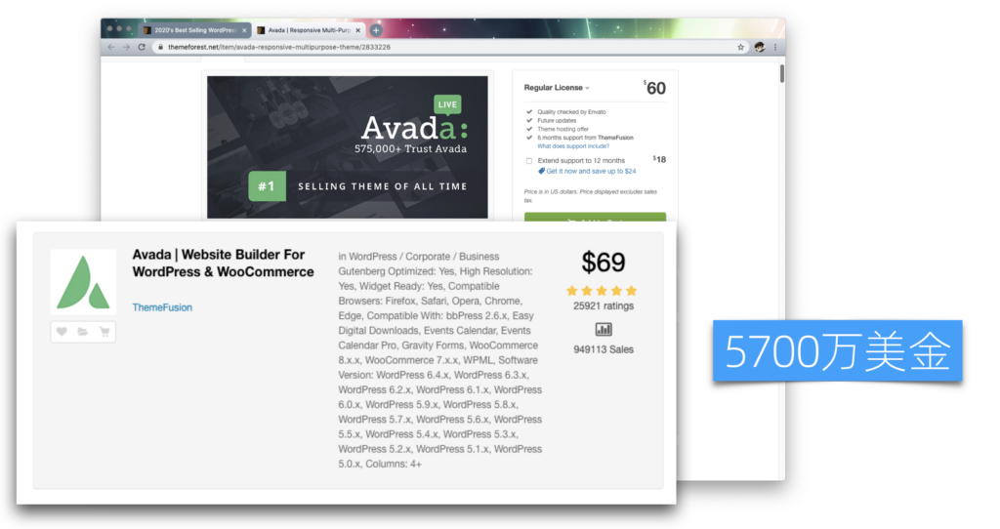
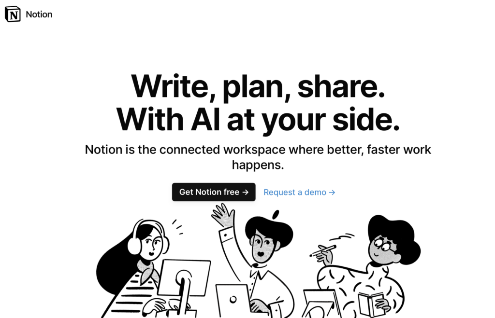
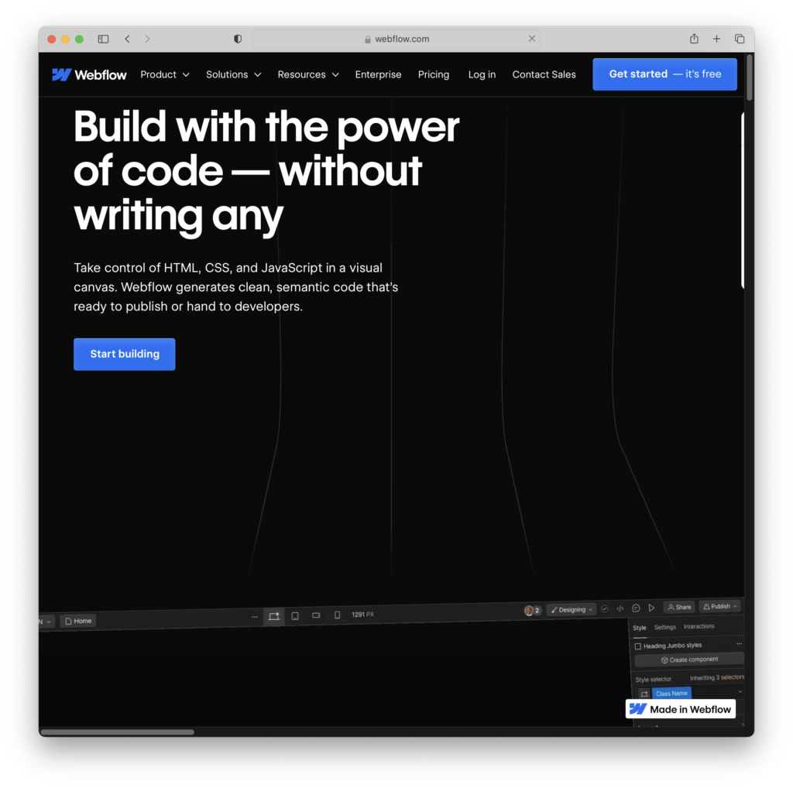
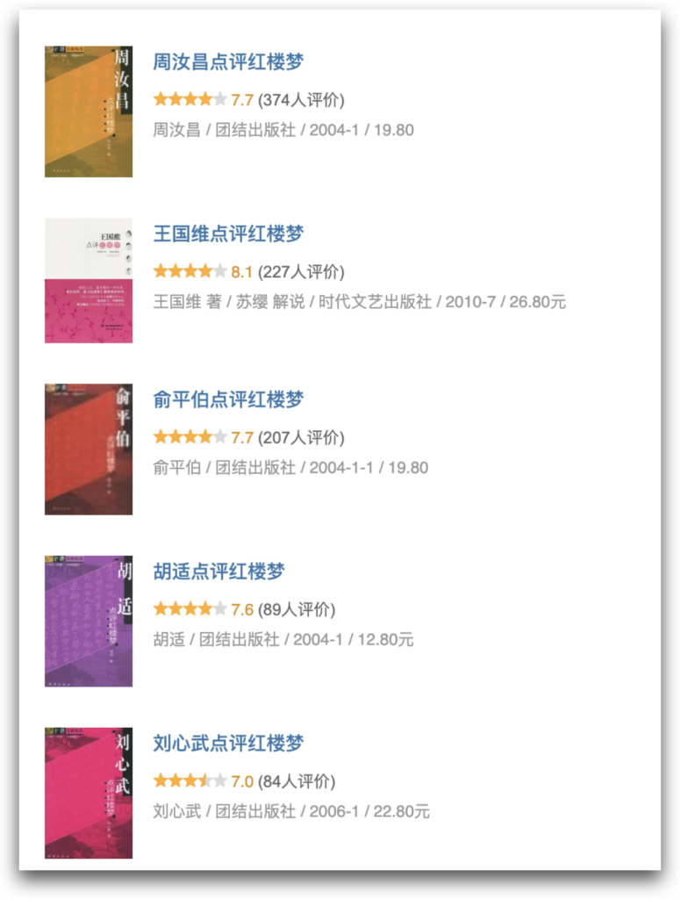
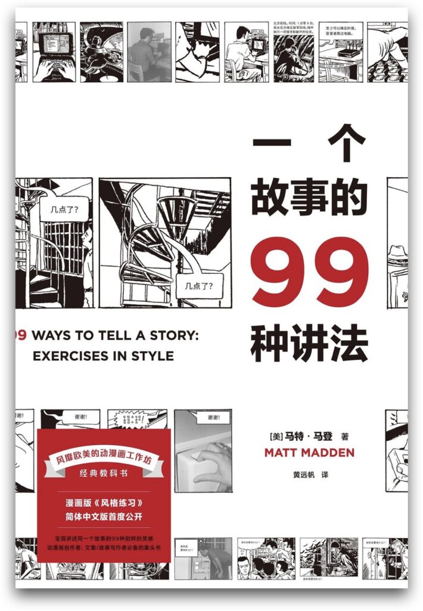
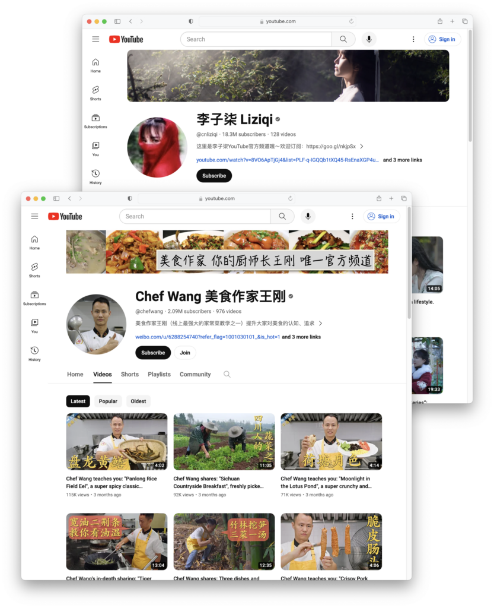
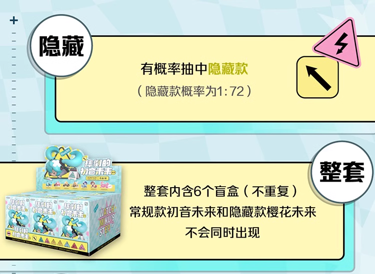
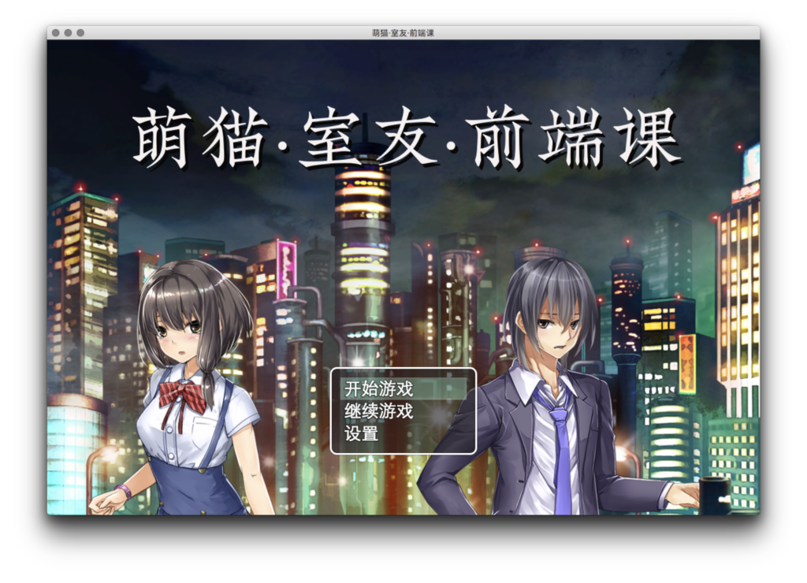

# 竞争策略:不竞争策略

在「规划一人企业」的第三部分，我们将讨论「竞争策略」。虽然我们理解了基础逻辑、也并尽可能面向小众刚需来选择细分市场，但无论如何选择，还是将不可避免地面临竞争。因此，在设计产品之前，我们需要考虑一些与竞争相关的策略。

今天我们重点来讨论「不竞争策略」。

核心思路
----

不竞争策略的核心思路依然是尽可能避免竞争。主要有两个方向：

-   将竞争变成合作共赢
-   增强独特性，弱化竞争基础，没有对比就没有竞争

打不过就加入
------

和目标是大块市场的大企业或创业公司不同，一人企业往往只需要很小的市场份额就可以获得很好，因此也是天然的优质合作伙伴。在确定竞争策略之前，我们应该先问自己，能否先通过合作的方式实现双赢。

### 成为生态的一部分

很多大型商业系统为了覆盖长尾需求，都提供插件系统或者有开放API。我们可以考虑基于它们研发产品，融入其生态，充分利用已有的用户和流量等资源。

#### WordPress

内容管理系统（CMS）是独立开发者非常喜欢涉足的一个领域，但有一个开源巨无霸 ------ WordPress。虽然很多人以为它已经过时，但根据2023年的数据，WordPress仍占据了整个网站建设市场45%的份额，并拥有6万个免费插件和9千个免费主题。这还不包括大约1万个付费主题，而这些付费主题通常价格不高。

WordPress庞大的开源生态

比如，我购买了一个非常棒的Networker主题，它可以直接将WordPress变成垂直门户，仅仅花费了600元。加上免费的Woocommerce插件，还包括网店功能。相比之下，如果雇佣一个外包公司设计网站并实施，至少要花费上千元。

在WordPress拥有如此大的市场份额的情况下，如果我们想进入CMS市场，最佳策略不是开发一个与WordPress竞争的产品，而是为WordPress开发插件和主题，即成为其生态系统的一部分。

可能有人会质疑，开发插件和主题能赚多少钱呢？

ThemeFroest上的畅销主题

可以参考这家为WordPress开发主题的公司，在ThemeForest上销售的一款主题的收入。从定价和销售粗略计算，仅这一款主题到2020年的时候就赚取了3,515万美元。而到了2024年2月，这个数字已经增长到了5,700万美元。

这表明，即使是成为大平台生态系统的一部分，也有潜在的巨大利润，虽然可能不足以支撑一个上市公司，但对于创业公司的早期已经足够了。更不用说一人企业了。

#### Notion

Notion首页

Notion是一个最近几年迅速崛起的文档平台，通过提供API，许多第三方工具在其基础上开发出了盈利的产品。以下是几个例子：

-   HelpKit：将Notion文档转换为托管知识库，无需编码，不到一年时间内月收入超过$3K，拥有130个付费客户。
-   Super.so：将Notion页面转换为具有自定义域名、字体、分析等功能的网站，6个月内月收入达到$12K。
-   Janel通过Notion建立了Newsletter OS，3个月内赚取了$20K美元，证明围绕Notion的产品可以盈利。

这种基于大平台发展独立小功能的思路被称为MicroSaaS，也是很值得我们借鉴的。

#### WebFlow

WebFlow首页

在 NoCode 领域，有一个非常实用的工具，叫做WebFlow。围绕着它也发展出来了很多商业工具。

-   JetBoost：无需编写代码即可为Webflow添加实时搜索、动态过滤等功能。
-   FlowBase：提供大量Webflow资源，包括高级组件、模板、指南、应用等。
-   PowerImporter：简化Webflow CMS的更新，支持Excel、Wordpress和Airtable。
-   Finsweet：提供定制的Webflow网站开发服务，并免费提供Webflow CMS库。
-   SystemFlow：为Webflow和Figma提供基于设计师的工具框架，包含1000+ CSS类、预建组件和布局等。
-   Flowyak：为初创企业设计和开发高转化Webflow模板。
-   BuildBites：按月固定价格提供无限Webflow开发服务。
-   WebPlug：一键同步Webflow CMS与Airtable数据库，无需复杂触发器。
-   PressFlow：将WordPress网站转换为Webflow网站的全面数字设计和开发服务。
-   DesignDash：为成长中的初创企业提供无限Web设计（主要是Webflow）订阅服务。

可以看到这些平台周边的服务和工具，通过提供定制开发服务、简化更新流程、资源实时搜索等功能，增强了平台的价值。

当你成为这些平台生态系统的一部分时，其用户基本上也就成了你的潜在客户。在这些平台的社群中进行推广时，由于不存在直接的竞争关系，更可能得到平台的欢迎和支持。因此，无论是为已有的大平台开发插件，还是基于这些平台的产品进行扩展，都是我们小公司、小团队和早期创业公司应该优先考虑的竞争策略。

非标准化、弱替代性品类
-----------

其次，我们可以选择非标准化的和弱替代性的品类。具体什么意思呢？我们分别来解释。

### 非标准化

非标准化品类指的是那些即便是同一品类下的产品或服务，消费者也能明显感受到它们之间的差异，这种差异往往基于品质、设计、品牌故事或者个性化服务等方面。

比如我们不会觉得《王国维点评红楼梦》和《胡适点评红楼梦》的内容是一样的，可以有很多人从不同的角度来点评和解读。

很多版本的红楼梦点评

甚至，同一个故事，以不同的方式重复讲述，只要把握技巧，读者都能听得津津有味，不会觉得千篇一律。金庸的小说已经被翻拍成电影电视剧很多次了，但每次都能吸引不少观众。

一个故事可以有很多种讲法

此外，手工艺品、体验式服务也是定性的非标准化品类。

-   手工艺品：手工艺品因其独一无二的设计和制作过程而成为非标准化的典型例子。即便是同样的产品类型，比如手工陶瓷杯，不同艺术家的作品也会有截然不同的风格、色彩和触感。
-   定制旅行服务：定制旅行服务根据不同客户的需求和偏好提供个性化的行程规划，这种服务的非标准化特征让每个旅行体验都独一无二。

### 弱替代性品类

弱替代性品类指的是消费者倾向于拥有多个相似产品而不是替代其中任何一个。这类品类的产品通常满足消费者的多样化需求或情感价值。典型品类包括：

-   时尚配饰：比如手表、珠宝等，消费者往往不满足于拥有单一款式，他们会根据不同的场合、心情或搭配需要选择不同的配饰。
-   收藏品：如邮票、艺术品、限量版运动鞋等，这些品类具有很强的收藏价值和情感绑定，使得消费者即便已拥有相似产品，也愿意继续购买。
-   流行服装：消费者往往追求多样化的衣着风格来适应不同的场合、季节或是个人心情的变化，时尚潮流的不断变化也推动了消费者持续更新自己的衣橱，寻找新的风格和设计。

无论是非标准化和弱替代性都是基于认知的。同样是衣服，直男们可以一个季度只需要一两套换洗衣服，表现出极强的替代性。而同样是这个人群，他们却会重复购买机械键盘和充电头。

改变品类属性
------

通过改变认知和商业逻辑，可以调整品类的替代性，甚至激发新的需求。

### 个性化、个人化

通过将个性和个人特色作为产品的一部分，让产品与众不同。

比如，虽然许多人可能在做相同的事情，讲述相同的内容，但由于每个人的个性和风格不同，消费者的体验也完全不同。这种差异化消除了明显的竞争关系。

个人IP成为产品特色

再如，针对用户提供定制服务，可以将标准产品变成个性化产品，从而创造需求。比如通过AI生成或者优化客户喜欢的设计或图案，然后将这些设计打印在T恤、手机壳或杯子上。

另一方面，个性化和个人化也是一人企业的核心竞争优势之一。大企业为了取悦尽可能多的用户，总是表现得四平八稳。但一人企业往往只需要服务于细分群体，鲜明的个人风格不但给受众留下深刻的印象，建立情感联系，也可以反向筛选用户。

### 改变商业逻辑

改变商业逻辑的一个例子是手办盲盒。本来可以花一份钱买齐全套的手办，以盲盒形式售卖，既增加了用户对已经获得手办的重复购买、也保持了用户对未获得手办的购买欲望。

以盲盒形式售卖的手办

创造新品类
-----

如果我们所在的优势领域不存在非标准化和弱替代性的品类，那么可以考虑创造一个新品类。「没有对比、就没有竞争」，我们不会将食物与工具进行比较，也不会拿锤子和包子进行比较，因为它们属于不同的品类。

创建新品类最简单的方式是跨界混搭。

比如，我之前尝试创造了一款介于课程和游戏之间的产品《萌猫、室友、前端课》，它可以让用户在玩游戏的过程中学习一些前端开发的知识，这就属于游戏和课程的混搭型产品。

可以学习前端知识的游戏

这是我曾经做过的一些比较有趣的尝试之一。它之所以特别，是因为它属于一个交叉品类，在这个品类中竞品非常少，实际上没有直接的竞争者。所以也可以认为它创造了一个品类。不过随着项目的进行，我们发现通过游戏形式准确传达大量知识内容十分困难，尤其是当需要内置一些开发环境时，复杂度极大增加，最终我们没有继续发展它。但是，这个思路是非常有意思的。

需要强调的是，一个产品是否属于新品类、是否和其他产品雷同，这完全取决于用户的认知，他们只会为自己的认知买单。这也直接影响着我们如何定位、宣传和推广产品，如何通过用户的使用体验塑造他们的认知。