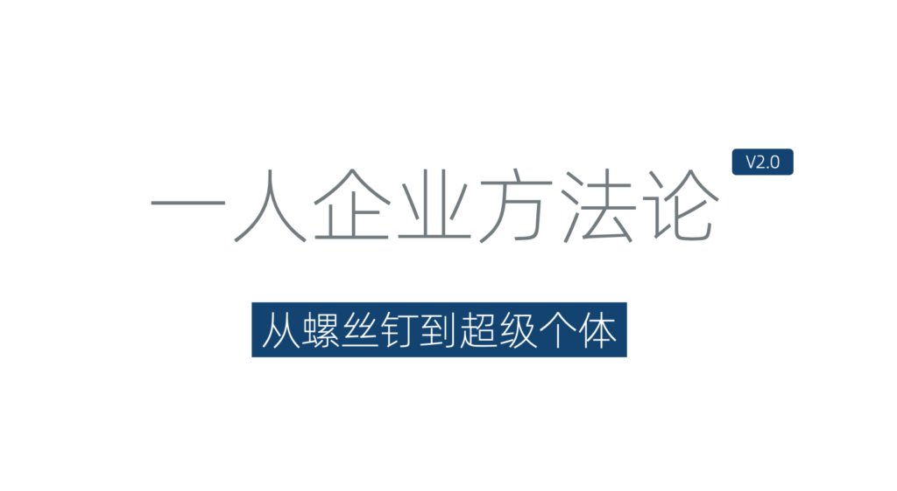
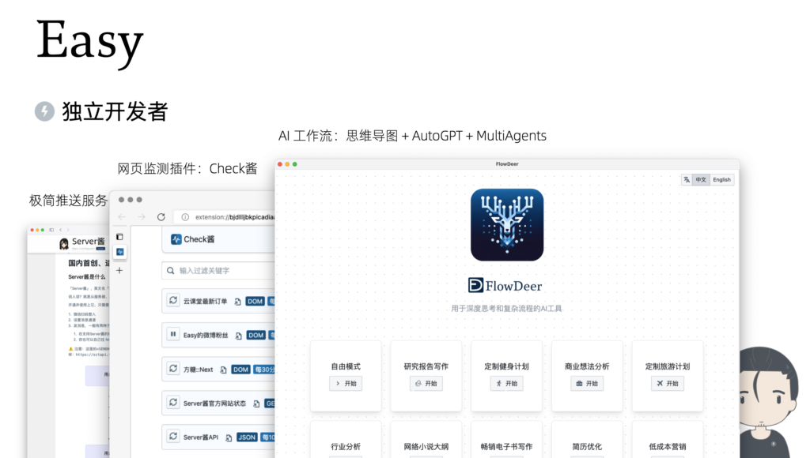
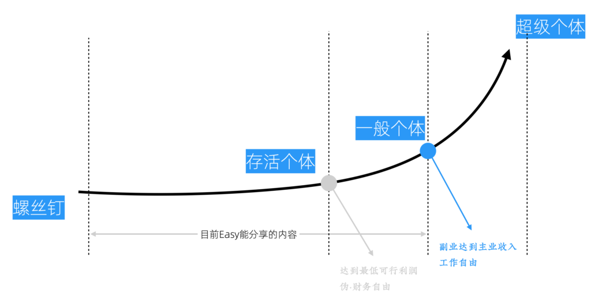
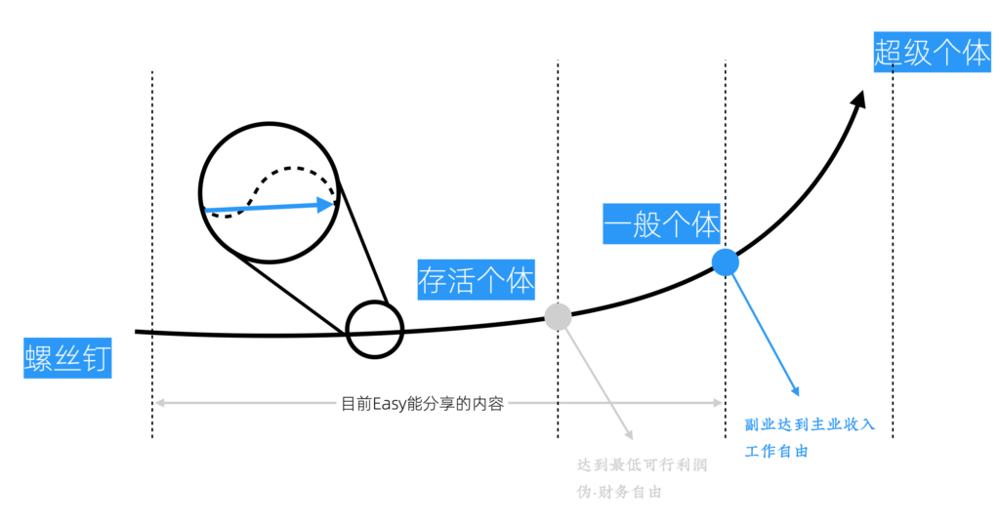

# 新版方法论概述

新版「一人企业方法论」
-----------

「一人企业方法论」这个名字大家听起来可能有点耳熟，因为我之前在GitHub上分享过一篇长文，叫做《[一人公司的方法论](https://github.com/easychen/one-person-businesses-methodology)》。它主要是针对独立开发者分享运营一人企业的一些经验。

经过两到三年的不断迭代，我们现在有了2.0版的「一人企业方法论」。这个名字之所以把「公司」换成了「企业」，是因为「一人公司」容易与公司法里面一人制公司产生混淆，所以我把它改成了「企业」这个词。

新版方法论

### 区别其一-更系统化

新版最大的不同，是引入了系统化的思维。之前思路上的局限是把一人业务和一人企业等同起来了，无视了多个一人业务之间的协同和资源重用。新版方法论认为一人企业的核心是维持一个能不断带来被动收入的资产池，需要定期对其中的资产进行维护和重配置。

### 区别其二-面向所有副业创业人群

另外一点不同就是，之前《一人公司方法论》那篇长文主要是面向独立开发者的。而我们的新版方法论是面向所有副业创业人群的，无论是否会编程，你都可以学习它。

因为随着开源软件、NoCode以及人工智能技术的成熟，很多不会编程的人也可以在这些工具的帮助下，非常快地搭建起自己的商业平台。这种快速搭建的商业平台不一定完美，但它够用。

这背后的一个逻辑是，我们要需要先构建MVP和原型来验证需求。而用于验证的产品本身不需要非常精细的技术；当业务原型运转起来以后，我们就有了现金流，也可以雇专门的人来做这些事情 ------ 技术也就不再是门槛。这部分内容我们会在以后专门讨论。

作者简介
----

先介绍下我自己。

### 独立开发者

Easy开发的独立项目

首先，我是一个独立开发者。

我从大学时就开始做独立开发，想尝试把自己的学费挣回来。从此掉进了独立开发的大坑一发不可收拾，即使在公司上班的时候，我也通过副业的方式做一些对主业有帮助的开源项目。

-   大概在六七年前，我做了一个极简推送服务，叫做[Server酱](https://sct.ftqq.com/)，这个服务因为做得久，用户还是不少的，有超过20万的用户。
-   前两年，又做了一个网页监控的浏览器插件，[Check酱](https://github.com/easychen/checkchan-dist)。这个项目和Server酱配合使用非常好用。
-   最新的一个作品就是关于AI的工作流的，叫做FlowDeer。它是一个思维导图，加上AutoGPT，再加上多智能体的一个整合形式的工具，可以处理复杂逻辑，也可以用来做深度思考。这个产品目前还在内测。

但比较有意思的是，我之前做独立开发项目的收入，实际上都没有能支撑起我的生活开销。

### 课程主讲人

所以，我还有一个身份：课程主讲人。

方糖技能站首页

这个「[方糖技能栈](https://stack.ftqq.com/)」网站，主要就是我的一些课程。它本来是我独立开发时的一个副产品。但后来反而是这个副产品实现了我的「最低可行利润」的达成。

所谓的最低可行利润，就是指赚到的这个钱可以养活自己，这样就不需要迫于生活压力去找工作。这个对于全职创业的人，或者说全职做一人企业的人来讲，其实是非常重要的一个里程碑。我们在后边会聊到。

### 方法论探索者和分享者

另外一方面，我对怎么靠技术挣钱这件事情，尤其是以个体的方式、优雅地挣钱很感兴趣。最开始，我写了[《程序员如何优雅地挣零花钱》](https://github.com/easychen/howto-make-more-money)。因为之前都是面向程序员的，所以我把这些文章和电子书都发布到了GitHub上，它们累积到现在大约有16K的Star（加星）。

Easy关于副业和一人企业的分享

在之后，我写作了[《精益副业》](https://github.com/easychen/lean-side-bussiness)这本书，它涵盖了一些实操的细节，比如怎么通过制作网课来变现、怎么开发软件来变现；讨论了在进行这些创作时，产品流程怎样最节省资源，设计流程应该安排最符合程序员习惯，以及做副业时要考虑的具体问题。这本书也是以免费电子书的形式发布到了GitHub上，现在大约有8K的Star。

最后，就是前文提到的《一人公司方法论》这篇长文。当时，我对这个方法论还只是有一个比较粗浅的认知，感受到了一个大体轮廓，经过最近这两到三年的迭代，现在这个方法论已经被细化了许多。这也是我们本书想要和大家分享的内容。

所以回过头来看，在挣钱这件事上，我还是比较执着的，前前后后大约花了好些年的时间来琢磨这些事情。

本方法论的局限性
--------

虽然我们这个方法论的Slogan是「从螺丝钉到超级个体」，但比较不幸的是，我目前最多算是一个过气的KOL。在我所有社交媒体中，粉丝数最多的微博，也只有60万左右。因此，我无法分享如何一步步成为超级个体的完整经验 ------ 因为我自己也还未成为超级个体。本书中能分享的，是截止到一个「一般个体」节点的经验和教训。

换个角度看，这或许也有好的方面。如果我已经成为超级个体，那么我很可能就不会花这么多时间来反思和总结方法论，并将其作为副产品分享出来。

成为超级个体过程中的几个前置节点

在成为「超级个体」之前，我标记了两个前置节点。分别是「存活个体」节点和「一般个体」节点。

### 「存活个体」节点

「存活个体」节点，就是达到「最低可行利润」的状态，我把它称为「伪-财务自由」。

之所以 加「伪」字，是因为它可能需要通过控制和降低生活成本，来实现让副业或独立创业项目带来的利润持平生活开销。比如，北京高昂的房价极大的拉高了生活成本，如果我们回房价较低的一些新一线城市工作和生活，那么我们就更容易达到这个节点。

当然，真正的财务自由，是不需要通过降低生活标准来实现的，这个节点会在更后边。

### 「一般个体」节点

「存活个体」节点的意义在于，一旦我们达到这个节点，只要愿意，就可以经年累月地全职经营自己的业务。而「一般个体」节点，则是指你的副业或者独立创业项目收入达到或超过你主业的收入。这种状态我称之为「工作自由」，意味着即使你不上班不工作，也能有和之前上班时持平的被动收入。

对一些人而言，「工作自由」可能等同于「财务自由」；但对于这种主业收入并不能支撑自由消费的同学来讲，「财务自由」需要更多一些的收入。这些节点的定义，只是便于在后续分享中使用，并不是特别权威的说法。你完全可以按照自己的想法来重新定义。

总之，目前我基本处于「工作自由」的「一般个体」节点。也就是说，即使我每天无所事事的到处溜达，每个月的被动收入依然和我之前上班是相差不多。

不过现实是，资产的持续性都是有限的，也需要定期维护（这个我们后续会讲到）；因为市场变动等原因，有些资产可能突然就没了，因此如果想要更好的发展，还要不停地创造新资产，来降低风险。所以我现在依然处于一个满负荷工作的状态。不过可以不工作和不得不工作，是完全不同的：你随时可以给自己放一个长假。

方法论的意义
------

在本书里边，我目前能够分享的，也就是「从螺丝钉到一般个体（工作自由）」的这一部分。希望后续有机会能补全「从一般个体到超级个体」的部分。

分享的作用和意义

还有一点需要特别说明的是，这里的分享并不能让你跨越成长过程，从螺丝钉一步成为超级个体或者一般个体。这个成长过程是少不了的，分享的意义在于「少走弯路」，我们希望通过分享，可以帮助大家避免一些我过去花费大量时间去犯的错误。

当然，很多行为在之前的错误，在当下又不一定是错误了。所以我们强调的是方法论而非结论。市场需求和竞争环境在不断变化，分享的结论可能并不那种重要。最重要的是，我们需要学会使用一套思考和分析工具，针对不同的情况自己独立思考并得出结论。

很多关于创业和副业的书，甚至不少成功人士的付费课程，往往也只分享结论而非方法论。授人以鱼不如授人以渔。好消息是，近年国外创业理论体系逐步成熟，关于创业的方法论正变得清晰起来；坏消息是，创业方法论并不适合一人企业。

虽然个体崛起已经是大势所趋，但关于这方面的书籍却多浮于表面。这几年我阅读了大量一人企业相关资料，尝试逐步将其中的观点和创业方法论进行融合，并花了大量时间在实践中检验。于是有了现在这个基本成型的2.0版方法论。

不谦虚地说，这是一人企业和副业创业领域少有的深度思考工具。实践过的人，都会感受到它的价值。希望它能成为你成功路上的强大助力。
