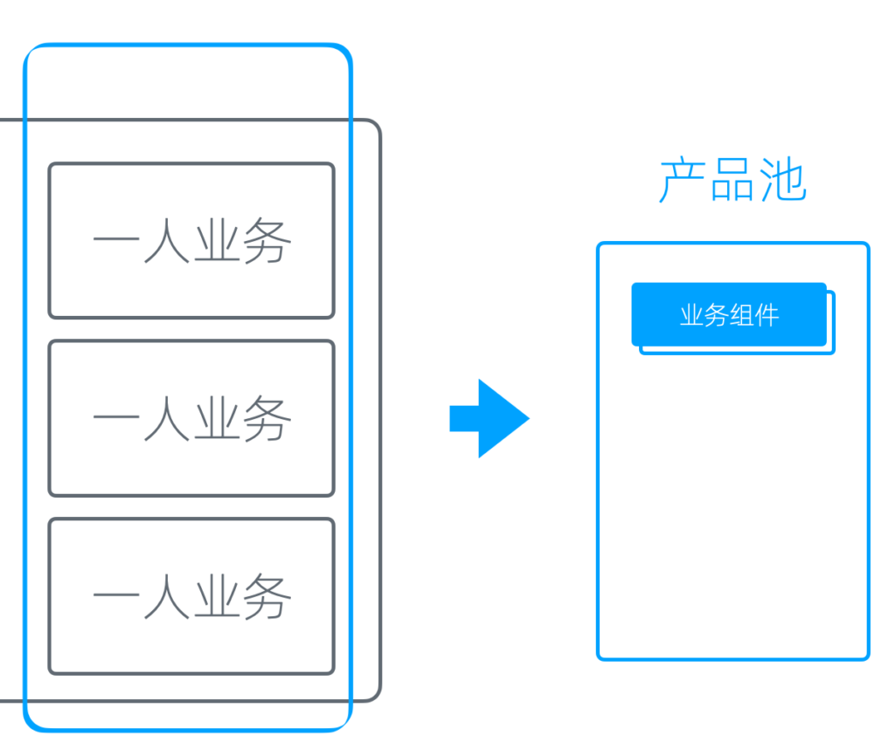
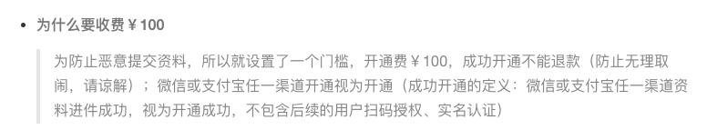
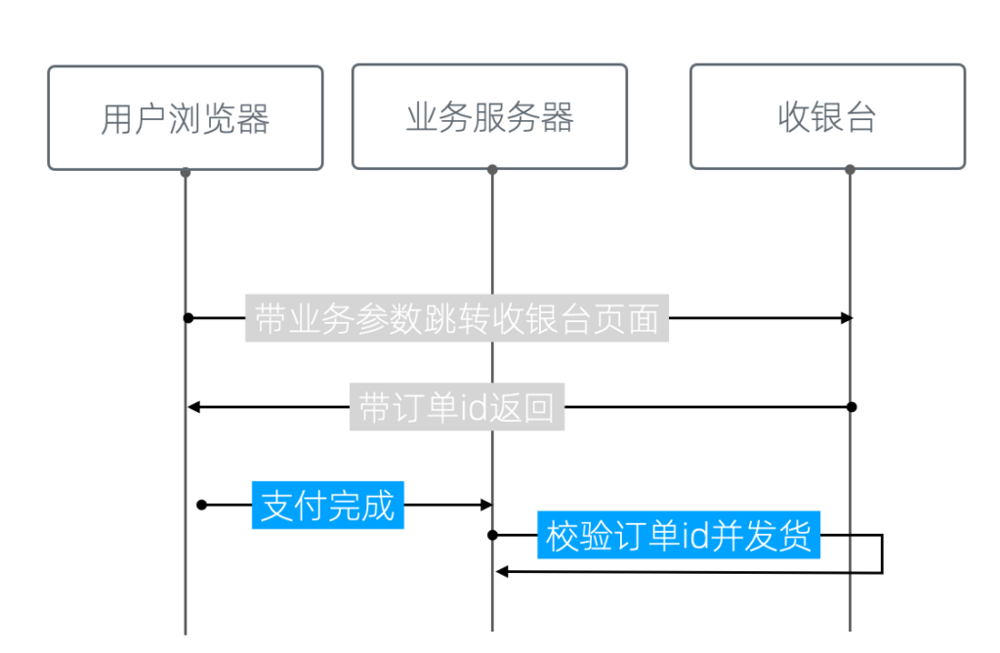
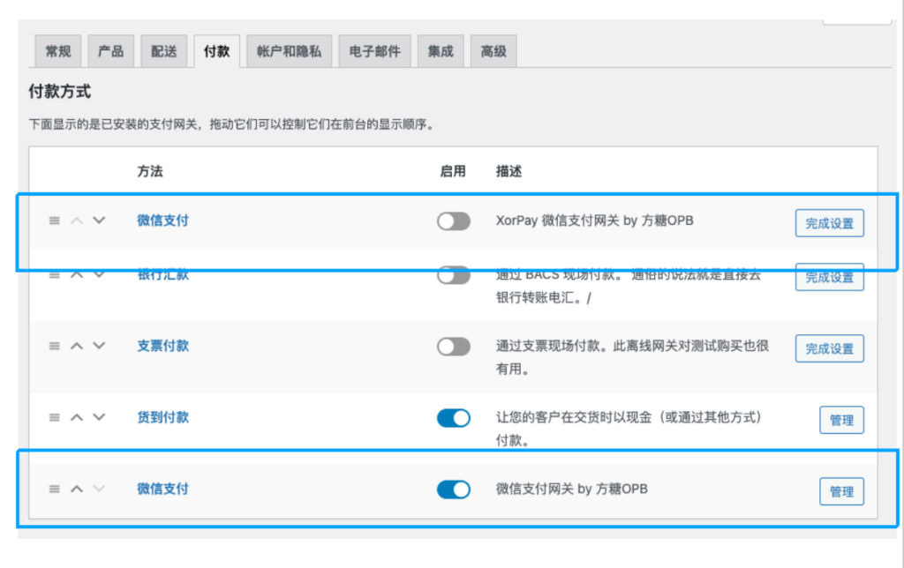
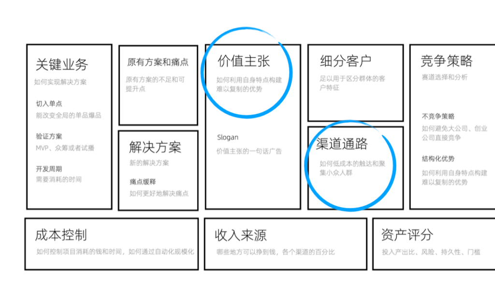
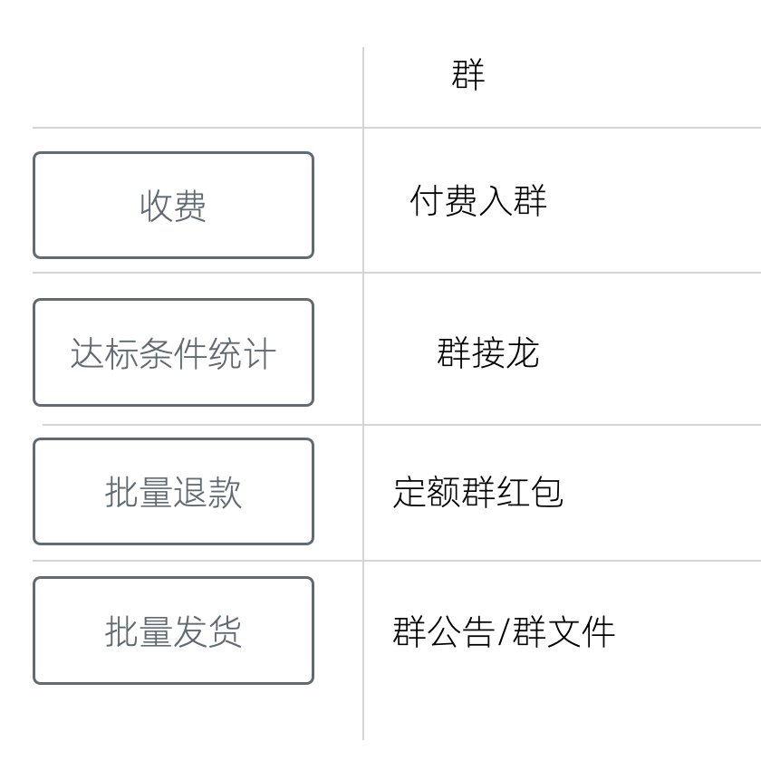
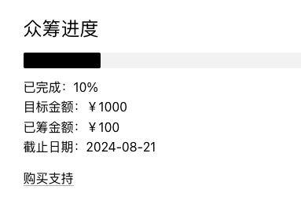
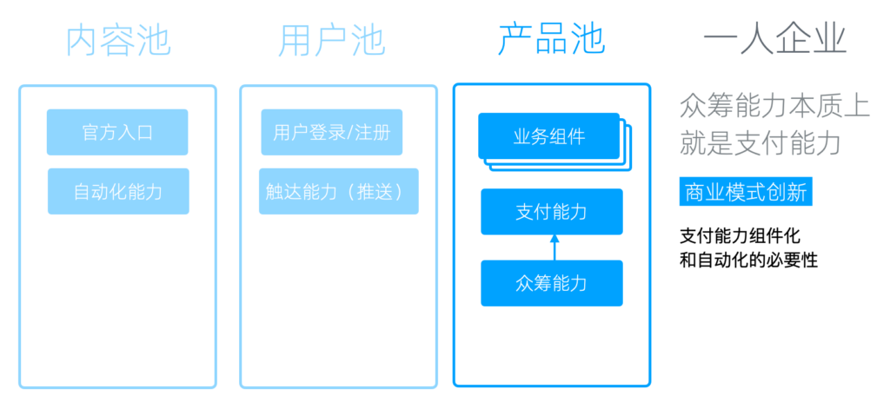

# 产品池和支付能力

产品池
---

我们已经有了用户池和内容池，接下来我们再把视线移回业务这边。

实际上，对于单个业务来说，在多个业务之间存在许多共通之处，比如是由于它们都旨在创造利润，因此需要许多与商业相关的通用功能和能力。

另一方面，有了用户池和内容池，业务本身就转变为一个可插拔的模块。它无需关注内容和用户相关功能，一旦接入我们的用户池和内容池，就能开始运作，无需再成为一个独立完整的业务。

因此，我们将这些业务整合为一系列业务组件，同时用「产品池」用来容纳它们。

从多业务到产品池+业务组件

支付能力
----

产品池最需要的是支付能力------这很容易理解。因为对企业而言，核心目的无疑是赚钱，而没有支付功能就无法产生收入。

### 支付能力服务商

#### 常用服务商

在国内，常用的有微信支付和支付宝，但这两者并不对个人开放，需要注册企业或个体工商户。

注册企业的成本集中在记账和场地。而个体工商户的注册地址在一些省份也有了要求，这无疑拉高了成本，因为办公地点其实是固定成本，而很多城市的民宅是不允许注册的。具体要求可以咨询当地的工商局，每个地方的政策都有所不同，但总体来说，这确实提高了成本。

#### 对个人开放的服务商

幸运的是，我们还有一些对个人开放的支付服务商。

像XorPay，这实际上是一个小微支付平台，在这个平台上，你可以接入微信和支付宝。可以自行申请开通，店面地址可以用住宅地址，店面照片可以用大门照片。另外我记得它有一个一百的开通费用，可以和客服确认下。

XorPay的FAQ中关于开通费用的说明

支付宝的某些支付方案也对个人开放，比如「当面付」，但使用场景有些不匹配，因为从名字就能看出，它本来是面对面支付用的。

比较而言，我认为使用XorPay这种小微支付平台是一个更好的方案，支持的渠道更多，用户支付的钱也是直接进入我们的账户，这是比较安全的。

支付接入
----

我们具备了支付能力，还需要与我们的业务组件进行对接，才能用起来。

如果我们只有一个业务，那无所谓；但如果业务多了，我们就会面临两个问题。

首先，每个业务都需要单独接入，这实际上是非常麻烦的。因为服务商提供的往往是系统层的对接，而不是应用层的，整个过程颇为繁琐。

另一方面，有些系统在设计上不支持多业务。如果我们使用微信官方的支付，它的支付目录有限制，最多支持5个。那我们的业务超过五个怎么办？这就需要我们自己寻找解决方案。

### 自建收银台方案

我们的解决方案是建立一个自己的收银台，这可以很好地解决上述两个问题。

简单来说，它就是将每一个业务看成一个应用，然后给这个应用分配一个参数。用户带着这个参数跳转到收银页面进行支付。支付完成后，收银台使用这个订单ID进行转向，用户再拿着这个支付完成的订单ID到业务中进行验证，整个支付就完成了。

收银台的流程示意图

收银台的意义在于，我们的多个业务可以共用支付和订单系统。

如果开发的业务足够多，会明白为多个业务单独开发支付和订单系统有多麻烦。虽然代码可以重用，但如果它分布到每一个业务中，我们维护起来会很麻烦。因此，将它做成一个共用的组件、将它封装成一个标准的基础能力是非常必要的。

### WooCommerce网关

如果我们使用 WordPress，那有一个更简单的方案，就是给 WooCommerce 添加支付网关。

绝大部分与支付相关的 WordPress 插件都会使用WooCommerce。这本来是一个第三方的插件，后来被WordPress 母公司收购了，虽然依然以独立品牌运营，但它其实是官方的产品。

它提供了完善的支付和商品相关的功能，但缺少一些国内常用的支付厂商。

WooCommerce支付网关设置界面

我们只需要添加一些网关，比如微信官方的支付网关或XorPay的支付网关，然后所有支持Woocommerce的应用就可以直接使用我们的支付能力了。

众筹能力
----

### 众筹的意义

在我们的一人企业方法论中，我不断强调众筹的重要意义。因为重要的事情需要至少说三遍。

一人企业的精力非常有限，所以试错成本非常高，不仅是金钱，它还是一种机会成本，因为我们一年能做的事情是非常有限的。因此，使用众筹来进行验证这种能力是非常重要的。

在比较主流的创业方法论中，核心验证的是两个东西：一个是价值主张，即我们的商品对于我们的目标用户到底有没有价值；第二是渠道通路，即我们的产品对这部分人有价值，但它能增长吗？它能达到我们想要的规模吗？

两个最重要的假设

### 多点验证

众筹验证它是一个简单粗暴的多点验证，即一次性验证价值主张和渠道通路。确切的说，它可能验证不了后期的增长，但可以验证早期渠道。

众筹的达标值，一定程度上就意味着早期规模的下限；用户少的时候，我们可以将其设定为不赔本的点；用户足够多的时候，我们甚至可以将其设定为我们期望的规模，很多Kickstarter上的项目主要收入就来源于众筹。

众筹对价值主张的验证，更为精准，是真金白银的真实验证。如果我们做落地页或者做访谈来验证价值主张，很多用户他会跟我们说我们这个东西很好，回去试一下，然后就没有然后了。但是通过众筹的方式验证，真心觉得好的会掏钱，表面上觉得好的就不会掏这份钱，验证的结果是非常真实的。

### 销售前置

第二，众筹把销售前置了。验证通过销售就完成了，验证不通过我们就不会去构建一些卖不掉的产品。这个就很重要，对一人企业来讲，业务成本里可能80%以上都是构建成本，而我们如果在构建之前就知道它卖不掉我们就可以不做这件事情，从而节省非常大量的成本。

当然有同学可能会说，我的东西都没有做出来，它对用户的这个吸引力显然是不够的，我们的这个众筹它不能很好地演示我们的这个产品，所以用户才不会购买，这个是有可能的。

但解决方案不是去开发产品，而是把用来众筹的视频或者用来给大家在众筹时测试的demo做得足够细致，让支持者可以体验到我们最后完成以后的效果。

也有同学觉得众筹太依赖于销售能力，但开发过程并不会提升你的销售能力，也就是说，众筹时卖不掉的产品，开发完成再售卖，同样卖不掉的可能性依然非常高。

### 众筹的构成要件

事实上，众筹系统构成要件很简单。

-   收费
-   达标条件统计
-   批量退款或者发货

#### 用群实现众筹

我们甚至用一个群都可以非常好地完成众筹，而不用购买任何的软件来做这个事情。

比如说，我们做一个付费入群，这个就把收费解决了；然后达标条件统计我们通过群接龙来做，付完费的接一下龙，就可以知道我们的软件到底卖了多少套，我们的课程卖了多少份，达没达标，群里大家都一目了然。批量退款的话也很简单，我们只需要发一个定额的群红包，每一个人按固定额度领一下，这个钱就退回去了。

发货的话，做得比较简陋一点的话我们可以把软件或者视频放到网盘上，通过群公告提供给大家链接，也可以直接放到群文件里面，这个就看群对应的功能。

通过群实现众筹

所以你看，众筹它是一种思维方式，其实并不是一个固定系统，不是说我们要有了一个系统才能做众筹，即使我们只有一个群我们也可以很好地来处理它。

而且像批量退款这个步骤，如果不能批量退款，大不了手工退款，辛苦一点而已。主要是我们退款的场景往往是没有达标的时候，所以这个用户反而不会太多，因为用户多了就达标了呀。

#### 用 WooCommerce 众筹

当然，如果我们经常做众筹，使用群就显得比较麻烦了。如果使用 WordPress ，我们也可以用 WordPress 插件来做。其实WooCommerce已经完成了一个标准的商品销售流程，商品购买和发货。

需要修改的地方只有两个。第一是，我们可能需要添加一个简码，用来输出这个商品的销量和是否达标的统计，比如说像下图这样。

商品众筹简码渲染效果

其次，我们需要一个批量退款按钮。但这个其实都是可选的，没有这个按钮其实也可以退款，只不过麻烦一点。

给WooCommerce添加批量退款按钮

所以呢，不要觉得众筹很麻烦，也不要觉得这个众筹必须要有系统，它是一种思维方式，希望大家把它用起来。这对一人企业和资源紧缺的小团队来讲，真的是非常非常重要的。

众筹能力本质上是支付能力

归根结底，众筹能力本质上是一种支付能力，它其实是一个商业模式的创新。如果我们的支付能力的组件化和自动化做得足够好的话，我们会发现像什么众筹啊，什么学完免费啊，这些看起来比较创新的商业模式都是很容易实现的。
