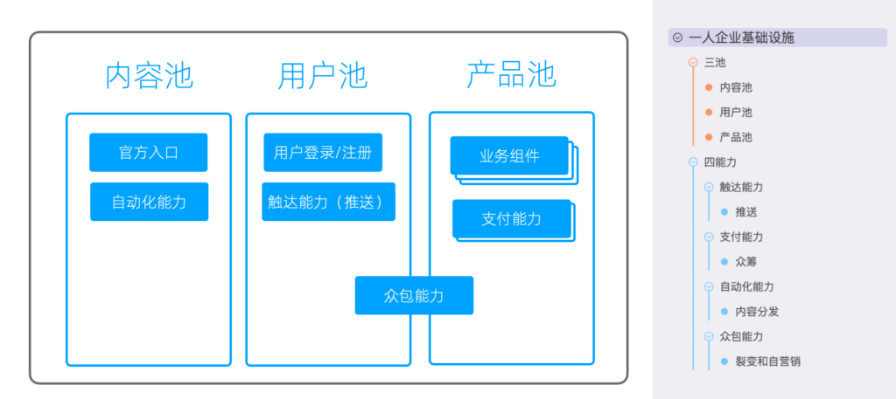
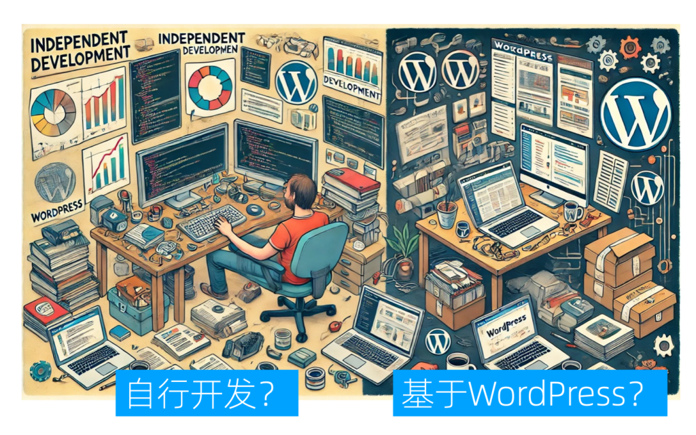
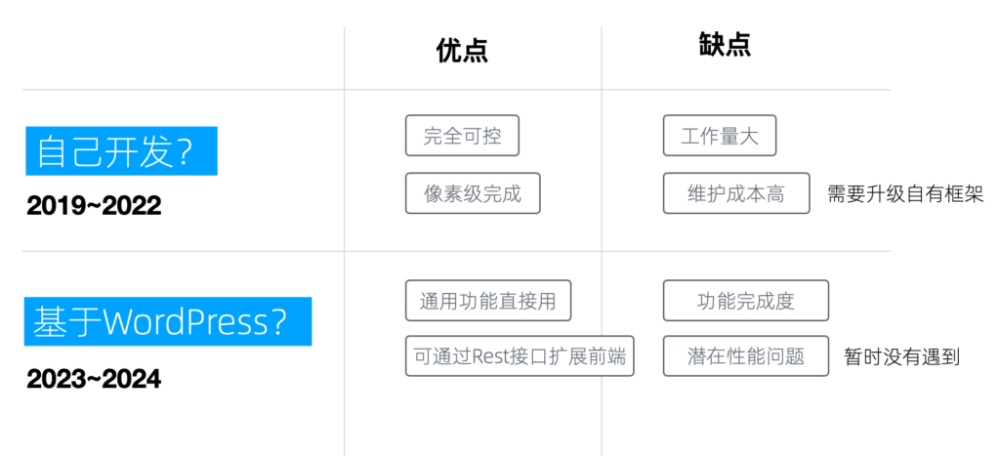
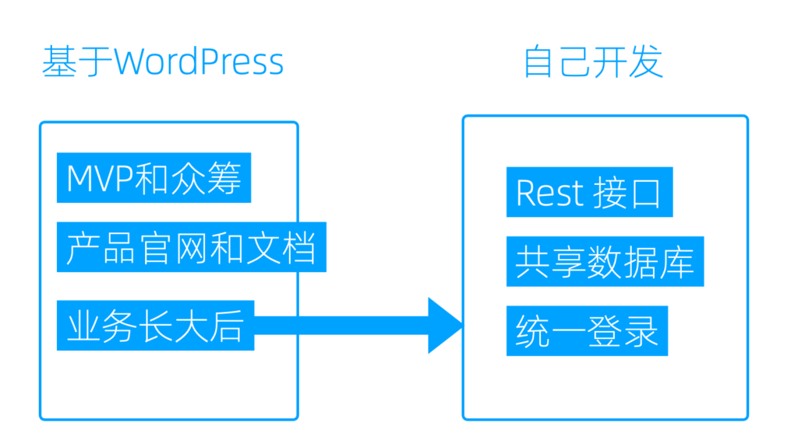
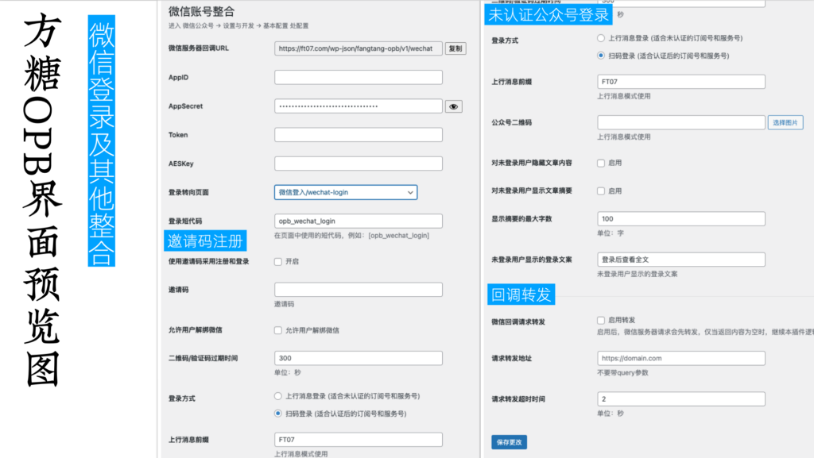
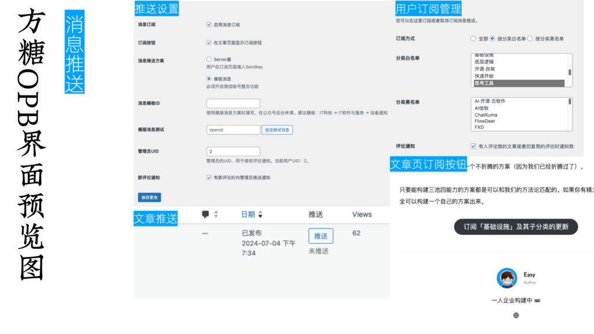
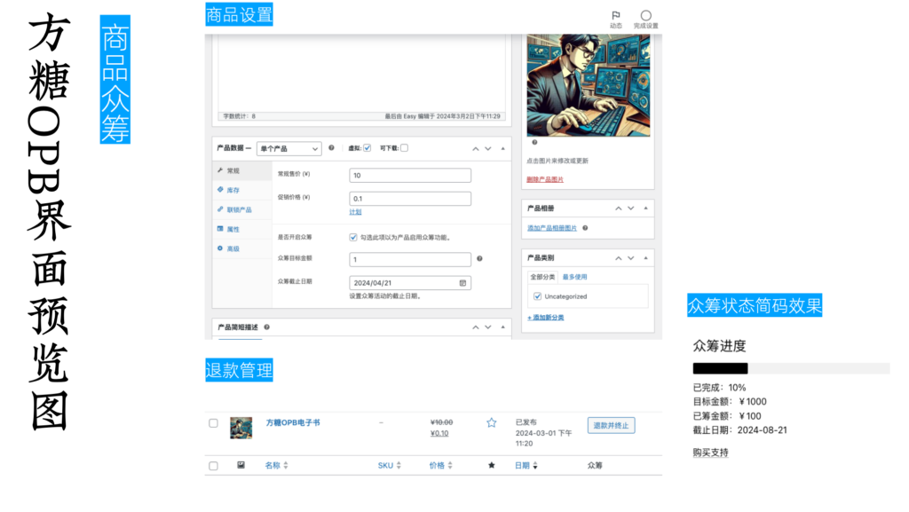
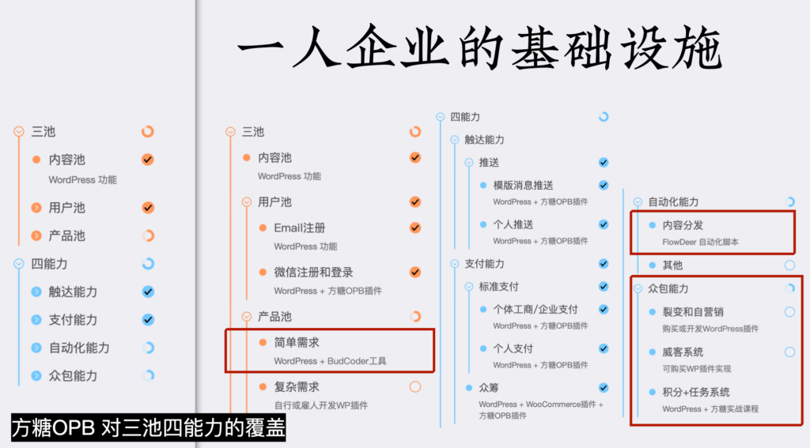
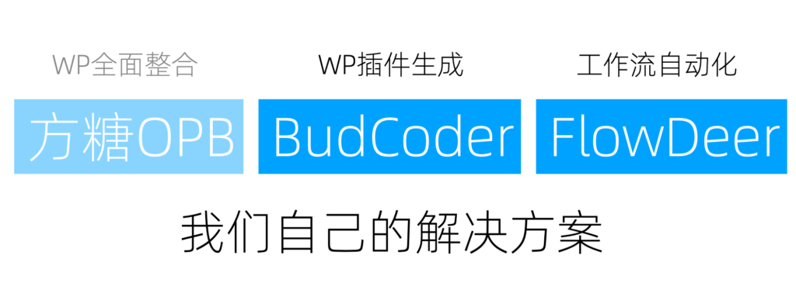

# 搭建一人企业基础设施

通过前文的讨论，我们认为一人企业的基础设施需要具备三个核心容器和四项关键能力：用户池、内容池、产品池；触达能力、支付能力、自动化能力和众包能力。

基础设施的三池四能力

明确了目标以后，我们就可以开始进入搭建阶段。

搭建方式
----

首先要做的选择是，是自行开发或雇人开发（外包）；还是基于开源项目搭建，比如基于 WordPress 搭建。

搭建方式的选择

不同的团队有自己不同的选择，恰巧我们两边都选过，这里分享下我们自己的经历。

### 自行开发

我们最初选择了自行开发，因为当时觉得WordPress过于臃肿。然而，现在回想起来，更多是因为认为自己的开发能力充足，误以为时间和技能成本较低，这最终被证明是一种误判。

从2019年到2022年，我们主要采用自行开发的方式，期间我们主要开发了网课平台，包括网课网站以及一些沙箱、在线运行环境，全部是独立开发的平台。

自行开发的优点在于完全可控，可以实现像素级的定制，将脑中的功能和细节百分百实现。

但缺点是工作量巨大，特别是当开发多个业务系统后，维护成本极高。我们已经从多个项目中抽离出公用部分，形成了自有的全栈框架，前端和后端统一，但框架的维护成本依然很高。比如，自有框架升级后，新项目自然可以直接使用，但可能需要回过头去升级老项目，这非常痛苦。

### 基于WordPress混搭

到了2023年和2024年，我们意识到大量开发时间被花在了本可以避免的事务上，而且业务量的增加最终可能需要我们开发一套内容管理系统（CMS），这实际上又等同于在做一个WordPress。因此，我们又重新采用了WordPress。

基于WordPress，其优点首先是通用功能都已实现，一些稍具特色的功能可以通过插件集成。例如，我们在搭建方糖07这个门户网站时，如果自行开发，至少需要半年才能迭代完细节。但通过使用WordPress并购买一个600元的主题，我们很快搭建完成、并使其达到了不错的阅读体验。

WordPress的REST接口也非常完善，可以通过插件在API层面实现功能扩展，甚至可以开发独立的前端，通过调用REST API来进行拓展。

非要找缺点的话，功能完成度和潜在的性能问题是WordPress的两大问题。功能完成度的问题在于，在可以偷懒（通过安装和购买插件实现）的情况下，可能最终实现的效果和我们想要的效果有10%的偏差。当然这肯定不是WordPress的错!😂

另一个潜在问题是，使用WordPress运营大规模的用户或内容网站时，性能可能成问题。尽管大部分性能问题由插件导致，但这仍是一个挑战。不过我们的产品用户数距离这个规模很远，一直在努力遇到这个问题中。

搭建方式优缺点比较

### 最佳实践

我们认为的最佳实践是，首先基于WordPress做我们业务的最小可行产品（MVP）和众筹，同时也可以把产品的官网和文档放在这个平台上。随着业务的增长和用户量的增加，我们再自行开发。

最佳实践

即使自行开发，我们也可以从三个层次上和 WordPress 进行混搭，分别脱离界面、后端和数据库的束缚。

首先，我们可以通过 REST 接口将 WordPress 作为后端使用，节省大量工作量。

然后，如果 WordPress 的后台系统效率依然不够高，我们可以共享数据库，自行开发一套新系统，直接从WordPress 的数据库读取数据，这样新系统的性能由我们的代码保证，数据共通，可以同时运行。

如果这样依然不够，我们还可以更进一步，建立一个完全独立的系统，但通过统一登录让用户可以关联起来。我们可以 WordPress 账户和微信关联。新系统虽然数据库不同，但通过微信登录走统一的Open ID，我们也可以定位到用户相关的信息。如果需要更多的用户信息，我们可以通过REST API的方式再读取相应数据。

通过这种多层次的混搭，我们可以实现最小量的开发，又拥有界面和性能的自由，同时尽可能降低维护成本。

参考方案：方糖OPB
----------

方糖OPB 是我们开发的系列 WordPress 插件，和 BudCoder、FlowDeer 配合使用，可以完成对「三池四能力」的高度覆盖。

### 产品界面

以下是它的界面，我们最近可能会做一些改动，以下截图供大家参考。

#### 微信账号整合

1.  我们添加了邀请码注册功能。这样产品还没有上线时，可以进行内测，只有知道邀请码的人才能登录。
2.  因为我们要支持个人运营，所以我们通过消息上行的方式来实现未认证公众号的登录。
3.  回调转发功能支持一个公众号在多个网站上使用。一旦接收到消息，会先转发到目标地址；如果目标地址不进行处理，再用当前网站的设置处理。

#### 微信支付

1.  标准的微信支付能力设置。
2.  收银台功能，包含支付APP和订单管理。只需一个页面跳转和一个HTTP请求验证就可以完成交易。
3.  实现了WooCommerce微信网关，包括官方微信和XorPay。所有支持WooCommerce的插件可以直接使用。

#### 消息推送

1.  实现了针对文章分类的订阅。您可以订阅某一个分类和该分类的更新，然后在文章发布时，可以点击推送按钮来推送给订阅该分类的用户。
2.  用户还可以通过一个管理界面来对这些订阅进行管理。
3.  还支持对评论进行订阅，使其实时性变得更高，可以大大提高互动性。

#### 商品众筹

在WooCommerce上实现的简版众筹。

1.  商品页在发布时选择开启众筹，设置一个截止时间和目标金额。
2.  在文章页面嵌入一个众筹状态简码，它会渲染当前这个商品的进度。
3.  商品管理的后台，提供批量退款功能。

### 基础设施结构和能力覆盖

我们来看一下回顾对比下一人企业基础设施的结构和能力。

可以看到，方糖OPB插件最整体覆盖是很高的，除了被红线框出的几处：

1.  产品池，我们需要有一个快速构建简单需求的能力。
2.  自动化能力方面，因为WordPress只是一个B/S结构的网站，所以它不是很适合。
3.  众包能力这一块是没有覆盖的。

### 配合 BudCoder 和 FlowDeer 使用

在搭配 BudCoder 和 FlowDeer 这两个工具后，我们可以将覆盖度进一步提高。

BudCoder可以实现WordPress插件的AI生成，对于一些相对简单的需求，大概是300行以下的需求，它是可以处理的。而随着AI模型能力的提升，它的处理效果会越来越好。FlowDeer工作流在做内容分发方面现在已经很成熟了。

有了它们，我们可以覆盖到之前欠缺的产品池的简单需求生成、简单需求完成和自动化能力里边的内容分发。整个体系里唯一没有覆盖的是众包能力。

自动验收面对的场景太复杂，很难有一个通用的插件可以处理，但可以通过积分系统+自行开发/生成插件来单独处理；如果接收人工验收，可以自行购买对应的成熟商业插件。