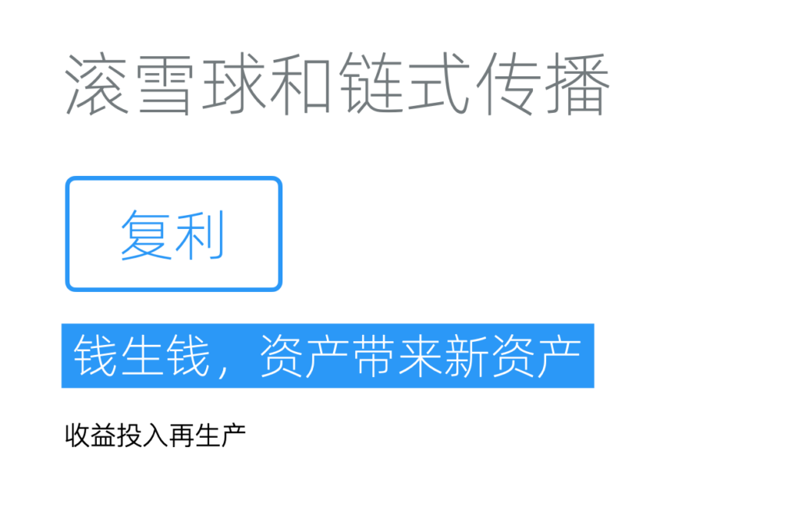
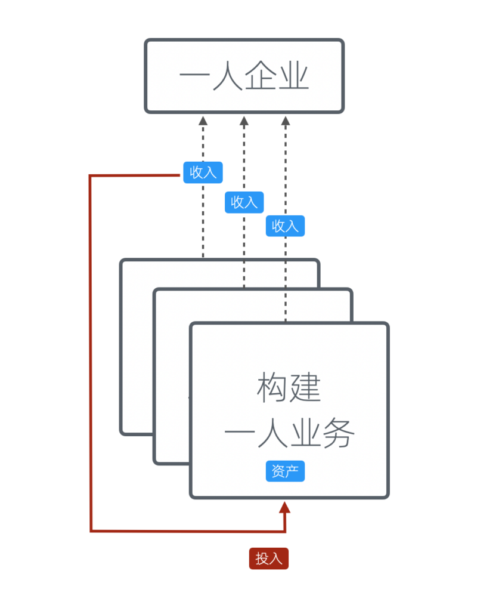
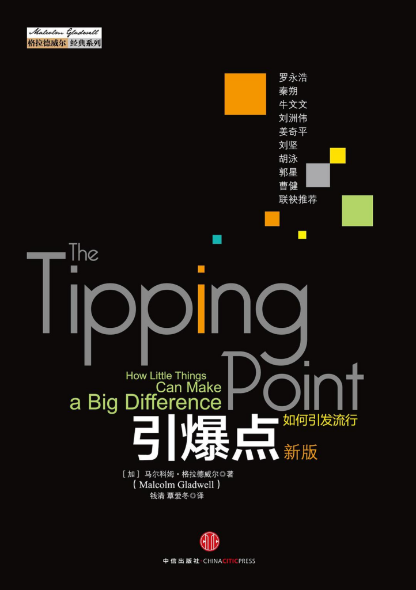
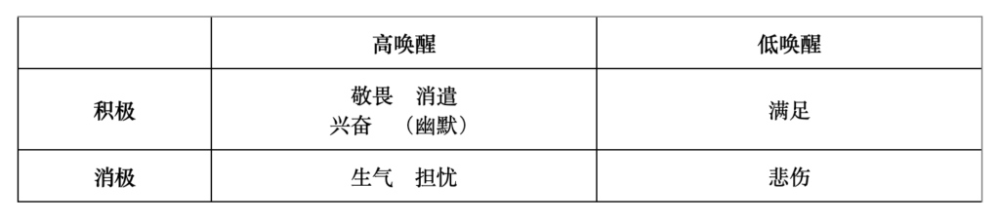
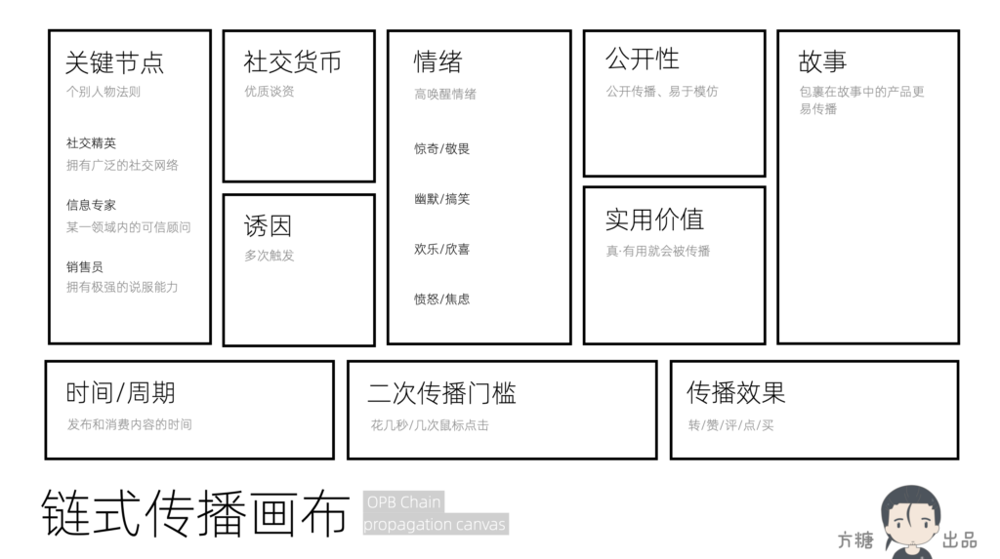

# 底层逻辑:滚雪球和链式传播

我们继续探讨底层逻辑。这次聊聊滚雪球和链式传播。

复利和滚雪球

复利：钱生钱
------

金钱最迷人的地方，不仅在于它本身就是财富，更因为它还会不断地带来新财富。

复利，是一种将利息并入本金，在下一个周期同样产生利息的算法。它是现代理财一个重要概念，由此产生的财富增长，称作「复利效应」，对财富可以带来深远的影响。

假设投资每年的回报率是100%，本金10万，如果只按照普通利息计算，每年回报只有10万元，10年亦只有100万元，整体财富增长只是10倍，但按照复利方法计算，首年回报是10万元，令个人整体财富变成20万，第二年20万会变成40万，第三年40万再变80万元，10年累计增长将高达1024倍（2的10次方），亦即指10万元的本金，最后会变成1.024亿元。当然，在实际投资中往往很难实现每年固定高回报率。市场波动、经济周期、投资选择等因素都会影响实际的投资回报。一般年回报率10%就已经是不错的投资了。

即使不主动投资，在我国大多数银行的定期存款，也可以选择利息在到期后与本金合并重新存入，从而实现复利效应。当然，因为利率本身不高、本金不多、周期又太长，这种财富增长的速度差强人意。

被动理财是精灵族的天赋技能

主要还是人族寿命太短，如果是精灵族，那么累计财富就要更加容易。在另一个西方世界常引用的例子中，假设美国土著1626年，愿意以60荷兰盾出售今日曼哈顿的土地，并将这60盾放到荷兰银行，收取每年6.5%的复利利率，他们2005年将可获得约63960亿港元的存款，较纽约市五条大街的物业总市值还要高。

理解复利效应的关键，在于认识到时间对投资回报的放大作用。它还有另外两个要件：

1.  指数增长：随着时间的推移，增长不是匀速的，而是增速的，因此可以实现指数级的增长
2.  再投资：将投资获得的回报再投资，从而获得更多的回报，这对实现增长至关重要

滚雪球
---

理解复利的逻辑以后，我们会发现它带给我们的启发并不限于金融领域，还可以用到非货币资产管理、知识积累、技能提升等多个领域。不过我们有一个更形象的说法：「滚雪球」效应。

它是一个比喻性的表达，来源于将一小块雪在雪地上滚动，雪球会越滚越大的现象，用以形容某种力量或效果随时间的推移而逐渐增强或扩大的过程。依然是复利的三要件：时间、增长、再投入。

举几个已经广泛应用到一人企业和创业领域的例子：

-   邀请制：获得种子用户以后，通过邀请码、返现等方式让他们邀请朋友作为新用户
-   UGC：发布内容引发用户讨论，将用户讨论整理作为新的内容发布，再整理新内容的讨论
-   付费式增长引擎：向渠道付费为商业产品获取用户，将从用户身上变现的钱再投入渠道，获取更多用户

用已有资产收益投入新资产

从更上一层看，我们也可以用已有资产的收益来投资新的资产。这种投资可以是资金层面的，也可以其他用于变现的间接资源，比如用户和流量。所以，资产会带来新资产。

另一个角度看，产品做深入以后必然会向上下游延伸，推动我们创造或者整合相关的资产。这也是「资产会带来新资产」的另一种解读。

链式传播：人传人
--------

链式传播

「滚雪球」在营销传播领域有一个专门的概念，叫做「链式传播」，也被称为「流量裂变」。它主要强调的是「二次传播」，亦即受众是否会产生再次传播内容的行为。具体到微博/推特上，就是「转发」。

现在很多平台引入了推荐算法，改用平台主导的「推荐流」代替用户主导的「信息流」，这种方式让平台可以名正言顺的控制原本属于用户的流量，也模糊了社会化传播的本质。当然，这不能简单地评价是对是错，商业平台往往有更多基于现实的考量。

但我们自己在做一人企业时，应该始终记住「人传人」才是传播的本质：搞定了二次传播，也就省下了市场费用。

如果想深入理解链式传播，有两本经典书籍推荐给大家，一本是《引爆点》、一本是《疯传》。

### 《引爆点》

《引爆点》（The Tipping Point）这本书由马尔科姆-格拉德威尔（Malcolm Gladwell）所著，首次出版于2000年。主要探讨了小的变化如何能够引发大的社会效应，即所谓的「引爆点」理论。作者借鉴流行病学的概念，通过将社会现象和病毒的传播类比展开研究。

《引爆点》

在书中，作者提出了「流行三法则」：

-   个别人物法则 (Law of the Few）：在流行传播中，有一些个体更为重要
    -   社交精英（Connectors）：拥有广泛的社交网络，他们认识的人数远远超过常人，能够作为不同社会圈层之间的桥梁
    -   信息专家（Mavens）：是信息的集散地，他们对信息有着深刻的理解和掌握，乐于分享。某一领域内被信赖的顾问，能够影响他人的看法和决定
    -   销售员（Salesmen）：拥有极强的说服和包装能力，能够通过个人魅力或说服技巧影响他人的行为和态度
-   附着力因素法则（Stickiness Factor）：总能找到一种简单的包装方式，让信息变得不可抗拒
-   环境威力法则（Power of context）：传播对于环境极度敏感，一些极小的变动，可能产生巨大的影响

其中个别人物法则无论是在社交媒体的大规模兴起，还是在新冠大流行中，都得到了充分的证明。但书中对附着力因素法则的研究，缺乏可操作性，并没有明确指出如何找到这种「简单的包装方式」。

### 《疯传》

《疯传》（Contagious: Why Things Catch On）这本书由乔纳-伯格（Jonah Berger）所著，于2013年出版。在书中，作者提出了使事物变得具有传染性的六大原则，即伯格的「STEPPS」模型。个人认为，这本书则可以看做对《引爆点》的绝佳补充，两者构成了相对完整的、又极具可操作性的链式传播理论。

《疯传》

六大原则如下：

-   社交货币（Social Currency）：在社交中，人们用谈论的话题向身边朋友炫耀身份、构建他们渴望的形象。构造符合这一需求的内容就更容易获得传播
-   诱因（Triggers）：可以设计一种在特定环境下能够激活顾客内心的产品与思想的触发器。一旦人们碰到，就会联想起我们的产品和思想
-   情绪（Emotion）：高唤醒情绪更容易刺激传播，包括惊奇/敬畏、幽默/搞笑、欣喜/欢乐，以及愤怒和焦虑
-   公开性（Public）：看不到的事物不会被轻易模仿，更不可能变得流行。设计一些具备公共传播属性的产品和思想
-   实用价值（Practical Value）：人天然具有互助倾向，只要产品或思想能够节省时间或者金钱，帮助个人提升，就会被大力传播
-   故事（Stories）：故事的魅力来自基因。包裹在吸引人的故事中的产品或理念更容易传播

六大原则中，关于情绪的研究非常有意思，同时也有些反直觉：满足感和悲伤并不会促进传播。

情绪的唤醒效果

这些原则已经被大量证明和使用，当我们不知道怎么策划一个传播时，可以把每一个原则都过一遍，往往会很快获得灵感。我们也了设计「链式传播画布」，帮助大家更全面地思考。

OPB链式传播画布

让雪球先滚起来
-------

时间是滚雪球效应中非常重要的一个要件，也是最难逾越的。因此，合理的时间规划，可以让我们获得更好的收益。一个简单的策略是：优先让雪球滚起来。

换言之，在一个具备滚雪球效应的资产（比如内容平台）和一个不具备此效应的资产（比如中台等内部基础设施）之间，我们应该优先完成前者。这样在我们完成后者的时间里，前者可以同步「滚动」。

更进一步，在可以提供被动收入的资产和不能提供被动收入的资产之间，我们同样应该优先前者。这样在处理后者的时间段里，我们可以获得被动收入。

你看，只是简单调整项目完成的顺序，就可以获得更多收益，这就是规划的力量；也是我们花大篇幅来讲底层逻辑的原因。