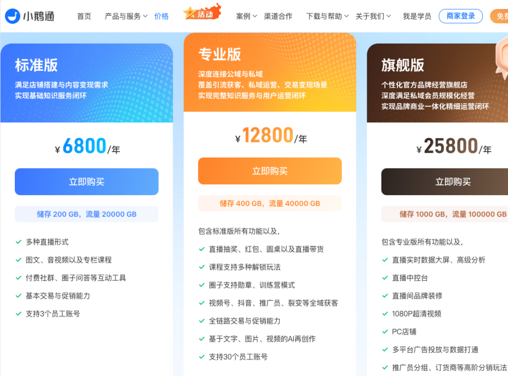
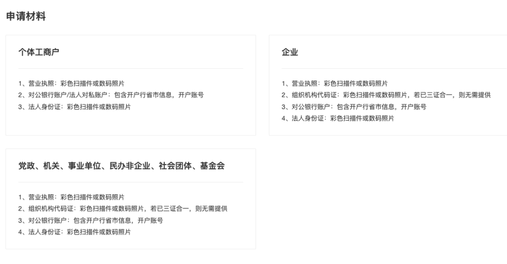
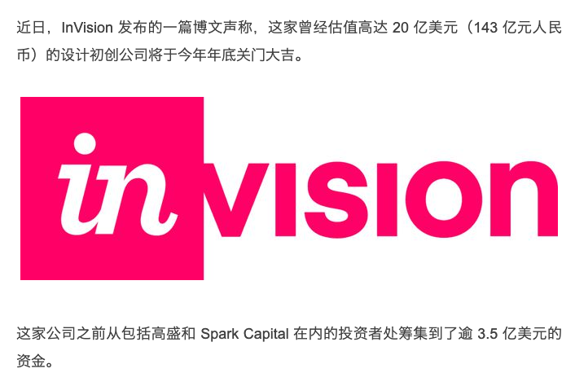
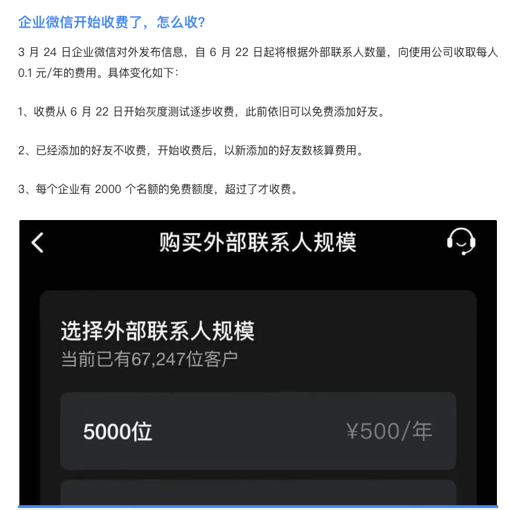

# 理想的一人企业基础设施

在了解方法论后，我们通常希望开始实践。但从这里开始，难度就会骤增，尤其是对一些没有技术基础的同学来说，会感到无从下手。

这是因为我们缺乏一些基础设施，而这些基础设施是使用互联网的企业所必需的，它们用于处理各种业务的通用场景。对于一些线下业务基础设施可能不一样，但一人线下业务往往难以规模化，所以我们这里只讨论以网络和数字经济为核心的一人企业基础设施。

为了将我们的想法和业务落地，让用户能够使用，我们需要构建一些基础设施。基础设施并不一定要自己构建，也可以直接使用现成的平台。例如，微信公众号就是一个很成熟的、用于付费阅读或广告商业模式的基础设施。

为什么要构建自己的基础设施
-------------

那么在有成熟平台的前提下，为什么我们还要构建自己的基础设施呢？首先要明确一点，并不是说平台的基础设施不能用，而是说在使用平台基础设施的同时，需要拥有一套完全自己可控的基础设施，并且实现用户的无缝连接。将单选变成多选。

### 商业模式

平台的核心商业模式是汇聚用户，从中获利。所以它对不同类型的用户以及在平台不同生命周期的策略是不一样的，这些策略可能并不适合我们的特定阶段。

例如，在一些平台上，如果某个账号影响力特别大，平台可能会削弱这种账号的能力。而对于一些特别小的账号，如果看不到增长趋势，就不会分配流量，甚至会限制你自己引来的流量。

另一方面，在平台早期，平台可能会扶持一些方向的账号，这时你会拿到较多的流量，但这些流量是从其他用户那里转移过来的。

如果没有自己的基础设施，就只能任由平台操控。但如果有自己的基础设施，当平台策略不匹配时，可以引导用户到自己的平台上消费内容、购买产品。

### 封号风险

平台有自己的红线和潜规则，甚至会出现一些失误。如果不小心碰到这些问题，可能会导致封号。对于个人用户，这可能没什么问题，但对于经营者，可能会导致数年构建的业务前功尽弃，所有努力化为乌有。

### 产品形态和品牌

使用平台的基础设施还可能导致产品形态过于雷同。如果产品形态比较保守，可能没有问题，但如果在产品形态上进行创新，平台基础设施的约束就会非常大。

例如，我们原来的视频课程放在网易云课堂上销售，但当我们想为学员提供实际操作的沙箱环境时，平台并不支持。即使我们自己开发沙箱，要与网易云课堂的用户对接时，发现该平台不提供接口。

为了防止讲师从平台导流，一些平台甚至在课件中不允许出现独立域名。这种规则在平台中后期会特别严格。

### 混合生态

我们认为的最佳实践是首先拥有一个完全可控的基础设施，然后充分利用各个平台的资源和流量，分发内容到其他平台，并将用户回流至自有基础设施，形成一个混合生态。

为什么要自己构建基础设施
------------

市面上有很多构建基础设施的软件或SaaS服务，但当我们尝试使用时，会发现它们多多少少存在一些问题。

### 价格高

价格高是一个典型问题，因为绝大部分的SaaS是面向企业的。

典型SaaS服务的定价

对企业来说可能便宜的价格，但对个人来说就很贵。在一人企业的早期，我们还没有赚钱，也没有风险投资，所以资源有限。一年上万的投入对没有收入的个人来说，还是太高了。

### 不对个人开放

另一个问题是很多基础设施不对个人开放，比如支付。

微信支付申请材料要求

一些对个人开放的支付服务，又没有与这些现成的基础设施整合起来。这导致很多现成的基础设施不能直接用。

### SaaS而非自架

一个潜在风险是如果我们不能自行建设基础设施，而是使用服务商架设的在线版本，会有两种潜在风险。一是企业突然倒闭，即使退钱，但我们的业务就突然崩溃，没有补救方案。

invision倒闭

另一个风险是企业突然涨价，因为业务已经在平台上，短时间内迁不出去，所以当服务商涨价时，议价能力很弱。如果我们赚到了很多钱，分润给服务商也无所谓，但对一人企业来说，如果费用过高，整体可能没有收益，甚至亏损。

企业微信突然对外部联系人收费

理想的一人企业基础设施
-----------

可见，现有的用来搭建基础设施的服务多多少少存在一些问题。那么，理想的一人企业基础设施应该是什么样子的呢？

### 足够便宜

首先，它应该足够便宜，至少在用户量很少的情况下应该非常便宜。这样我们才能在没有赚钱的情况下持续运营。

可以自行架设的开源软件是一个非常好的选择，因为当用户量小的时候，对服务器资源的要求很低，只需租一个最低性能的虚拟机实例即可运营。

提供自架方案的在线SaaS是一个更省事的选择，因为你可以随时迁移到自架方案，没有lock-in的风险。

### 足够可控

另一方面，基础设施需要足够可控，不会因为别人的决定导致业务中断。虽然可能会受一些影响，但不能因为影响导致整个业务崩溃。

比如说，平台限流或封号，至少可以通过其他方法触达已有用户。服务商疯狂涨价时，至少可以将数据迁移出来，在自己的环境中快速搭建，让用户继续使用，不至于流失到竞争对手那里。

### 个人可用

我们希望这个基础设施可以以个人资质来运营。

因为注册公司的成本很高，虽然工商注册已经足够便宜，甚至有些城市连公章都是赠送的，但真正的费用在于每个月的记账。如果没有合适的场地，还需要租用场地，这两项加起来一年就需要几千甚至上万。

所以我们希望这个基础设施有一个完整的针对个人用户的解决方案，包括用户注册、登录、支付和消息推送等功能都可以个人资质使用。

### 足够开放

如果我们想在产品和商业模式上进行创新，必然会对常规流程、界面和功能进行修改。所以我们的基础设施需要足够开放，允许我们方便地进行二次开发。

另一方面，这个基础设施最好足够流行，这样才能容易找到二次开发工程师。不然就像现在的银行，全球有43%的银行依赖于COBOL程序，但已经很难找到对应的工程师来维护。

### 繁荣生态

即使能找到工程师进行开发，开发过程总是需要时间，而且由于需求和工程师理解问题，会经历很长时间的迭代才能出现相对成熟的产品。

如果使用的基础设施有繁荣的生态，很多功能可能已经被开发出来，并以免费或付费的方式发布为插件，我们可以直接使用。

即使插件有一些细节不符合需求，改动起来也会很快，成本会大大降低。

### 适配于方法论

当然，最重要的一点是，我们希望这个基础设施可以很好地适配「一人企业方法论」、为我们这套可能是唯一的针对一人企业的方法论提供全程支撑，让使用这套方法论的用户可以开箱即用，不要再花更多时间在测试和开发基础功能上。