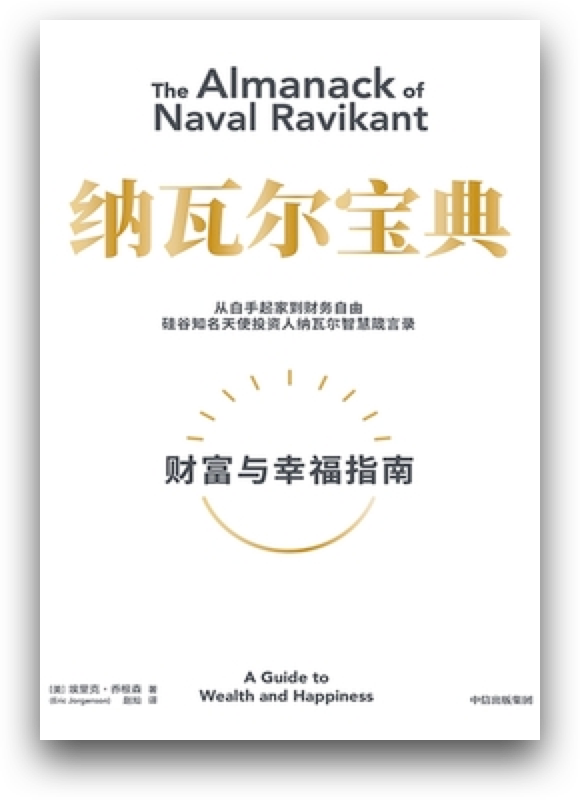
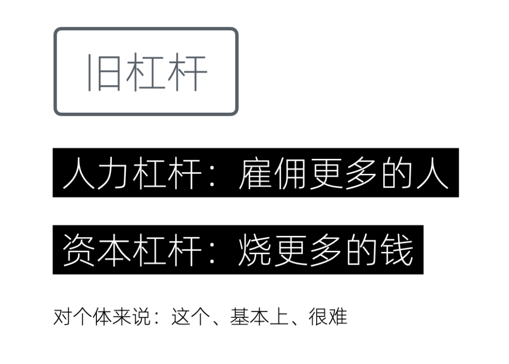
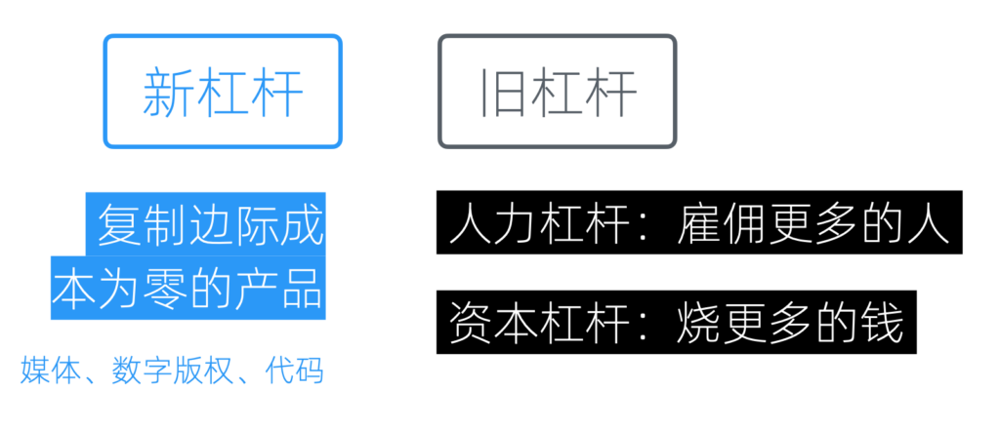
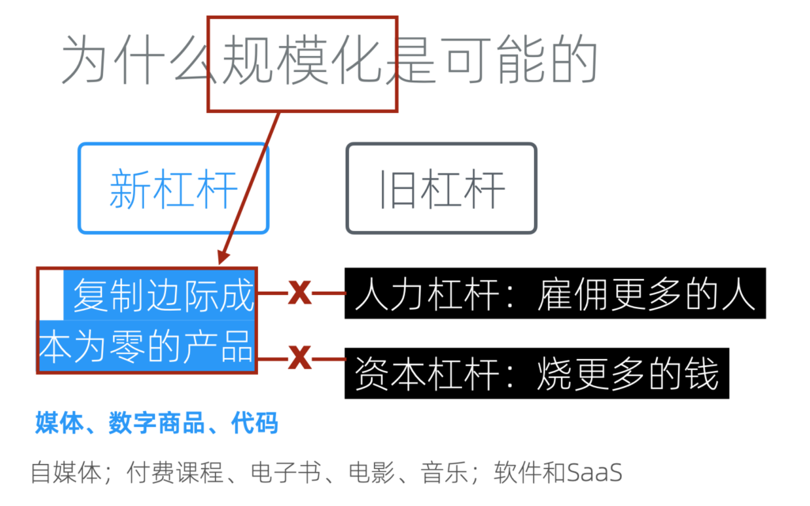
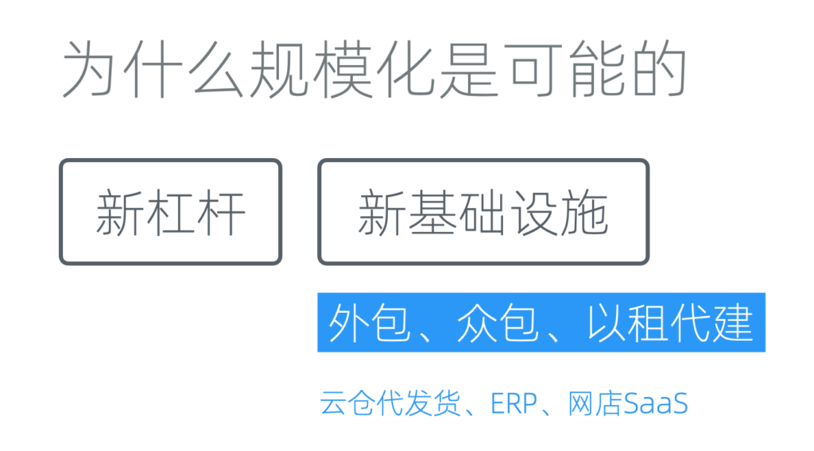
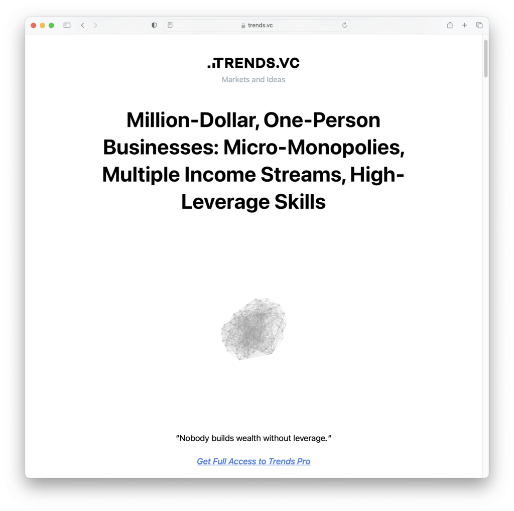

# 底层逻辑:为什么规模化是可能的

那么，接下来我们来探讨为何规模化成为可能。如果我们回顾过去二十到三十年，会发现对于一个一人企业来说，实现规模化似乎是一件非常困难的事情。若一个人便能打造一个大型公司，为何还需要雇佣那么多员工呢？

不过幸好，时代变了。

新杠杆
---

《纳瓦尔宝典》

这里，我们需要引入一个由纳瓦尔在《纳瓦尔宝典》中提出的概念，即「新杠杆」。正是「新杠杆」将个体的能力几何级数地放大，使其具备了和大型公司抗衡的能量。在讨论「新」杠杆之前，让我们先回顾一下「传统」的杠杆。

### 传统杠杆

传统杠杆

首先是人力杠杆。举个例子，假如我自己开一家公司，特别是在制造行业，我一个人只能制造一件商品。如果我雇佣100人，那么一天之内就能生产出100件商品。这就是利用人力实现的杠杆效应。

另一个是资本杠杆。它意味着我拥有大量的资金用于扩张规模，可以用于营销或市场开拓。有了钱其实就能雇到人，只是需要花时间而已。有了人力和资金，规模化便成为可能，甚至可以说很容易。当然，规模化之后是否能生存下来，赚取的利润是否丰厚，则是另外一个话题。

但对于个体来说，这两种杠杆较难使用，因为它们都需要别人的许可，如需要资本投入，或者依赖风险投资，或者是家族企业的支持。并不是每个人都可以轻易利用这些传统杠杆。

### 新兴杠杆

而新杠杆则是指那些复制边际成本为零的产品，如多媒体内容、版权、代码等。

新旧杠杆的对比

如果我们的产品是实体商品，那么其规模化必然依赖于传统的人力和资本杠杆，因为实体商品必然涉及到原料、生产、库存和物流等成本。这些成本随着商品的规模变大，会批量增加。

而新杠杆在定义上，就是冲着「无（边际）成本规划化」去的。因为对于复制和发布成本为零的产品，一旦生产完成，无论复制多少份，都不会再增加成本。这是一个简单的乘法，0乘以多少结果都是0。

新杠杆为何可以规模化

也就是说，新杠杆并不能取代传统杠杆，它们只能在数字经济领域（和其他存在零复制成本的领域）呼风唤雨。一旦我们涉及到实体，依然需要传统杠杆。所以没有必要将它们对立起来，我们可以全都要。

只不过新杠杆因为无需许可，所以对每个人都触手可及。同时又没有复制成本，可以在不借助传统杠杆的前提下规模化。这对一人企业来说，堪称绝配。

更具体来说，我们经常见到的自媒体、付费课程、电子书，软件和SaaS（软件即服务）都是属于新杠杆。事实上，虽然叫做新杠杆，但在我们的网络生活中已然司空见惯，早已融入。

新基础设施
-----

逐渐成熟的新型基础设施

新基础设施现在也逐渐成熟。在它们的基础上，我们采用「外包」、「众包」和「以租代建」的方式，来解决一些以往只通过人力杠杆和资本杠杆才能解决的事情。

当我们有密集的人工需求时，可以用外包的方式，将其分离出去。众包也类似，只是把外包的对象换成了一个很大的群体。比如我们的系统需要英文版，但工作量很大，可以人工智能翻译以后，推送给用户让帮忙校对。一个人只推送一条，只需要占用几分钟时间。但因为用户很多，所以可以很快完成翻译工作。

而在资本杠杆上，以租代建是一个很好的思路，也已是主流的成熟做法。它其实就是说，对于非核心基础设施，能租用的就不要自己购买和从头开发。这可以在短期降低成本的前提下保持灵活性。云计算平台和各种SaaS是这一思路下最主要的基础设施。

比如之前，我们从零开始做独立网店需要找人开发，不但周期长，一般还要花费数万元。但现在，只需要通过支付几千元的年费，直接租用一个网店，并将其绑定到我们的域名和支付系统上来使用。

以租代建还有一个额外的优点，如果租用的是大型企业的产品，那么更大的意义还在于基础设施的扩展性：当我们的产品用户越来越多时，无需自行进行高并发、高压力的优化，不用担心基础设施无法支撑；同时，也无需雇佣运维进行日常维护。这就是为什么即使我用一行docker命令就可以搭建，但我依然愿意花几千块钱在云平台租用数据库实例的原因。

当然，具体问题具体分析，如果你对网店的需求WordPress+官方的WooCommerce插件就能解决，而你又有维护能力，那么自建可能是更好的方案。另外，高品质的SaaS租用费用并不低，需要结合最低可行利润综合考虑做出决策。

成功案例
----

事实比理论更具说服力，我们收集和整理一些一人企业可以规模化的案例。

### 《百万美金的一人企业》

《百万美金的一人企业》

以下是《百万美金的一人企业》中的部分例子：

-   电子商务：Allen Walton 利用自己在安全摄像头商店工作的经验，创立了 SpyGuy，这是一个在线商店，在第一年的收入就突破了100万美元​​。
-   制造业：Scott Paladini 通过雇佣工厂制作可以被压缩进小盒子的床垫，并通过他建立的网店销售给客户，这些床垫的销售收入达到了百万美元​​。
-   信息内容创作：Daniel Faggella 利用他对巴西柔术的热爱，创造了一个订阅制的电子商务网站 Science of Skill，销售在线健身、自卫和自我保护的课程及产品，这个业务最终以超过100万美元的价格出售​​。
-   专业服务和创意业务：Pamela Grossman 在经历严重的惊恐症后，创立了 In The Present，这是一个提供品牌建设、市场营销和视频制作的精品营销和制作工作室，年收入超过200万美元​​。
-   个人服务公司：Joey Healy 经营着 Joey Healy Eyebrow Studio，这是一个眉毛造型业务，最终通过开设私人工作室和与水疗连锁店的利润分享安排，使年收入突破了100万美元​​。
-   房地产：Cory Binsfield 在回到他的家乡 Duluth 后，通过投资房地产建立了一个百万美元的微型企业。他现在拥有116套公寓，年收入超过100万美元​​。

这是基于美国2016年的数据，注意地域和时效性

### Trenders.vc的报告

trends.vc趋势报告

Trenders.vc是一个针对独立开发者的趋势报告服务，以下是[Trenders.vc](https://trends.vc/archive/)的报告中总结的例子：

-   财务辅导 ：米歇尔-塔斯科 (Michelle Tascoe) 通过一对一财务辅导赚取了 120 万美元，ARR 有望达到 50 万美元。
-   音乐产业 ：阿德里安-伍德在音乐行业工作了十年。他将 Modern Producers 的年收入提高到了 12 万美元。
-   健身教练 ：Stacy Berman 是一名健身教练，她将全年户外健身训练营的年收入增至 100 万美元。
-   付费课程 ：薛兆丰是一位经济学家，他开设的经济学课程带来了超过 800 万美元的销售额。
-   教练认证 ：Kendall Summerhawk 因其女性商业教练认证公司荣获 9 项 Stevie® 奖。她的财富增加到了 200 万美元。
-   软件开发 ：Mike Carson 是一位喜欢自动化任务的软件开发人员。他将 Park.io 的 ARR 增长至 150 万美元。这是一个自动域名抢注工具。
-   SaaS业务 ：Nathan Latka 创立了 Heyo，筹集了 250 万美元。他在播客上分享了经营 SaaS 业务的经验，该业务产生了超过 100 万美元的赞助。

### IndieHackers的案例库

IH案例库

IndieHackers是全球知名的独立创作者社区，它的[案例库](https://www.indiehackers.com/stories)持续提供最新的成功案例，以下是近期的摘录：

-   AI建站：Arjun Jain 于 8 月 1 日开始构建 pre.dev，并于 9 月中旬开始销售。到了 11 月中旬，他达到了 10 万美元的年回报率(ARR)里程碑，现在他的 ARR 已达到 14.4 万美元。他通过积极定价和精准定位客户群，专注于那些愿意为节省时间付费的客户，特别是通过 Clutch.co 公开列出最低费率的客户。他们还将产品定位于帮助代理机构大幅减少客户引入时间，通过销售而不是广告推广实现增长，并快速通过迭代和自动化改进产品。

-   博客销售：Marc Andre 通过建立和出售博客赚取了200万美元。自2007年开始，他拥有六个六位数的退出，总计达到200万美元。仅在2023年，他就通过出售三个博客赚取了80万美元。他的成功秘诀包括选择合适的利基市场、专注于内容和搜索引擎优化（SEO）以增长博客，并通过多种方法进行盈利，包括数字产品、联盟营销和广告收入。此外，他通过私下交易、市场和经纪人成功出售网站，并强调了避免过度个人品牌化和建立团队的重要性，以吸引潜在买家。

-   AI音频：Sébastien Night 创造了一款早期的 AI 产品 OneTake AI，并将其月回报率 (MRR) 从 $10k 增长到 $42k，年回报率 (ARR) 达到 $500k。他通过专注于转化真实录音而非生成内容，成功抓住 AI 技术的浪潮。Sébastien 强调了了解客户需求的重要性，通过直接与客户沟通，快速迭代产品以满足市场需求。他的成功策略包括明确的增长目标、有效的客户反馈机制和选择合适的技术栈，以及通过提供高价值产品来吸引和保留客户。
